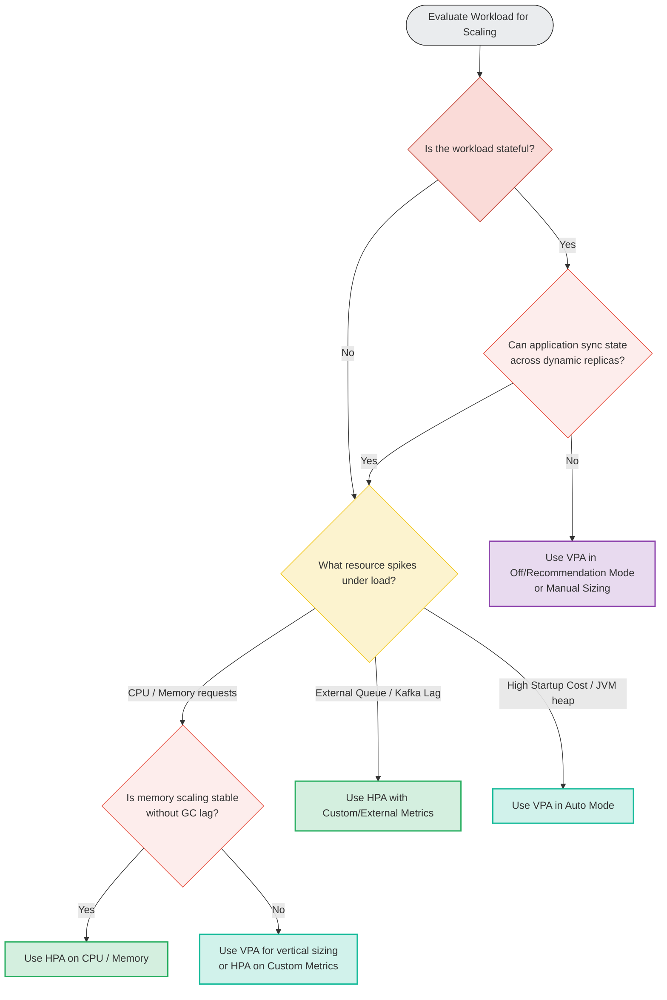

# 📐 Scaling Decision Tree

This decision tree helps platform engineers choose the correct autoscaling mechanism for different types of applications.

### Explanatory Summary
* **Stateful vs. Stateless:** Stateless applications are natural candidates for HPA (horizontal scaling). Stateful applications (like databases) require VPA or manual sizing unless they have native horizontal clustering support (e.g., Elasticsearch, Cassandra).
* **Lagging vs. Leading metrics:** For queue consumers (Kafka, RabbitMQ, SQS), scale on queue depth / lag using Custom/External metrics. CPU/Memory is usually a lagging indicator.
* **HPA vs. VPA Conflict:** Avoid running HPA and VPA together on the same metric (CPU/Memory). If memory is unstable due to runtime engine GC habits, prefer VPA (vertical resizing) or HPA scaled on custom application metrics (e.g. connections).
