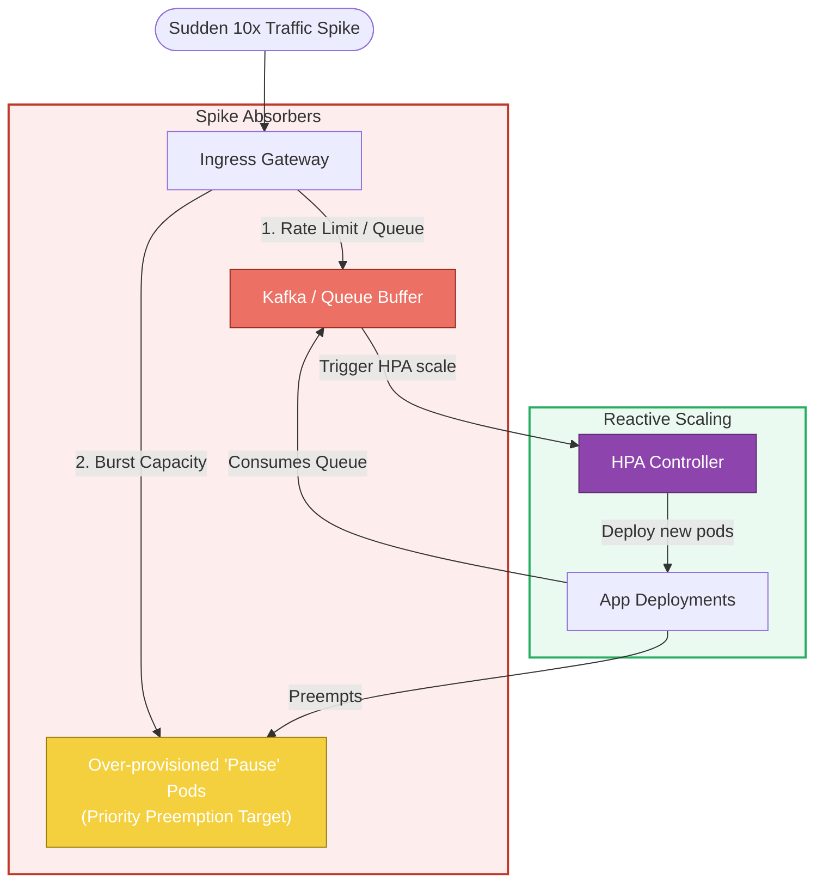

# 📐 Traffic Spike Handling

This diagram illustrates the mitigation steps and components involved in absorbing sudden, massive traffic surges.

### Explanatory Summary
* **Queue Buffering:** For asynchronous processes, traffic surges are absorbed by queue systems (like Kafka or RabbitMQ) while the scale-up takes place. This avoids application resource exhaustion.
* **Warm Standby via Pause Pods:** SREs configure low-priority "Pause" pods (running a sleep loop) that reserve space on nodes. When high-priority application pods scale up, the scheduler evicts the low-priority pause pods instantly, giving the application immediate head-room without waiting for new VMs to boot.
