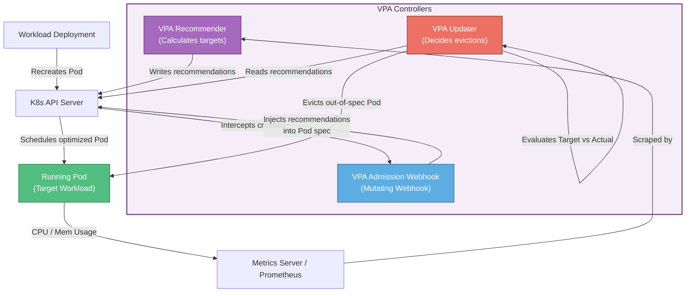

# 📐 Vertical Pod Autoscaler (VPA) Workflow

This diagram shows how VPA monitors workloads, generates resource recommendations, and executes auto-adjustments.

### Explanatory Summary
1. **Usage Monitoring:** The **Recommender** pulls historical and current CPU/Memory usage metrics from the Metrics Server or Prometheus.
2. **Recommendation Generation:** The Recommender continually updates the VPA resource object's `status.recommendation` block with target requests and limits (Lower Bound, Target, Upper Bound, Uncapped Target).
3. **Eviction Loop:** In `Auto` mode, the **Updater** watches running pods. If a pod's current CPU/memory settings deviate significantly from the recommended target, the Updater evicts the pod.
4. **Mutating Webhook Injection:** When the Deployment controller recreates the evicted pod, the creation request is intercepted by the **VPA Mutating Admission Webhook**. The webhook replaces the developer-configured requests/limits with the VPA's latest target recommendations before scheduling the pod to a node.
