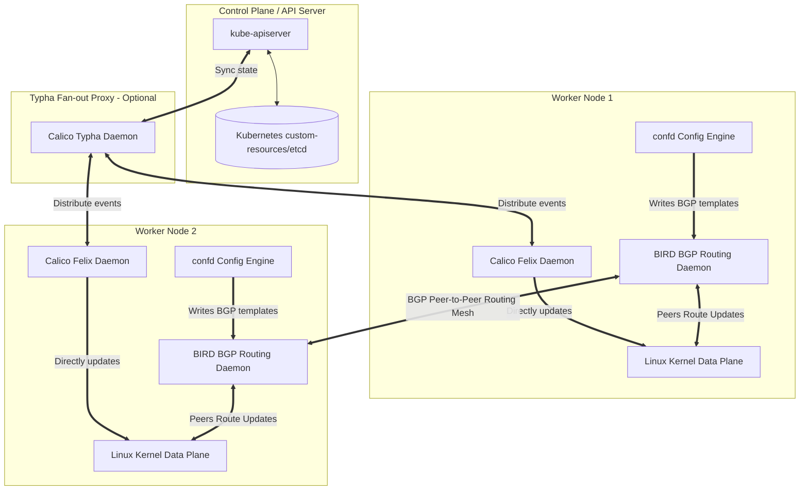

# Calico Component Architecture

This diagram illustrates how Calico's control plane and data plane components communicate to configure routing and policy enforcement across a Kubernetes cluster.

### Components Decoded:
1. **Felix:** The brain of Calico on each host. It programs IP routes, configures network interfaces, and writes iptables or eBPF chains to enforce Network Policies.
2. **BIRD:** A dynamic routing daemon that exchanges IP routing information with BIRD on other nodes using BGP, ensuring nodes know how to reach remote Pod CIDRs directly.
3. **Confd:** Listens to the Calico datastore for changes in network settings, generating configuration files for BIRD dynamically.
4. **Typha:** Sits between Felix and the Kubernetes API server in large clusters. Felix agents query Typha instead of the API server directly, reducing the connection load on the Kubernetes control plane.
5. **Datastore:** Calico stores its configurations (like IP Pools and Profile policies) inside the standard Kubernetes database (`etcd`) via Custom Resource Definitions (CRDs).
