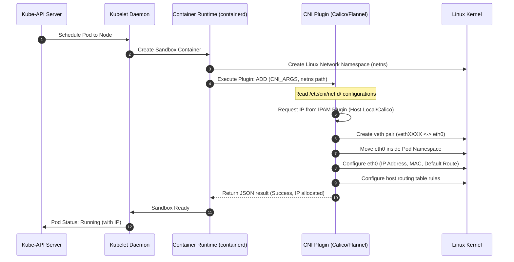

# Container Network Interface (CNI) Workflow

This diagram outlines how Kubelet invokes the CNI plugin on Pod initialization and deletion.

### Key Lifecycle Operations:
* **`ADD` Execution:** Invoked when starting a container. The runtime passes container ID, network namespace path, network configuration JSON, and container-specific arguments.
* **IPAM Delegation:** CNI plugins separate network routing from IP address management. They delegate IP allocation to specialized IPAM plugins (e.g., allocating a slice of a CIDR).
* **`DEL` Execution:** Invoked when destroying a container. It triggers CNI to free the IP address back to the pool and delete the virtual ethernet interfaces from the host.
