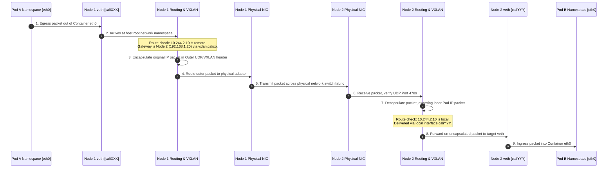

# Cross-Node Packet Communication Flow

This sequence diagram traces the step-by-step path of a single packet as it crosses kernel-space and physical interface boundaries from a source Pod on Node 1 to a destination Pod on Node 2.

### Protocol Plumbing Steps:
1. **Network Namespace Boundary:** The packet crosses the container-to-host border via a virtual ethernet pipe (`veth`).
2. **Host Routing Decision:** The host Linux kernel inspects the destination IP against its routing table (`ip route`).
3. **Encapsulation Device:** Traffic is directed to the overlay network device (e.g. `vxlan.calico`), which dynamically appends outer IP headers.
4. **Physical Network:** Standard routers and switches in the physical datacenter only see the outer host node IPs, routing the packet like standard host-to-host traffic.
5. **Decapsulation and Local Delivery:** The receiving node processes the incoming outer packet, unpacks the original payload, and directs it to the correct virtual interface in the target container.
