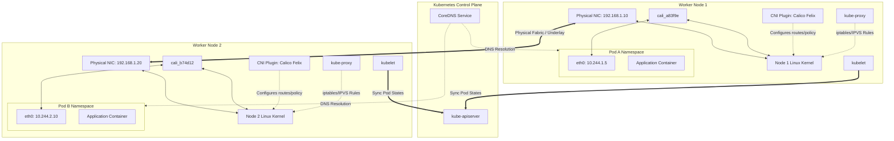

# Kubernetes Networking Architecture

This diagram illustrates the comprehensive structural architecture of Kubernetes networking, showing node boundaries, virtual namespaces, interface connections, and the control loop elements.

### Architectural Concepts:
1. **Network Namespaces (`netns`):** Each Pod has its own isolated network stack (interfaces, routing table, firewall rules).
2. **Virtual Ethernet (`veth`):** Act as physical patches between the isolated container namespace and the host's root namespace.
3. **Kube-Proxy:** Operates in the background, writing firewall rules (`iptables` or `IPVS`) inside the host's kernel to direct service VIP traffic to target Pods.
4. **Felix (Calico CNI):** Programs routing and firewall rules locally on each node based on API server configuration states.
