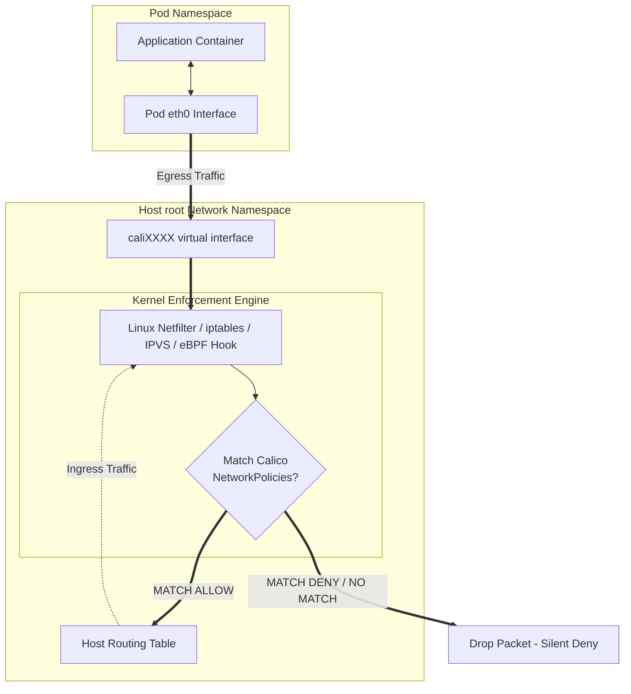

# Network Policy Enforcement Points

This diagram shows where network policies are evaluated in the kernel packet path (using iptables, Netfilter, or eBPF hooks) as traffic attempts to enter or exit a Pod's virtual interface.

### Key Enforcement Points:
1. **Virtual Interface Boundary:** Policies are applied directly at the `veth` boundary in the host namespace. Placing firewall rules here ensures that unauthorized packets are dropped *before* consuming Pod CPU resources or entering the container's namespace.
2. **Default Deny Implementation:** Calico constructs filter chains using iptables `PREROUTING`/`FORWARD` hooks or eBPF programs. If a Pod is selected by a policy, a default drop rule is appended. Packets that fail to match an explicit `allow` rule are dropped.
3. **eBPF Acceleration:** In modern configurations, Calico bypasses the iptables kernel subsystem entirely. It attaches eBPF bytecode programs directly to the `tc` (Traffic Control) ingress/egress queues of the `veth` interfaces, dropping or forwarding packets in microseconds.
