# Packet Flow Between Pods

This diagram details and contrasts the network routing paths for local Pod-to-Pod traffic (on the same worker node) versus remote Pod-to-Pod traffic (across separate worker nodes).

```mermaid
graph TD
    subgraph Case1 [Scenario A: Same-Node Communication]
        PodA1[Pod A - 10.244.1.5]
        PodB1[Pod B - 10.244.1.12]
        
        HostBridge[Host Routing Engine]
        
        PodA1 ==> |eth0| vethA1[cali_a83f9e]
        vethA1 ==> |Route Check| HostBridge
        HostBridge ==> |Direct delivery| vethB1[cali_b22e11]
        vethB1 ==> |eth0| PodB1
    end

    subgraph Case2 [Scenario B: Cross-Node Routing via VXLAN]
        subgraph Node1 [Worker Node 1]
            PodA2[Pod A - 10.244.1.5]
            vethA2[cali_a83f9e]
            Kernel1[Kernel Route Table]
            VXLANDev1[vxlan.calico Device]
            PhysNic1[Physical NIC]
            
            PodA2 ==> |eth0| vethA2
            vethA2 ==> Kernel1
            Kernel1 ==> |Route to 10.244.2.0/24| VXLANDev1
            VXLANDev1 ==> |Encapsulate Frame| PhysNic1
        end

        subgraph Node2 [Worker Node 2]
            PhysNic2[Physical NIC]
            VXLANDev2[vxlan.calico Device]
            Kernel2[Kernel Route Table]
            vethB2[cali_b74d12]
            PodB2[Pod B - 10.244.2.10]
            
            PhysNic2 ==> |Receive UDP 4789| VXLANDev2
            VXLANDev2 ==> |Decapsulate Frame| Kernel2
            Kernel2 ==> |Local Route| vethB2
            vethB2 ==> |eth0| PodB2
        end

        PhysNic1 ==> |Overlay Network Transmission| PhysNic2
    end
```

### Path Trace:
* **Same-Node Path:** Since both Pod namespaces are on the same machine, the host kernel intercepts the packet egressing `vethA1`, checks the local ARP table, determines that the destination IP `10.244.1.12` resides on local interface `cali_b22e11`, and copies the packet directly to it without hitting the physical network adapter.
* **Cross-Node Path:** The kernel on Node 1 checks the route table, recognizes that `10.244.2.10` matches a CIDR block hosted on Node 2, forwards it to the VXLAN virtual adapter for UDP wrapping, sends it over the wire, and the receiving node decapsulates the packet to deliver it to Pod B's `veth` endpoint.
