# Pod Networking Lifecycle

This diagram demonstrates the timeline and state machine transitions of Pod network creation and decommissioning.

```mermaid
stateDiagram-v2
    [*] --> Scheduled : Pod Scheduled to Node
    Scheduled --> NamespaceCreated : Kubelet creates container sandbox
    NamespaceCreated --> CNI_AddInvoked : CRI calls CNI ADD command
    
    state CNI_AddInvoked {
        [*] --> IPAM_Allocated : Allocate Pod IP from CIDR pool
        IPAM_Allocated --> InterfacesCreated : Create veth pair on Node
        InterfacesCreated --> InterfaceMoved : Move eth0 into Pod netns
        InterfaceMoved --> RoutesProgrammed : Add default route to host gateway
    }

    CNI_AddInvoked --> NetworkReady : CNI returns success JSON
    NetworkReady --> ContainersStarted : Sidecars and Main App container launch
    ContainersStarted --> Running : Pod status updated to Active
    
    Running --> Terminating : Delete Pod requested
    Terminating --> CNI_DelInvoked : CRI calls CNI DEL command
    
    state CNI_DelInvoked {
        [*] --> InterfacesDeleted : Remove host veth and inner eth0
        InterfacesDeleted --> IP_Released : Return Pod IP to IPAM pool
    }

    CNI_DelInvoked --> NamespaceDestroyed : Clean up network namespace
    NamespaceDestroyed --> [*] : Pod resource fully cleaned up
```

### Key Phases:
1. **Pending State:** Pod scheduling has occurred, but networking is not configured.
2. **Plumbing State (CNI `ADD`):** The network namespace is empty. CNI sets up the link, assigns IP, and attaches it to the host routing fabric.
3. **Active State:** Applications can send packets. Kubernetes updates Endpoints/EndpointSlices so Service routing can proceed.
4. **Tearing Down (CNI `DEL`):** Avoids IP address leaks by freeing allocated addresses and cleaning up kernel virtual interfaces.
