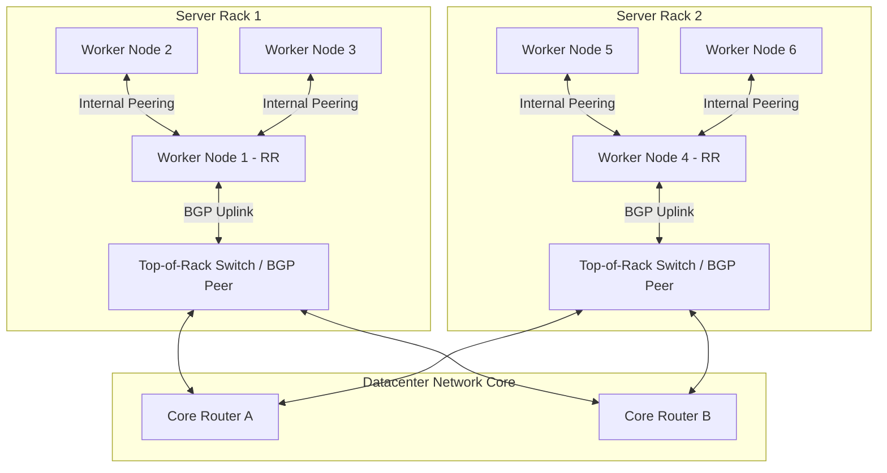

# Production Network Topology (BGP Peering)

This diagram visualizes a scalable production network topology utilizing BGP Route Reflectors and Top-of-Rack (ToR) hardware routers, avoiding the O(N²) scaling overhead of a full-mesh BGP network.

### Architectural Concepts:
1. **Full-Mesh vs. Route Reflectors:** In standard BGP configurations, every node must establish a peering connection with every other node. In a 100-node cluster, this requires 4,950 connections. Calico solves this by dedicating specific nodes as **Route Reflectors (RR)**, aggregating routing updates and broadcasting them to non-reflector nodes.
2. **Top-of-Rack (ToR) Integration:** In on-premises and bare-metal environments, Calico BIRD daemons peer directly with physical ToR switch routers. This enables Pod IPs to be routed natively across the entire datacenter without overlay network encapsulation overhead.
3. **High Availability Routing:** Nodes are connected to redundant ToR switches, using Equal-Cost Multi-Path (ECMP) routing to distribute traffic across parallel uplinks.
