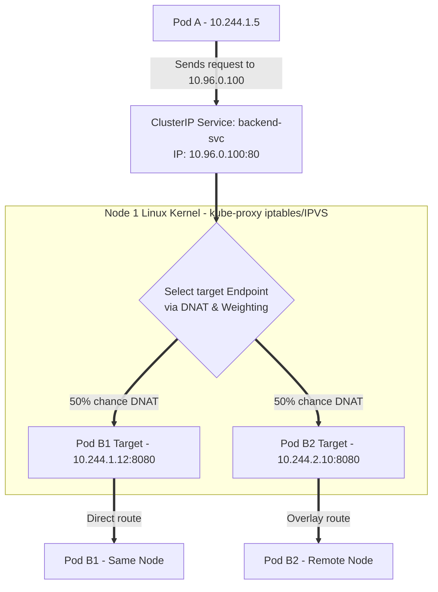

# Service-to-Service Communication

This diagram illustrates how virtual Service IP addresses (ClusterIPs) are translated into actual Pod target IPs using Netfilter DNAT rules configured by kube-proxy.

### Destination NAT (DNAT) Mechanics:
1. **Virtual VIP:** A Service IP (ClusterIP) does not correspond to a physical network adapter. It exists only as a configuration entry in host NAT tables.
2. **Kube-Proxy Sync Loop:** Kube-proxy monitors the Kubernetes API for Services and Endpoints. It constantly updates the node's `iptables` or `IPVS` rules to map Service IPs to active Pod IPs.
3. **Randomized Load Balancing:** When a packet targeted at `10.96.0.100` leaves Pod A, the host kernel intercepts it and applies DNAT (Destination Network Address Translation), replacing the destination Service IP with a randomly chosen backend Pod IP (e.g. `10.244.2.10`) before routing.
