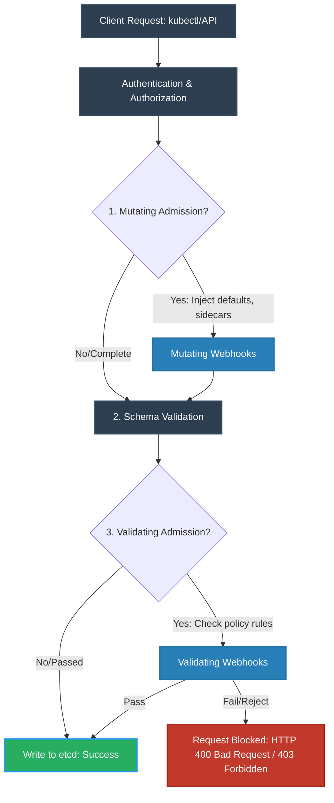

# Admission Controller Workflow

This diagram outlines how API requests are processed through mutating and validating admission webhooks.

### Request Lifecycle Phases:
1. **Mutating Phase:** Modifies incoming resource requests. For example, it might auto-inject a sidecar container, mount volumes, or add default resource limits.
2. **Schema Validation:** Verifies that the JSON/YAML complies with the OpenAPI schema of the resource.
3. **Validating Phase:** Checks the request against strict policy rules (e.g., verifying if image digests are signed, or if a user is trying to deploy a container running as root). Validating controllers are run in parallel.
4. **Persist:** Once all validating webhooks return an allow decision, the request is written to `etcd`.
