# Client Authentication Flow

This sequence diagram details how the Kubernetes API Server validates incoming requests from users and workloads.

```mermaid
sequenceDiagram
    autonumber
    actor Developer as Kubernetes Client / Pod
    participant API as Kube-API Server
    participant CertAuth as X.509 Client Cert Authenticator
    participant OIDCBound as OIDC Authenticator (Dex/Okta)
    participant SAAuth as Service Account Authenticator
    participant UserDB as Username/Groups Context

    Developer->>API: HTTPS Request (TLS + Auth Header or Cert)
    
    rect rgb(30, 41, 59)
        Note over API, SAAuth: Authentication Phase (First matching authenticator wins)
        
        alt X.509 Certificate Authentication
            API->>CertAuth: Validate TLS Client Cert
            CertAuth-->>API: Match (CN=jane, O=devs) -> Authenticated
        else OIDC JWT Token
            API->>OIDCBound: Validate JWT Header (ID Token)
            OIDCBound-->>API: Match (sub=jane@enterprise.com) -> Authenticated
        else Service Account Token
            API->>SAAuth: Validate Token (Signed JWK / Secret)
            SAAuth-->>API: Match (system:serviceaccount:production:secure-app-sa) -> Authenticated
        end
    end

    alt Authentication Success
        API->>UserDB: Populate Request Context (User, Groups)
        API->>API: Proceed to Authorization phase
    else Authentication Failure (All mechanisms fail)
        API-->>Developer: HTTP 401 Unauthorized
    end
```

### Key Mechanisms:
* **X.509 Client Certificates:** Used by internal cluster components (like Kubelet) and admin tools. The username is parsed from the Common Name (`CN`), and groups are parsed from the Organization (`O`).
* **OIDC Tokens (JWT):** The enterprise standard for human users. The API Server validates the signature against the external identity provider (IdP) metadata.
* **Service Account Tokens:** Bound to pod lifecycles (TokenRequest API). These are short-lived JSON Web Tokens signed by the API Server's private key.
