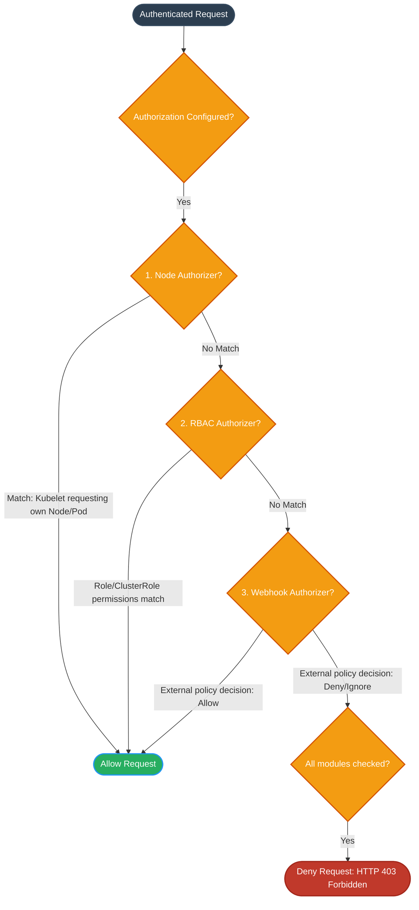

# Authorization Workflow

This diagram outlines how Kubernetes processes a request through different authorization modules (Node, RBAC, Webhook) and determines whether to allow or deny the action.

### Authorization Modules:
1. **Node Authorizer:** A special-purpose authorization mode that specifically authorizes API requests made by kubelets to read/modify their own node or pods.
2. **RBAC (Role-Based Access Control):** The default authorization mode. Evaluates Roles and ClusterRoles configured within the cluster.
3. **Webhook Authorizer:** Delegates authorization decisions to an external HTTP endpoint (e.g., OPA Gatekeeper or custom policy engines).
4. **Deny by Default:** If no authorizer explicitly allows the request, it is denied by default (least privilege principle).
