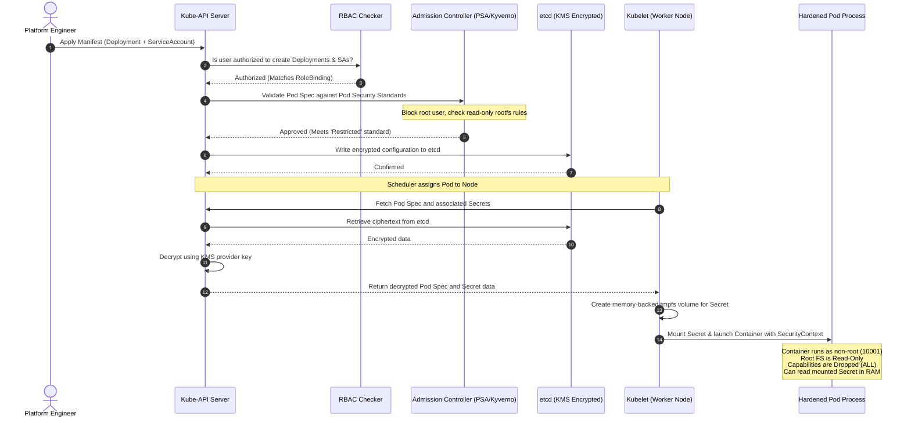

# End-to-End Kubernetes Security Model

This comprehensive sequence diagram connects all the day's security concepts (RBAC, Service Accounts, Admission Controllers, Secret Protection, and Pod Security Contexts) into a single unified deployment lifecycle.

### Complete Defense-in-Depth Lifecycle:
1. **At the API Gate:** The request is authenticated and authorized via RBAC.
2. **At Admission Control:** The request is validated against organizational policy (PSA/Kyverno).
3. **At the Storage Layer:** The manifest details and secret content are written to etcd in encrypted format.
4. **On the Node:** Kubelet accesses API server using mutual TLS client certificate, downloading secrets only for pods scheduled to itself.
5. **In Memory:** Secrets are stored in RAM (`tmpfs`), preventing host leakage.
6. **In Execution:** The container process runs under restricted Linux user contexts, isolated by kernel namespaces, seccomp filters, and dropped capabilities.
