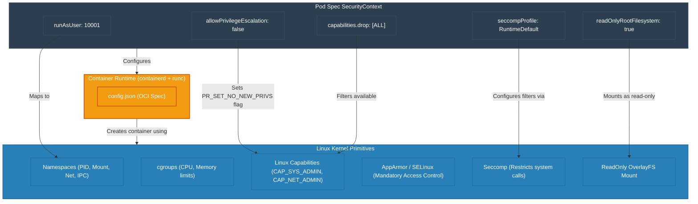

# Pod Security Context Architecture

This diagram illustrates how Kubernetes Pod Security Context definitions are translated by the container runtime into Linux kernel-level isolation mechanisms.

### Kernel Hardening Features:
1. **Namespaces:** Provide isolation (e.g., a process inside the container cannot see processes on the host or in other containers).
2. **Capabilities:** Linux divides root privileges into distinct privileges (capabilities). Dropping `ALL` ensures even if a process runs as root inside the container, it cannot execute administrative actions (like changing routing tables).
3. **Seccomp (Secure Computing Mode):** Filters system calls (e.g., blocking `ptrace` or `sys_chroot`) that could be used for container escapes.
4. **AppArmor / SELinux:** Controls which files, network ports, and devices a containerized application can access.
