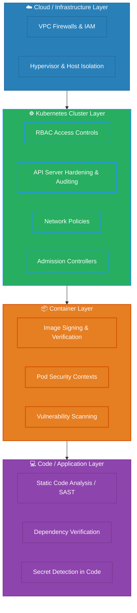

# Production Security Layers (The 4Cs)

This diagram visualizes the layered defense-in-depth model of Kubernetes security, starting from the physical infrastructure/cloud up to the application code.

### The 4Cs Security Model:
1. **Cloud/Infrastructure:** The foundation. Secure the OS host, restrict external network access, and apply Cloud provider IAM policies. If the host is compromised, everything running on it is compromised.
2. **Cluster:** Securing the control plane and workloads. This is where RBAC, Network Policies, etcd encryption, and Admission Controllers reside.
3. **Container:** Hardening the artifact. Use minimal base images (distroless), drop privileges in the container runtime, and scan images for CVEs.
4. **Code:** The source layer. Ensure the application code is free of SQL injection, doesn't leak secrets in source, and uses secure dependencies.
