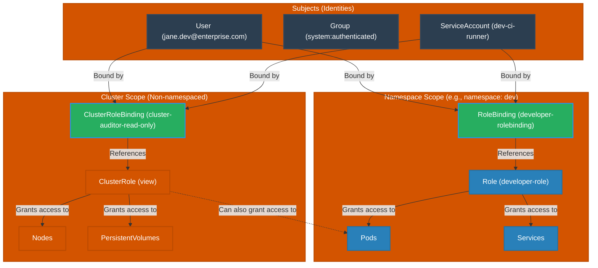

# Role-Based Access Control (RBAC) Architecture

This diagram illustrates how Kubernetes associates subjects (Users, Groups, Service Accounts) with permissions using Roles, ClusterRoles, RoleBindings, and ClusterRoleBindings.

### Key Differences:
1. **`Role`**: Namespaced policy that defines what API resources and verbs are allowed in a single namespace.
2. **`ClusterRole`**: Cluster-wide policy that defines permissions for non-namespaced resources (like nodes) or namespaced resources across *all* namespaces.
3. **`RoleBinding`**: Granting the permissions of a `Role` (or a `ClusterRole`) to subjects within a specific namespace.
4. **`ClusterRoleBinding`**: Granting permissions of a `ClusterRole` cluster-wide (across all namespaces and non-namespaced resources).
