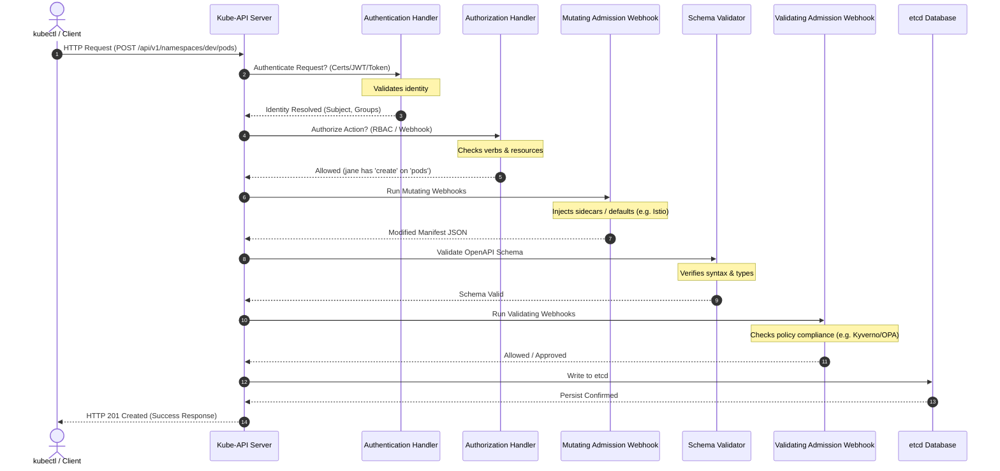

# Request Validation Pipeline

This workflow diagram describes the sequence of stages a request undergoes inside the `kube-apiserver` before write confirmation.

### Critical Stages:
* **Fail-Closed vs. Fail-Open Webhooks:** During Mutating and Validating phases, if a webhook does not respond, the API Server will either block the request (fail-closed) or allow it (fail-open) depending on the configuration. In production, security webhooks should be configured to fail-closed.
* **OpenAPI Schema Validation:** Prevents malformed or corrupted objects from polluting the etcd state.
