# Secret Storage and Access Flow

This diagram illustrates how Secrets are stored in etcd, how the API Server encrypts them, and how they are securely mounted into Pods.

```mermaid
sequenceDiagram
    autonumber
    participant Kubelet as Kubelet (Worker Node)
    participant API as Kube-API Server
    participant KMS as KMS Provider (e.g. Vault/KMS Plugin)
    participant Etcd as etcd Database
    
    rect rgb(30, 41, 59)
        Note over API, Etcd: Write Secret Flow (Creation)
        API->>API: Receive Secret (Base64 encoded)
        API->>KMS: Request Encryption (Plaintext Secret)
        KMS->>KMS: Encrypt with Key Encryption Key (KEK)
        KMS-->>API: Return Ciphertext
        API->>Etcd: Write Ciphertext
    end

    rect rgb(44, 62, 80)
        Note over Kubelet, Etcd: Read Secret Flow (Pod Mounting)
        Kubelet->>API: Get Secret (Needed for Pod start)
        API->>Etcd: Fetch Ciphertext
        Etcd-->>API: Return Ciphertext
        API->>KMS: Request Decryption (Ciphertext)
        KMS-->>API: Return Plaintext Secret
        API->>Kubelet: Send Decrypted Secret via TLS
        Kubelet->>Kubelet: Create tmpfs volume (Memory)
        Kubelet->>Kubelet: Write secret data to tmpfs mount
    end
```

### Key Security Best Practices:
1. **Never write secrets to persistent disk on the node:** Kubernetes handles secret mounts using `tmpfs` (a volatile RAM-based filesystem). When the Pod stops, the memory is cleared.
2. **Encrypt etcd at rest:** By default, secrets are stored in etcd as base64 strings (which is equivalent to plaintext). Using an EncryptionConfiguration with KMS ensures that a compromised etcd backup does not leak credentials.
3. **Limit Secret scope:** Only mount necessary secrets into the Pods that explicitly require them.
