# Service Account Token Lifecycle

This diagram demonstrates how Service Account tokens are requested, projected, mounted, and rotated inside Pods.

```mermaid
sequenceDiagram
    autonumber
    participant APIServer as Kube-API Server
    participant Kubelet as Kubelet Daemon
    participant Pod as Pod Container
    
    APIServer->>APIServer: ServiceAccount Object Created
    Note over Kubelet: Pod scheduled to Node
    Kubelet->>APIServer: TokenRequest API call (request token for SA)
    APIServer->>APIServer: Generate short-lived OIDC-compatible JWT
    APIServer-->>Kubelet: Return token payload (aud, exp, sub)
    
    Note over Kubelet: Mount token into container
    Kubelet->>Pod: Write token to /var/run/secrets/kubernetes.io/serviceaccount/token (tmpfs)
    
    Note over Pod: Pod reads token from mount to call API
    Pod->>APIServer: API Request with Bearer Token Header
    APIServer->>APIServer: Validate token signature and check RBAC
    
    rect rgb(30, 41, 59)
        Note over Kubelet, Pod: Rotation Loop (~every 1 hour or when 80% through lifetime)
        Kubelet->>APIServer: Request new token (TokenRequest API)
        APIServer-->>Kubelet: Return rotated token
        Kubelet->>Pod: Atomically write new token to tmpfs mount (via symlink update)
    end
```

### Key Security Enhancements (Bound Service Account Tokens):
* **Audience Binding:** Tokens are bound to a specific audience (e.g., the API Server). If a token is stolen, it cannot be used elsewhere.
* **Time Boundary:** Tokens expire (default is 1 hour). They are periodically refreshed and re-written by Kubelet.
* **Object Binding:** The token is tied to the Pod's lifecycle. If the Pod is deleted, the token is invalidated immediately by the API Server.
* **Non-Persistent:** Tokens are stored in a memory-backed file system (`tmpfs`) and never touch the host disk.
