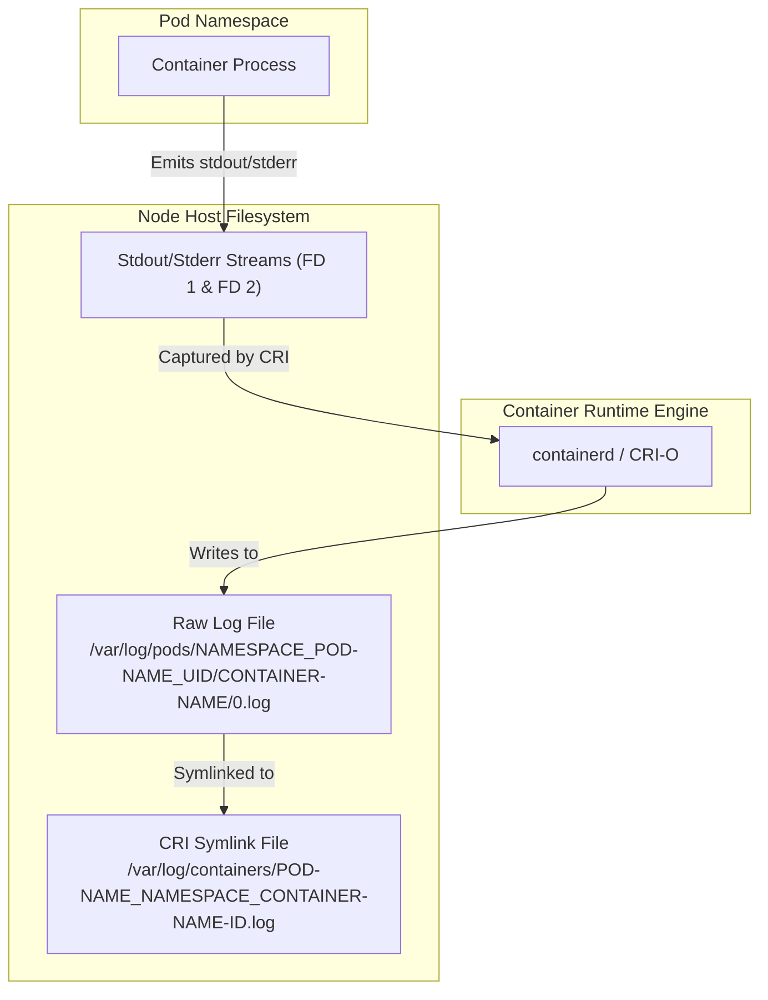

# Kubernetes Node-Level Logging Architecture

This diagram illustrates how container logs flow from a Pod to the physical files on the host node, and how container engines structure symlinks for easier shipper access.

### Key Architectural Concepts:
* **Runtime Capture:** The container runtime daemon is responsible for capturing file descriptors 1 (`stdout`) and 2 (`stderr`) of the root container process and writing them to the host file system.
* **Storage Path Hierarchy:**
  * The raw source is stored in `/var/log/pods/` using a folder naming convention that includes the Pod UID to prevent conflicts during re-schedulings.
  * A flatter, readable symlink is generated under `/var/log/containers/` to help collectors easily query logs using filename pattern matching.
