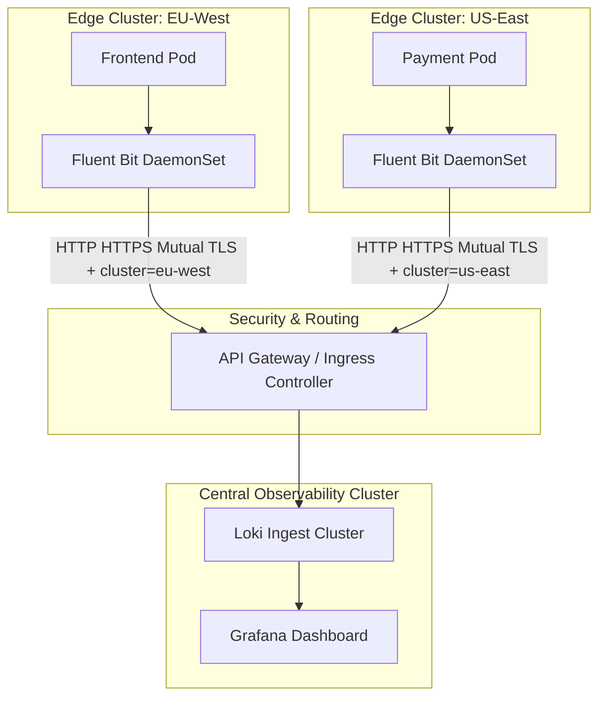

# Multi-Cluster Logging Architecture

This hub-and-spoke architecture diagram shows how logs from multiple geographic or logical Kubernetes clusters are aggregated into a single centralized observability cluster.

### Key Multi-Cluster Patterns:
* **Mutual TLS (mTLS):** Ensures logs are encrypted in transit over public networks.
* **Cluster Tagging:** The shipper injects a static cluster identifier label (e.g. `cluster="eu-west"`) at the edge, allowing users to query logs globally or filter by specific environments.
* **Local Buffer Gateways:** If the central hub goes offline, edge collectors buffer logs locally to prevent data loss.
