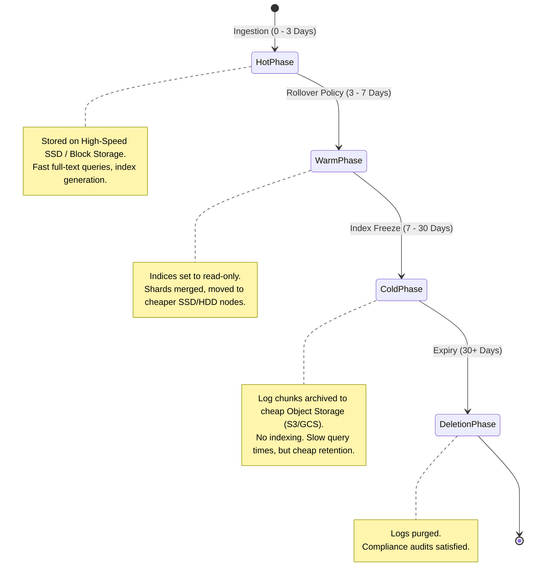

# Log Lifecycle & Retention Management

This state diagram details the lifecycle of logging data as it ages, showing transitions between storage tiers to optimize costs.

### Operational Lifecycle Optimization:
* **ILM (Index Lifecycle Management):** Elasticsearch automates these transitions using index templates.
* **Loki Retention Policy:** Loki uses a compactor service to scan object storage and delete chunks older than the retention limit (e.g., 30 days).
