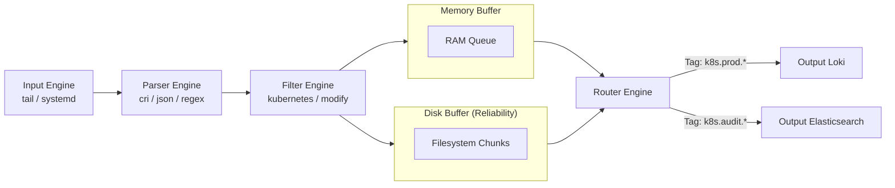

# Fluent Bit Processing Pipeline

This diagram shows how Fluent Bit ingests log strings, converts them to internal binary tables, enriches/modifies them, manages backpressure using buffers, and routes them to destinations.

### Pipeline Details:
1. **Input:** Collects data streams from sources. Tailing `/var/log/containers/*.log` assigns a tag (e.g., `kube.var.log.containers.pod_ns_container.log`).
2. **Parser:** Parses unstructured text into JSON maps.
3. **Filter:** Modifies records. The `kubernetes` filter contacts Kube-API or local cache to append pod metadata using the filename tag.
4. **Buffer:** Temporarily holds logs. If downstream backpressure occurs, items write to disk to prevent OOM errors.
5. **Router & Output:** Evaluates output rules against tags and sends logs to endpoints.
