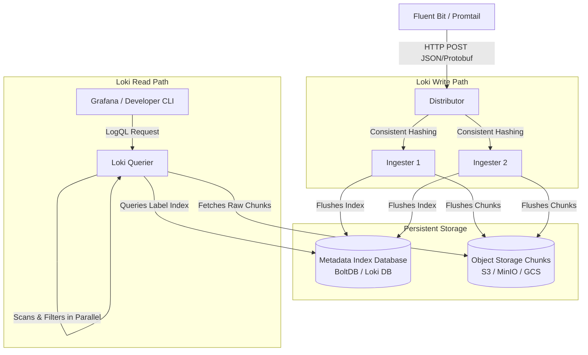

# Grafana Loki Architecture

This diagram shows Loki's write and read paths. It highlights how write streams bypass indexing for raw content, while the read path queries chunk indexes and parses raw streams.

### Components Summary:
* **Distributor:** Validates incoming streams, checks ingestion rate limits, and uses consistent hashing to assign streams to Ingesters.
* **Ingester:** Buffers incoming log lines in memory, groups them into chunks, and periodically flushes compressed logs to object storage.
* **Querier:** Handles LogQL execution by fetching index metadata to discover relevant chunks, retrieving the chunks from object storage, and scanning lines in parallel.
