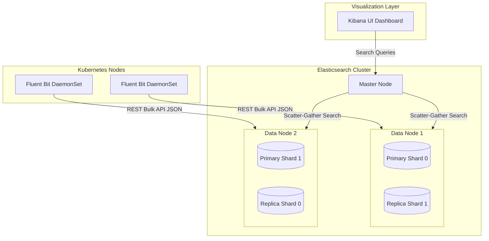

# EFK Logging Stack Architecture

This diagram details the full-text search layout of the EFK stack. It illustrates how log streams are indexed and searched using shards and replicas.

### Architectural Details:
* **Bulk Ingestion:** Fluent Bit bundles logs into JSON packages and writes them using the Elasticsearch bulk HTTP API (`_bulk`) to minimize network connections.
* **Master vs. Data Nodes:** Master nodes manage index mappings and cluster state. Data nodes hold index shards and execute writes and search lookups.
* **Sharding & Replicas:** Primary shards split indices for horizontal scaling, while replica shards sit on separate nodes to provide high availability and balance read traffic.
