# Log Collection Workflow

This sequence diagram outlines the chronological flow of log collection, showing the interaction between the application container, the runtime engine, the node file system, and the Fluent Bit DaemonSet.

```mermaid
sequenceDiagram
    autonumber
    actor App as App Container Process
    participant CRI as CRI Runtime (containerd)
    participant Disk as Host Log File (/var/log/pods/...)
    participant FB as Fluent Bit DaemonSet (Node Agent)
    participant K8sAPI as Kube-API Server

    App->>CRI: Writes logs to stdout stream
    CRI->>Disk: Appends raw log with CRI formatting header
    
    loop Log Tail Monitoring
        FB->>Disk: Detects file updates (inotify) and reads new bytes
    end

    rect rgb(30, 41, 59)
        Note over FB, K8sAPI: Metadata Enrichment Phase
        FB->>FB: Parses file name to extract Pod namespace and name
        FB->>K8sAPI: Look up Pod metadata (labels, annotations)
        K8sAPI-->>FB: Returns metadata JSON payload
    end

    FB->>FB: Appends Kubernetes tags to log payload
    FB->>FB: Filters out noisy logs & masks sensitive fields
    FB->>Disk: Buffer logs in local storage chunks (optional)
```

### Key Workflow Details:
1. **Asynchronous Tail:** Fluent Bit does not intercept traffic directly. It reads logs asynchronously from disk to avoid delaying application processes.
2. **Local Cache Optimization:** The Fluent Bit `kubernetes` filter caches metadata queries in memory so it does not overload the Kube-API Server with API calls.
