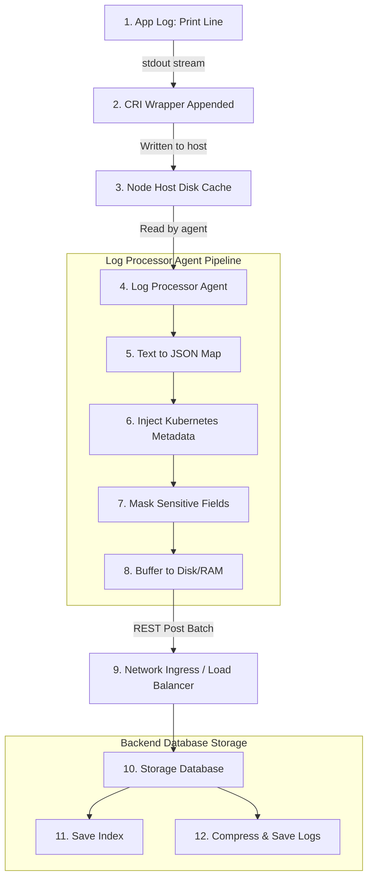

# Pod-to-Storage Log Packet Flow

This block diagram traces a log record's lifecycle, showing how it transforms from a plain text line in memory to an indexed log entry.

### Storage Stages:
* **Log Lines to JSON:** Converting flat strings to structural fields allows indices to reference specific elements (e.g. `service_name`).
* **Enrichment:** Metadata injection guarantees that logs can be queried by resource properties (namespace, labels, annotations) even after the target pod has been terminated.
