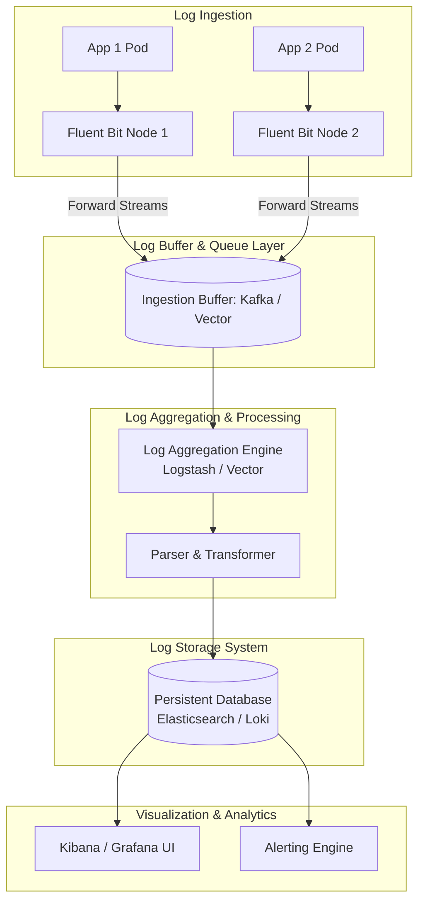

# Centralized Logging Pipeline Hierarchy

This pipeline diagram illustrates the stages of logging data management at an enterprise scale, highlighting data flow through buffer queues and ingestion layers.

### Ingestion Queue Layer:
* **Kafka/Vector Buffer:** At scale, storage databases (like Elasticsearch or Loki) can experience outages or latency spikes. Inserting a message queue buffer (like Kafka or Vector) protects the logging pipeline from data loss by absorbing incoming logs when backends are slow.
* **Decoupling writes:** The logging daemon forwards logs to the queue near-instantly, decoupling application nodes from database writes.
