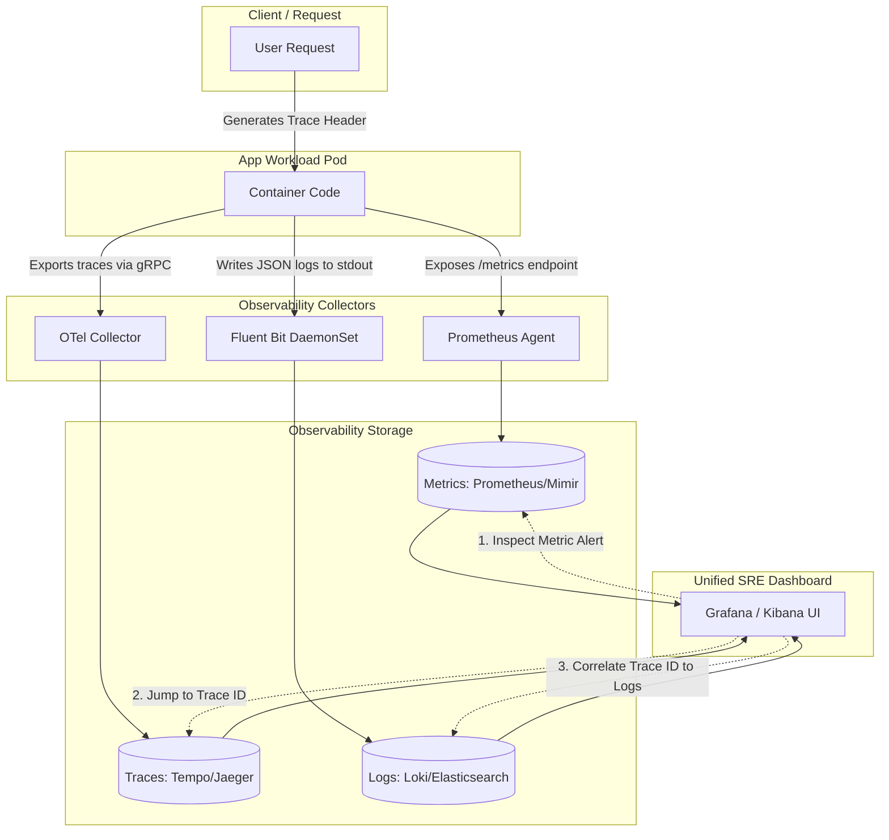

# Production Observability Architecture

This diagram shows how logging fits into the three pillars of observability (Metrics, Traces, and Logs) and how they correlate using trace IDs and metadata.

### The Correlation Loop:
1. **Metrics Alert:** A Prometheus alert fires because the `payment-service` request latency exceeds 2 seconds.
2. **Trace Inspection:** The SRE clicks the alert and opens Grafana Tempo to inspect the specific request trace, identifying that the payment service is blocked by a database query.
3. **Log Examination:** The dashboard uses the `TraceID` to query Loki, instantly showing only the log lines associated with that exact database query execution.
