# Log Search Workflow

This diagram outlines how log queries (such as LogQL queries) are processed by the storage cluster, demonstrating label filtering and text scanning.

```mermaid
sequenceDiagram
    autonumber
    actor SRE as SRE Engineer / UI
    participant Q as Querier Engine
    participant DB as Index Store (BoltDB)
    participant OS as Chunk Store (Object Storage S3)

    SRE->>Q: Submits query: {app="api-gateway"} |= "401 Unauthorized"
    Q->>DB: Resolves stream identifiers for label app="api-gateway"
    DB-->>Q: Returns list of stream IDs and matching Chunk UIDs
    
    rect rgb(30, 41, 59)
        Note over Q, OS: Fetching Chunks Phase
        Q->>OS: Requests matching raw compressed chunk files (Chunk UIDs)
        OS-->>Q: Returns compressed gzip chunk payloads
    end

    Q->>Q: Decompresses log chunks in memory
    Q->>Q: Runs text filter regex matching "401 Unauthorized"
    Q-->>SRE: Returns matched, chronological log list
```

### Search Insights:
* **Label Optimization:** Adding targeted labels (e.g. `env="prod"`, `app="gateway"`) helps Loki retrieve only the exact chunk files needed, minimizing network and CPU overhead.
* **Avoid High Cardinality:** Do not use labels for dynamic values (like `user_id` or `trace_id`), as this creates millions of tiny chunk directories, degrading database performance.
