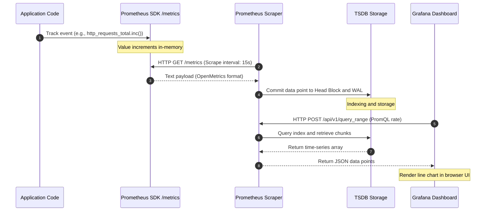
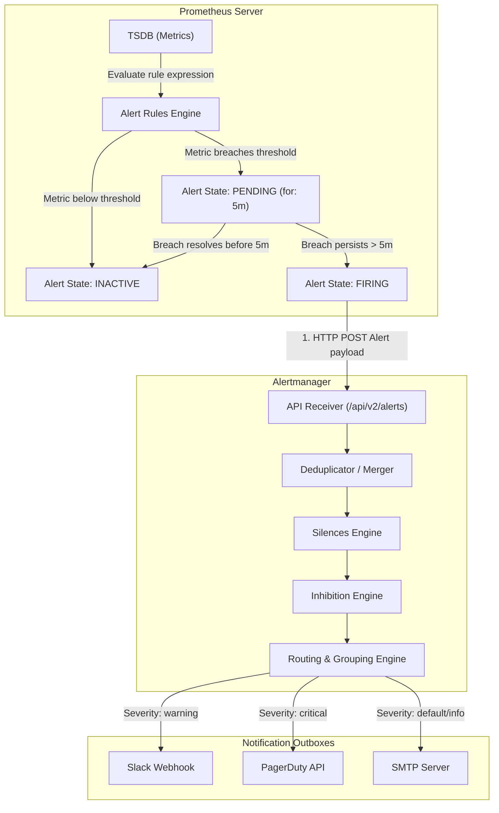
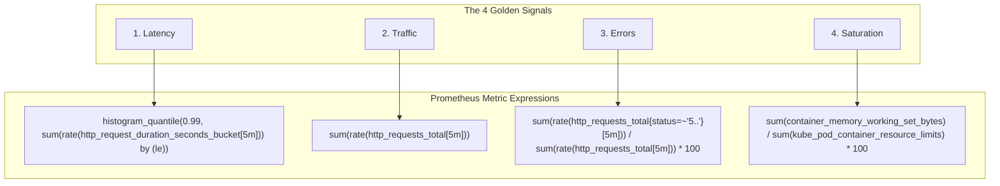
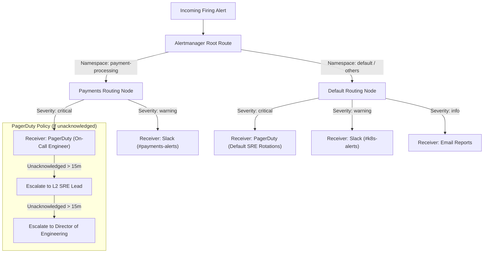
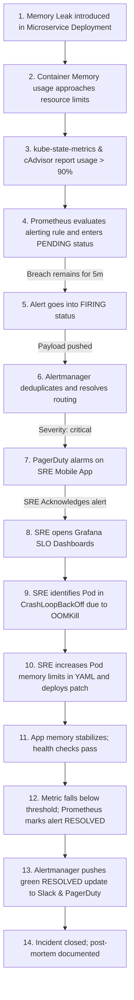

# 📊 Day 17 Diagrams: Observability & Monitoring Architecture

This handbook contains 12 professional diagrams depicting metrics pipelines, Prometheus architecture, Grafana rendering workflows, Alertmanager routing trees, and enterprise multi-cluster monitoring architectures.

---

## 1. Prometheus Core Architecture

This diagram details the internal subsystems of a Prometheus Server and how it interacts with external exporters, service discovery, push gateways, Alertmanager, and visualization platforms.

```mermaid
graph TD
    subgraph K8S ["Kubernetes Cluster / API Server"]
        SD["Service Discovery (Pods, Nodes, Endpoints)"]
    end

    subgraph PROME ["Prometheus Server"]
        RETRIEVAL["Retrieval Engine (Scrape Manager)"]
        
        subgraph TSDB ["TSDB (Time Series Database)"]
            WAL["Write-Ahead Log (WAL)"]
            HEAD["Head Block (Active Memory)"]
            COMPACT["Compactor / Disk Blocks (2h Chunks)"]
            HEAD -->|Flushed every 2 hours| COMPACT
        end
        
        RULES["Rules Engine (Alerting & Recording)"]
        WEBAPI["HTTP Web Server / PromQL Engine"]
        
        RETRIEVAL -->|Scrapes metrics| HEAD
        RETRIEVAL -->|Appends to WAL| WAL
        RULES -->|Queries TSDB via PromQL| TSDB
        WEBAPI -->|Queries TSDB| TSDB
    end

    subgraph TARGETS ["Scrape Targets"]
        NE["Node Exporter (:9100)"]
        KSM["kube-state-metrics (:8080)"]
        APP["Podinfo App (:9898)"]
    end

    subgraph PUSH ["Short-Lived Jobs"]
        GW["Pushgateway"]
    end

    subgraph OUT ["Alerting & Visualization"]
        AM["Alertmanager (:9093)"]
        GRAF["Grafana (:3000)"]
    end

    SD -->|Provides target lists| RETRIEVAL
    NE -->|Pull model| RETRIEVAL
    KSM -->|Pull model| RETRIEVAL
    APP -->|Pull model| RETRIEVAL
    GW -->|Pushes batch metrics| RETRIEVAL
    
    RULES -->|Sends alerts (Active/Firing)| AM
    GRAF -->|PromQL queries| WEBAPI
```

---

## 2. End-to-End Metrics Pipeline

The path a single metric takes from code instrumentation, down to dashboard rendering in Grafana.



---

## 3. Exporter Internal Workflow

How custom and system exporters bridge hardware syscalls and applications into a Prometheus-readable format.

```mermaid
graph LR
    subgraph Host ["Linux Host OS"]
        Kern["Kernel System Status"]
        Proc["/proc Filesystem"]
        Sys["/sys Filesystem"]
    end

    subgraph NodeExporter ["Node Exporter process"]
        ColCPU["CPU Collector"]
        ColMem["Memory Collector"]
        ColDisk["Diskstat Collector"]
        Registry["Prometheus Registry"]
        HTTPServer["Embedded HTTP Server"]
        
        Proc --> ColCPU
        Sys --> ColMem
        Kern --> ColDisk
        
        ColCPU --> Registry
        ColMem --> Registry
        ColDisk --> Registry
        Registry --> HTTPServer
    end

    Prom["Prometheus Scraper"] -->|Scrape Request /metrics| HTTPServer
    HTTPServer -->> Prom|Text response: node_cpu_seconds_total...|
```

---

## 4. Grafana Query and Visualization Flow

This diagram details the query path and visualization cycle from the user's dashboard view.

```mermaid
graph TD
    User["User Browser / UI"] -->|1. Opens Dashboard| Dash["Grafana Dashboard Engine"]
    Dash -->|2. Resolves variables (e.g., $namespace)| QueryVar["Dashboard Variables Manager"]
    QueryVar -->|3. Sends Range Query| Proxy["Grafana Datasource Proxy"]
    Proxy -->|4. PromQL: rate(http_requests_total[$__rate_interval])| PromAPI["Prometheus Web API (/api/v1/query_range)"]
    PromAPI -->|5. TSDB Scan| TSDB["Prometheus TSDB Block Reader"]
    TSDB -->|6. Chunks Array| PromAPI
    PromAPI -->|7. JSON Result| Proxy
    Proxy -->|8. Raw Metric Time-Series JSON| Dash
    Dash -->|9. Render Canvas Chart| User
```

---

## 5. Alerting Architecture & Lifecycles

This diagram illustrates how alert rules are processed and triggered in Prometheus, and routed, deduplicated, and resolved in Alertmanager.



---

## 6. Kubernetes Service Discovery Workflow

How Prometheus dynamically monitors cluster state and adjusts scrape targets in real-time.

```mermaid
graph TD
    subgraph ControlPlane ["Kubernetes Control Plane"]
        API["kube-apiserver"]
    end

    subgraph PromSD ["Prometheus Service Discovery Engine"]
        Watch["API Watcher (Role: endpoints, pods, nodes)"]
        TargetCache["Discovered Scrape Targets Cache"]
        Relabel["Relabel Config Processor"]
        Active["Active Scrape Targets list"]
        
        API -->|Long Poll/Watch endpoints stream| Watch
        Watch --> TargetCache
        TargetCache --> Relabel
        Relabel -->|Filter out unscraped pods (keep)| Active
        Relabel -->|Drop matching regex| Drop["Target Dropped"]
    end

    subgraph Nodes ["Worker Nodes"]
        PodA["Pod A (prometheus.io/scrape=true)"]
        PodB["Pod B (No annotations)"]
    end

    Active -->|Scrape Loop (15s)| PodA
    Drop -.-> PodB
```

---

## 7. The SRE Golden Signals Model

How Golden Signals are monitored on typical API services, Kafka clusters, and databases.



---

## 8. Enterprise Multi-Cluster Monitoring Architecture

A standard production design utilizing Thanos for global querying and long-term metric storage.

```mermaid
graph TD
    subgraph ClusterProd ["Production Cluster (US-East)"]
        AgentE["Prometheus Agent Mode"]
        AppE["Workloads"]
        AgentE -->|Scrapes| AppE
    end

    subgraph ClusterDev ["Staging Cluster (US-West)"]
        AgentW["Prometheus Agent Mode"]
        AppW["Workloads"]
        AgentW -->|Scrapes| AppW
    end

    subgraph ObservabilityCluster ["Observability Hub Cluster"]
        ThanosRecv["Thanos Receiver Gateway"]
        ThanosStore["Thanos Store Gateway"]
        ThanosQuery["Thanos Global Querier"]
        Grafana["Grafana Engine"]
        
        ThanosQuery --> ThanosRecv
        ThanosQuery --> ThanosStore
        Grafana -->|Query request| ThanosQuery
    end

    subgraph CloudStorage ["Object Storage (AWS S3 / GCP GCS)"]
        Bucket["Long-term Metric Bucket"]
    end

    AgentE -->|Remote Write metrics stream| ThanosRecv
    AgentW -->|Remote Write metrics stream| ThanosRecv
    ThanosRecv -->|Uploads TSDB block chunks (every 2h)| Bucket
    ThanosStore -->|Reads historical index & blocks| Bucket
```

---

## 9. Alert Routing and Escalation Workflow

How Alertmanager handles classification, routing rules, silence intervals, and escalation logic.



---

## 10. Multi-Cluster Metrics Federation

An alternative model using Prometheus Federation, where a central server scrapes aggregated metrics from regional edge Prometheus servers.

```mermaid
graph TD
    subgraph CentralHub ["Central Management Cluster"]
        PromCentral["Central Prometheus Server"]
    end

    subgraph EastCluster ["Region US-East Cluster"]
        PromEast["Prometheus Server (US-East)"]
        TargetsEast["Regional App Nodes"]
        PromEast -->|Scrapes| TargetsEast
    end

    subgraph WestCluster ["Region US-West Cluster"]
        PromWest["Prometheus Server (US-West)"]
        TargetsWest["Regional App Nodes"]
        PromWest -->|Scrapes| TargetsWest
    end

    PromCentral -->|Scrapes federated endpoint: /federate?match[]='{__name__=~"job:.*"}'| PromEast
    PromCentral -->|Scrapes federated endpoint: /federate?match[]='{__name__=~"job:.*"}'| PromWest
```

---

## 11. End-to-End Metrics Lifecycle

The lifecycle of metrics database compaction, WAL writing, downsampling, and long-term object retention.

```mermaid
graph TD
    subgraph RAM ["1. Active Memory (In-Memory Buffer)"]
        Write["Metric write event"] --> WAL["Write-Ahead Log (WAL) for crash recovery"]
        Write --> Head["Head Block (Holds active data: 0 to 2 hours)"]
    end

    subgraph LocalDisk ["2. Local Persistent Storage"]
        Head -->|Compacted & flushed every 2h| Block["TSDB Block (Metadata + Chunk Index + Samples)"]
        WAL -->|Truncated after block flush| Trunc["WAL Purged"]
    end

    subgraph LongTerm ["3. Remote Long-Term Retention"]
        Block -->|Thanos Sidecar uploads| RemoteBucket["S3/GCS Object Bucket"]
        RemoteBucket -->|Thanos Compactor merges blocks| Comp["Merged Historical Blocks"]
        Comp -->|Downsampled to 5m resolution (after 40h)| Down5["5m Downsampled Data"]
        Comp -->|Downsampled to 1h resolution (after 10d)| Down1h["1h Downsampled Data"]
        Comp -->|Retention rule expiry (e.g. 1 year)| Delete["Permanently Deleted"]
    end
```

---

## 12. SRE Incident Detection and Resolution Lifecycle

A full operational workflow of an SRE detecting an incident, triaging, implementing a patch, and resolving the alert.


