# 🖼️ Production Observability Visual Guide: 12 Tracing Diagrams

This folder contains high-resolution architecture diagrams mapped using Mermaid. These diagrams serve as visual templates for internal training or architecture design reviews.

---

## 1. Trace Lifecycle
*Visualizes the journey of trace data from application instrumentation to storage and query.*

```mermaid
graph TD
    User["User Trigger Action"] -->|1. Generate Request| App["Application Code (Instrumented)"]
    App -->|2. Create API Span| OTelSDK["OpenTelemetry SDK in App"]
    OTelSDK -->|3. Buffer & Batch Spans| Queue["In-Memory Span Queue"]
    Queue -->|4. Push (OTLP/gRPC)| OTelAgent["OTel Collector (DaemonSet Agent)"]
    OTelAgent -->|5. Forward (OTLP/gRPC)| OTelGW["OTel Collector (Deployment Gateway)"]
    OTelGW -->|6. Batch Write| DB["Storage Backend (Elasticsearch/Tempo)"]
    DB -->|7. Query Data| JaegerUI["Jaeger UI / Query API"]
    SRE["SRE / Developer"] -->|8. Search Traces| JaegerUI
```

---

## 2. OpenTelemetry Architecture
*The separation between APIs, SDKs, Collectors, and Backends.*

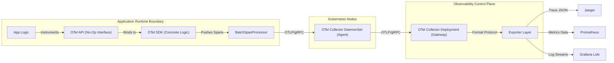

---

## 3. Request Journey Across Services
*Flow of a user payment checkout request across multiple Kubernetes microservices.*

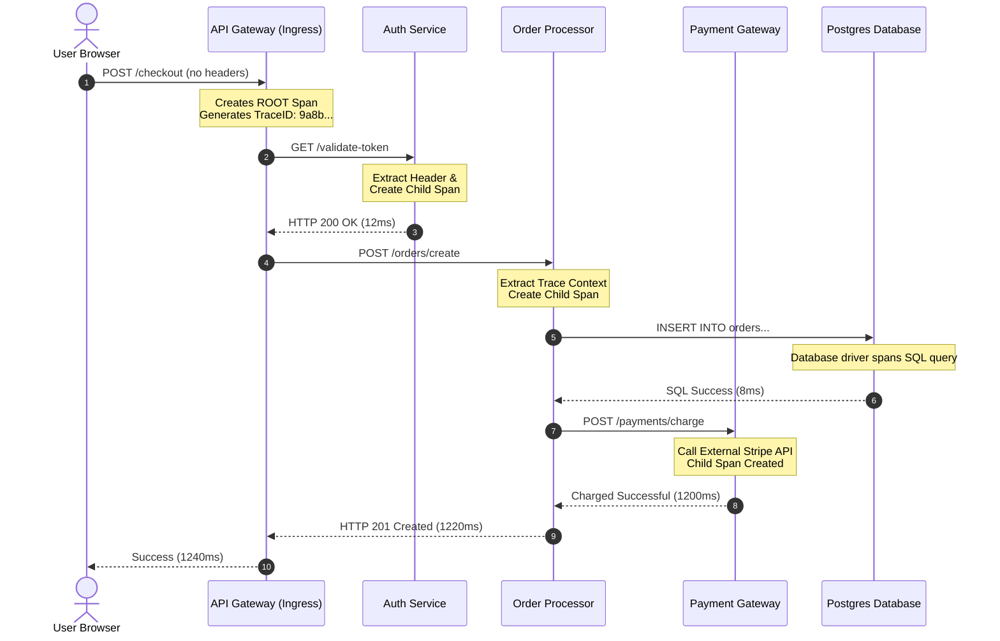

---

## 4. Span Hierarchy
*Gantt-chart view and Parent-Child Directed Acyclic Graph (DAG) relationship.*

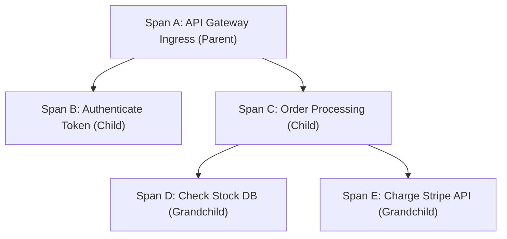

---

## 5. Context Propagation Flow
*Stitching downstream calls together using W3C HTTP header inject/extract loop.*

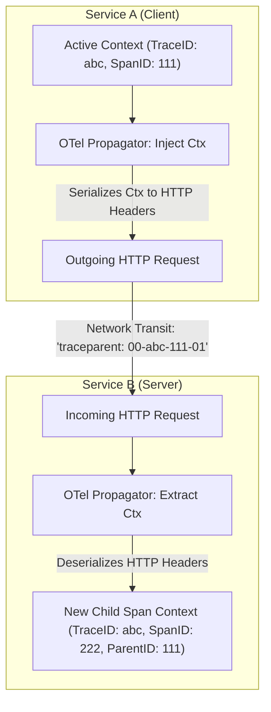

---

## 6. Jaeger Architecture
*High-scale Jaeger components setup inside a Kubernetes cluster.*

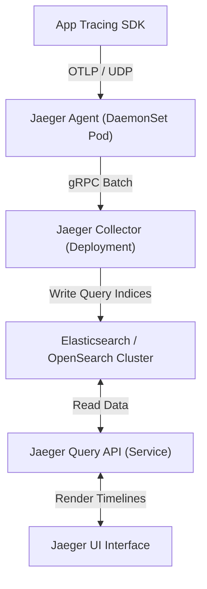

---

## 7. OpenTelemetry Collector Pipeline
*The internal telemetry processing stages inside an OTel Collector pod.*

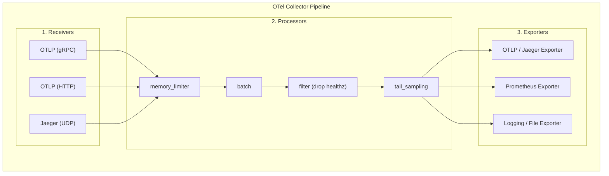

---

## 8. End-to-End Observability Architecture in Kubernetes
*Unified system showing Prometheus metrics, Loki logs, and Jaeger traces correlated.*

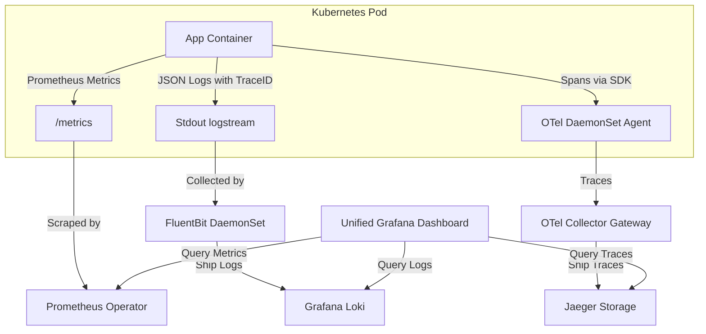

---

## 9. Performance Bottleneck Workflow
*Identifying serial database calls, fan-out loops, and external latencies.*

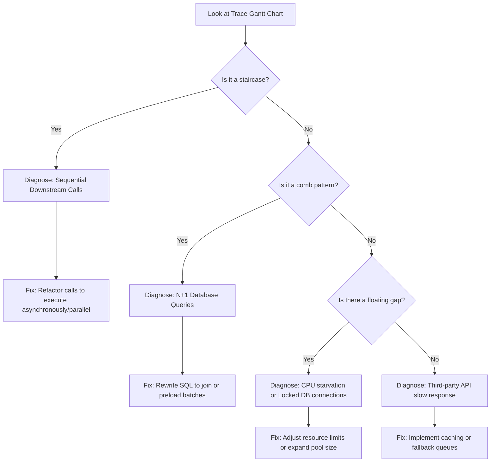

---

## 10. Microservice Request Tracing Sequence
*Step-by-step trace generation in a transaction.*

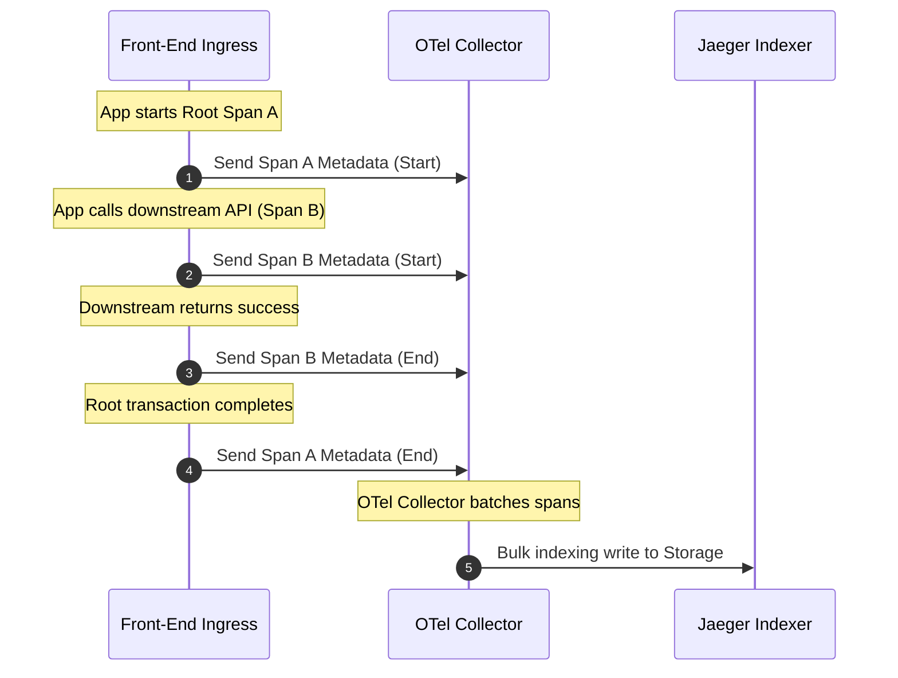

---

## 11. Production Tracing Architecture
*A highly resilient tracing ingestion topology buffering data with Kafka to protect storage backend during spikes.*

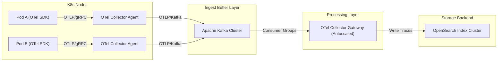

---

## 12. Incident Investigation Flow
*Using tracing to quickly isolate production errors.*

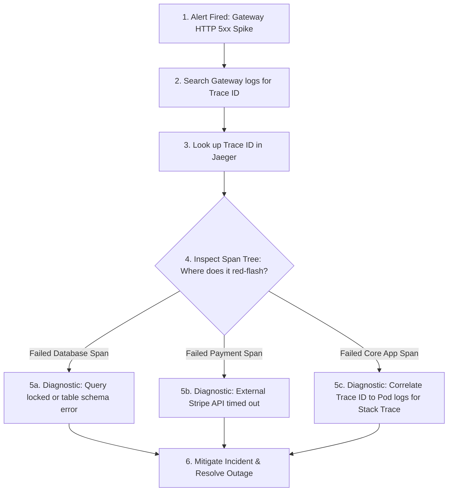

---

*Continue to the [manifests/](../manifests/) folder to view configurations that deploy this distributed tracing ecosystem in Kubernetes.*
