# 🖼️ Kubernetes Production Debugging Visual Guide: 12 Diagrams

This guide contains high-resolution SRE architecture and workflow diagrams mapped using Mermaid. These diagrams serve as visual runbooks for diagnosing and operating Kubernetes clusters under production pressure.

---

## 1. Production Debugging Workflow
*The step-by-step lifecycle of an incident from automated alert firing to post-mitigation validation.*

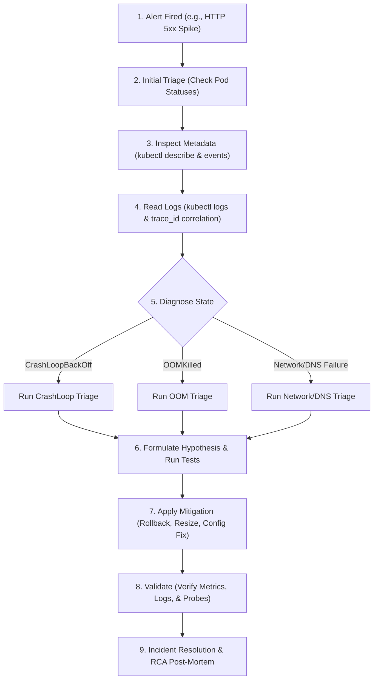

---

## 2. CrashLoopBackOff Investigation Triage Flowchart
*How to systematic diagnose container startup and runtime crashes.*

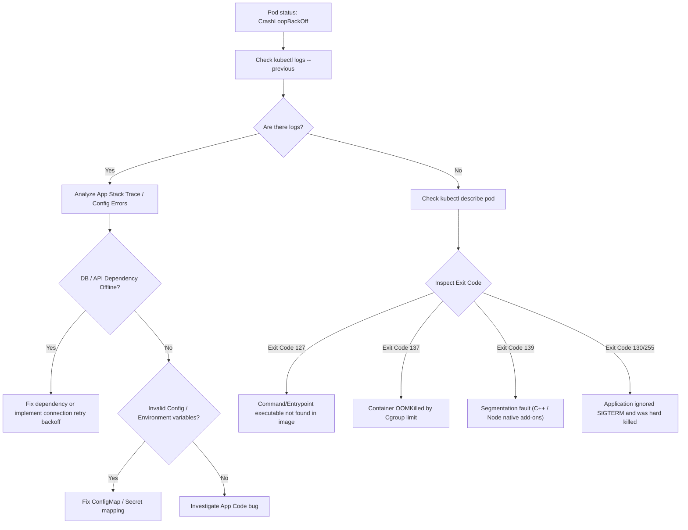

---

## 3. OOMKilled Analysis Flow
*Isolating memory issues between container limits and node-level pressure.*

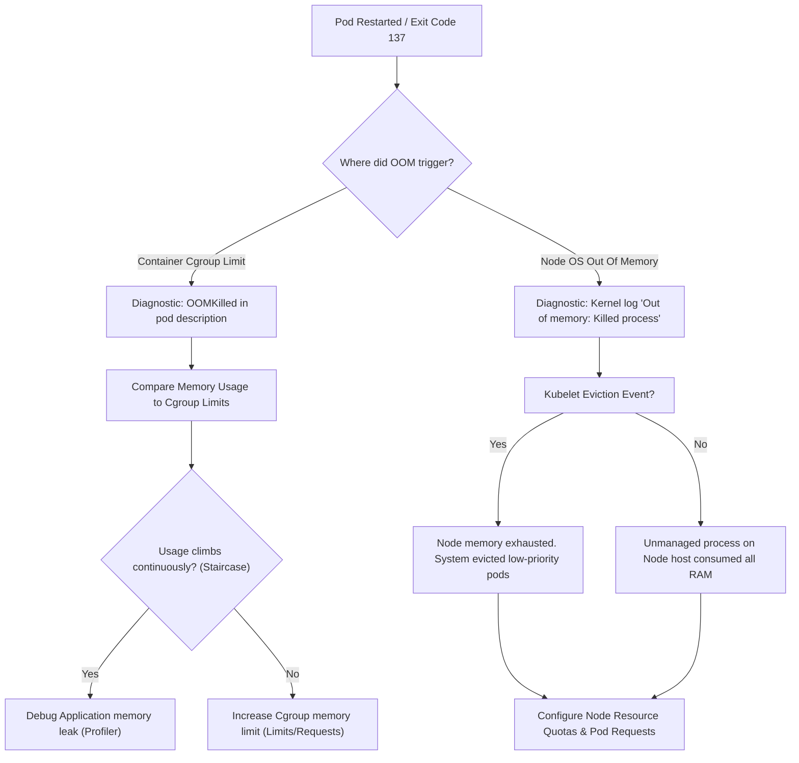

---

## 4. Network Troubleshooting Process
*Step-by-step verification of the Kubernetes data plane.*

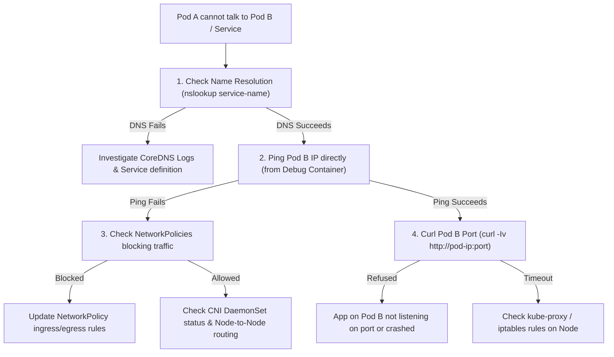

---

## 5. DNS Resolution Workflow in Kubernetes
*How an application resolves a local service DNS query inside the cluster.*

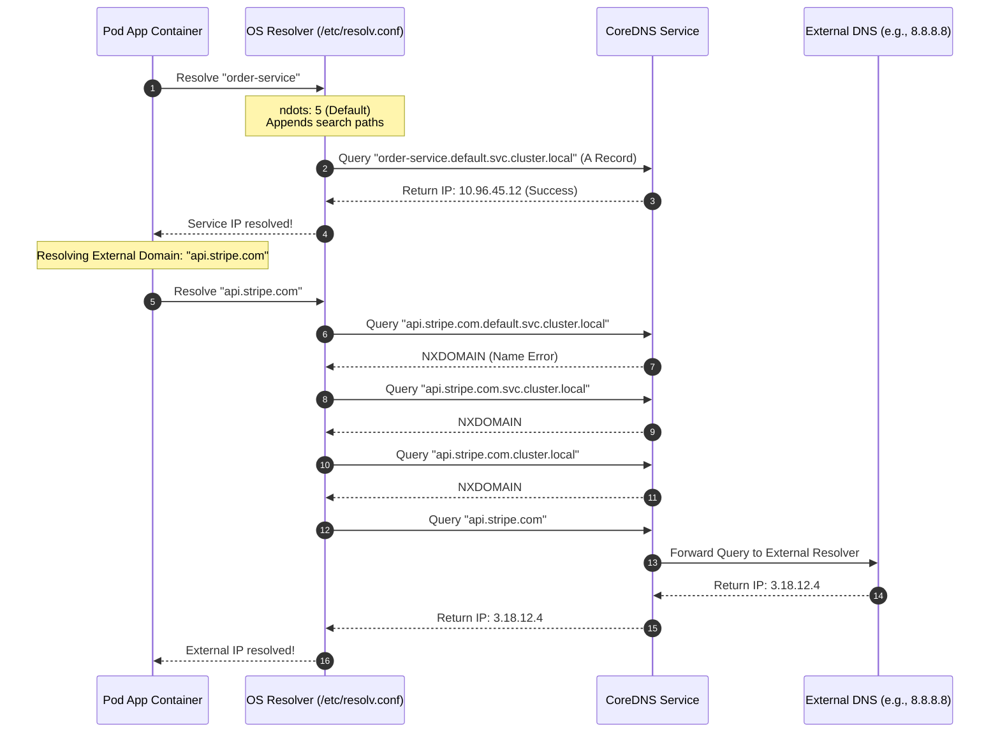

---

## 6. Incident Response Lifecycle
*The chronological stages of resolving a critical production issue.*

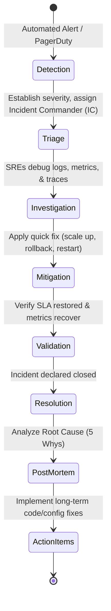

---

## 7. Root Cause Analysis (RCA) Decision Tree
*Isolating the root cause from a high-level system failure.*

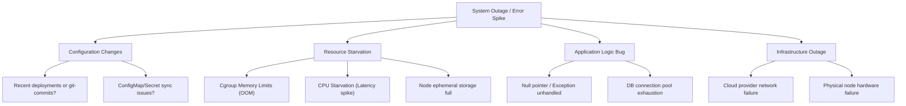

---

## 8. Kubernetes Debugging Toolkit
*A categorization of commands, tools, and techniques for live cluster diagnosis.*

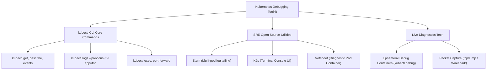

---

## 9. Service Failure Investigation Path
*Finding out why a Kubernetes Service is failing to route requests.*

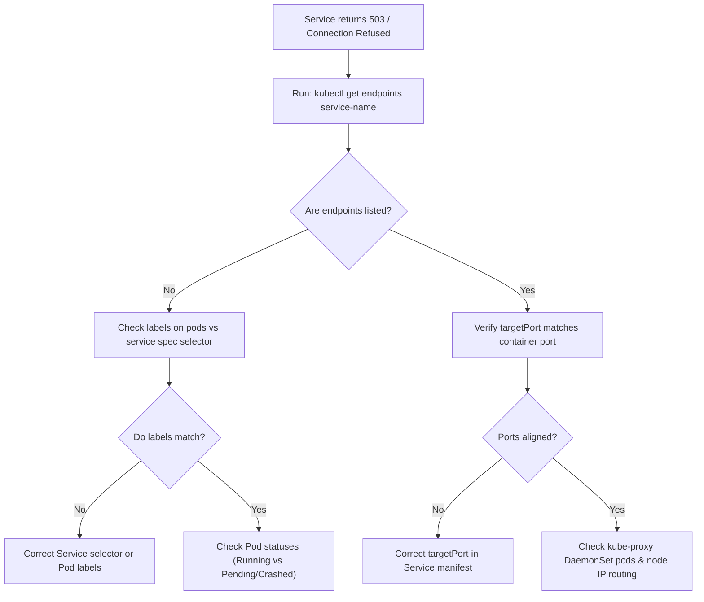

---

## 10. Production Incident Workflow
*The coordination path between the On-Call Engineer, Team, and Stakeholders.*

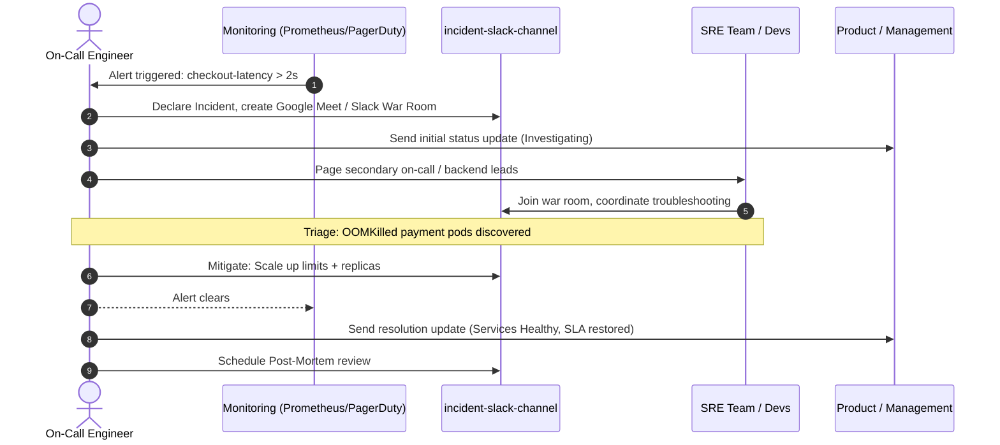

---

## 11. Troubleshooting Decision Matrix
*A high-level logical path from Pod phases to specific diagnostic playbooks.*

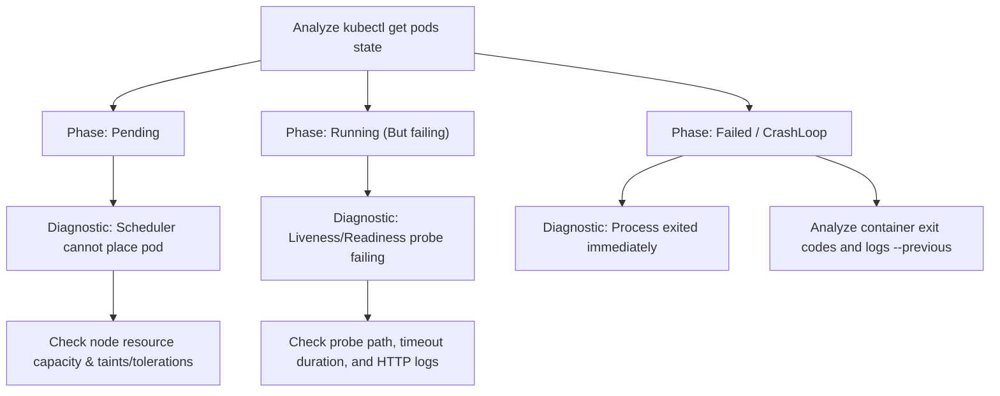

---

## 12. End-to-End Debugging Architecture
*The complete logical architecture mapping a user connection down through the control plane to the data plane.*

```mermaid
graph TD
    subgraph "External Ingress Layer"
        User["User Browser"] -->|HTTPS| Ingress["Ingress Controller Pod"]
    end

    subgraph "Control Plane Node"
        KubeAPI["kube-apiserver"]
        KubeEvents["Cluster Event Stream"]
        KubeAPI <--> KubeEvents
    end

    subgraph "Data Plane Nodes (Worker)"
        Ingress -->|Route request| Svc["Kubernetes Service (ClusterIP)"]
        Svc -->|Load Balances (iptables/IPVS)| PodA["Pod A (Frontend Container)"]
        PodA -->|DNS Resolve| CoreDNS["CoreDNS Pods"]
        PodA -->|Route API request| PodB["Pod B (Payment Container)"]
        
        Kubelet["kubelet daemon"] -->|Checks container health| PodA & PodB
        Kubelet -->|Logs events| KubeAPI
    end
    
    subgraph "SRE Diagnostic Actions"
        SRE["SRE Laptop"] -->|kubectl describe/logs| KubeAPI
        SRE -->|kubectl debug ephemeral| PodB
        SRE -->|kubectl port-forward| PodA
    end
```

---

*Proceed to the [notes/](../notes/) folder to read the SRE Core Concepts Guide detailing the inner workings of these components.*
