# 📖 Day 20 - CI/CD and GitOps for Production Kubernetes
### 🏷️ PHASE 3 - OBSERVABILITY & PRODUCTION OPERATIONS

Welcome to Day 20. Today, we bridge the gap between building application manifests and operating them at scale. In production, the question is not *"How do I run this container?"* but *"How do I deploy 500 microservices across 10 clusters without human error, credential exposure, or configuration drift?"*

We will dismantle the traditional "push-based" pipelines and reconstruct them using modern **GitOps** paradigms with **ArgoCD** and **Flux**. By the end of this day, you will never want to run `kubectl apply` manually again.

---

## 🎯 Learning Objectives

By the end of this day, you will deeply understand:
1. Why traditional "push-based" deployment pipelines fail under production scaling.
2. The core principles of GitOps and pull-based reconciliation.
3. The internal architectures of ArgoCD and Flux.
4. Desired state reconciliation, drift detection, and automated self-healing.
5. Production progressive delivery strategies (Rolling, Blue/Green, Canary).
6. Multi-environment promotion workflows (Dev -> Staging -> Prod) using Kustomize and Git branches/folders.

---

## 🛑 Why Traditional Deployments Break at Scale

In the early days of Kubernetes, developers and SREs deployed applications using shell scripts or standard CI pipelines (Jenkins, GitLab CI, GitHub Actions) running:
```bash
kubectl apply -f manifests/deployment.yaml --namespace production
```

While this works for simple workloads, it introduces fatal flaws in enterprise production:

### 1. The Security Nightmare (Credential Exposure)
To run `kubectl apply`, your CI pipeline needs cluster-admin credentials (kubeconfig or service account tokens). If your CI runner is compromised, the attacker gains full administrative access to your production Kubernetes cluster.

### 2. Configuration Drift (The Silent Killer)
Imagine a developer debugs an outage at 3 AM. They run:
```bash
kubectl scale deployment/payment-service --replicas=10 -n production
```
This change lives only in the cluster's live memory. The next time the CI pipeline runs, or if the pod is rescheduled, the cluster reverts to the old configuration stored in Git. Conversely, someone could manually modify a ConfigMap, and because Git is unaware of it, the system enters an untracked, unstable state.

### 3. Lack of Auditability and Rollback Gaps
Who changed the resource limits on `auth-service`? When? Why?
In a push-based model, audit logs are scattered across CI jobs, cloud provider IAM logs, and Kubernetes API logs. Rolling back requires finding a previous CI build and rerunning it, hoping no manifests have changed in the meantime.

---

## 🔄 CI/CD Fundamentals: Push vs. Pull

A modern deployment pipeline separates **Continuous Integration (CI)** from **Continuous Delivery/Deployment (CD)**.

### Traditional Push-Based CI/CD
In a push-based system, the CI tool compiles, tests, packages, and directly "pushes" the changes into the Kubernetes API.
```
[ Developer ] ──> [ Git Repo ] ──> [ CI Server (GitHub Actions) ] ──( kubectl apply )──> [ Kubernetes API ]
```

### Modern Pull-Based GitOps
In a pull-based (GitOps) system, the CI pipeline stops at the registry. An agent inside the Kubernetes cluster constantly pulls the desired state from Git.
```
[ Developer ] ──> [ Git Repo ] ──> [ CI Server ] ──> [ Image Registry ]
                                          │
                               (Updates Config Repo)
                                          │
                                          ▼
                                   [ Config Repo ]
                                          ▲
                                          │ (Pulls & Reconciles)
                                   [ GitOps Agent ] ──> [ Kubernetes API ]
```

---

## 📊 Visualizing the Architecture (Mermaid Diagrams)

Here are the visual blueprints explaining how these systems work in production.

### 1. The End-to-End GitOps CI/CD Pipeline
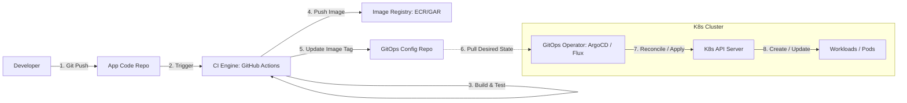

### 2. GitOps Reconciliation Loop
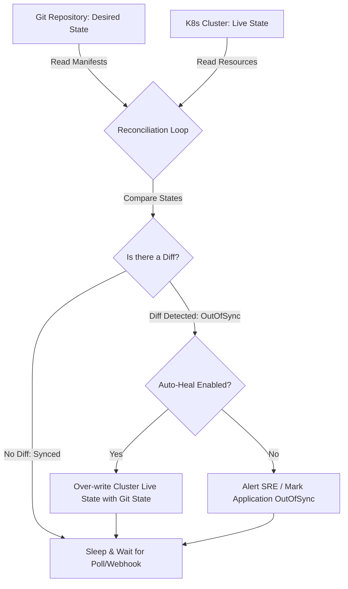

### 3. ArgoCD Internal Architecture
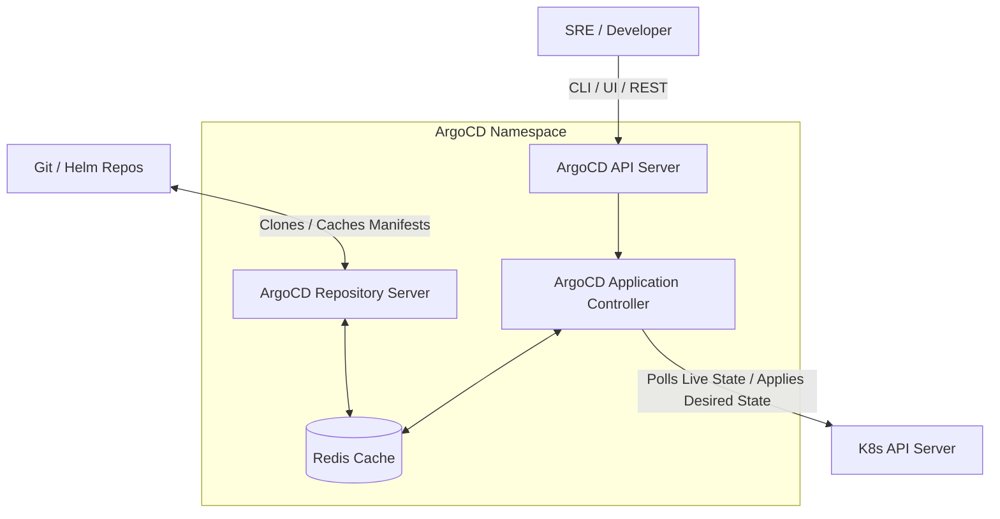

### 4. Flux v2 Internal Architecture (GitOps Toolkit)
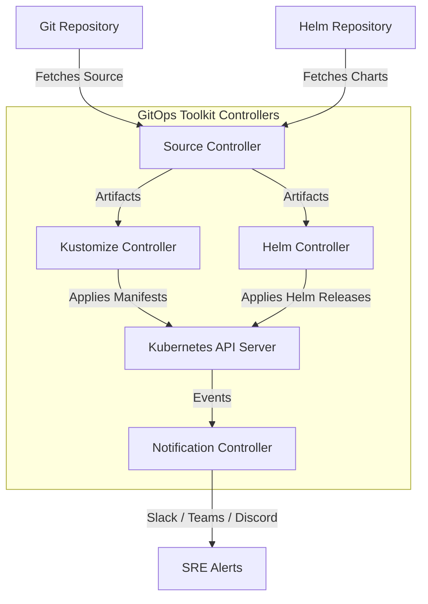

### 5. Desired State Reconciliation Lifecycle
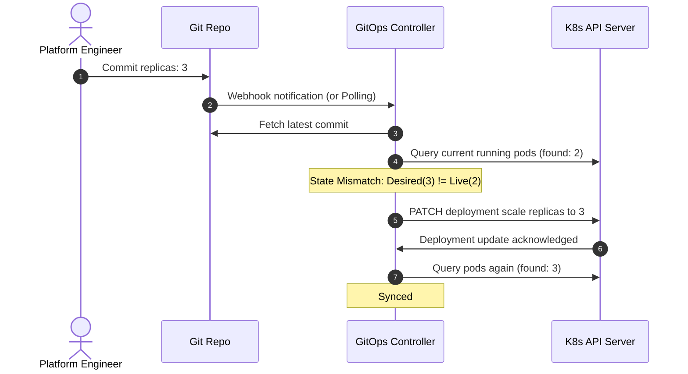

### 6. Deployment Lifecycle (Code to Cluster)
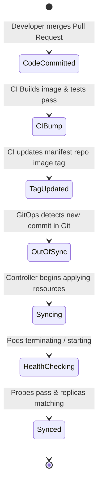

### 7. Drift Detection Workflow
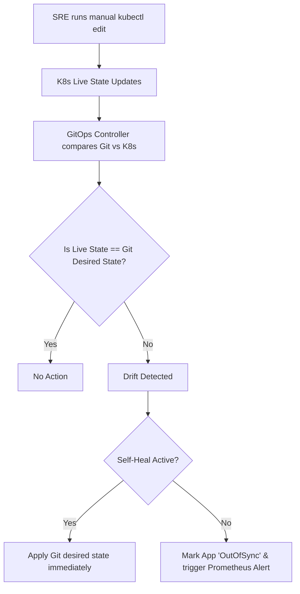

### 8. Rollback Workflow (GitOps Style)
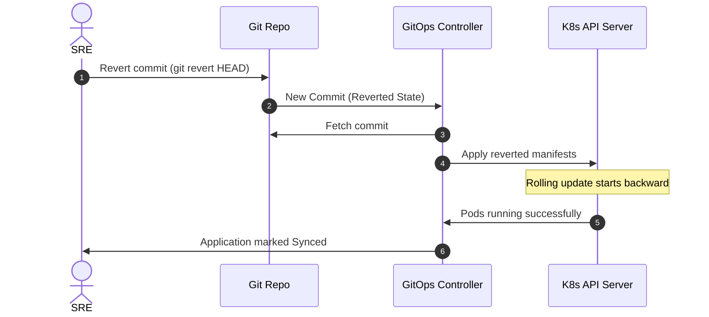

### 9. Multi-Environment Promotion Workflow
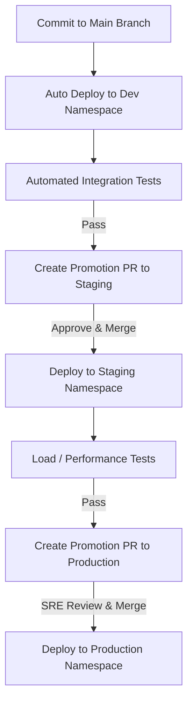

### 10. Multi-Cluster Production Deployment Architecture
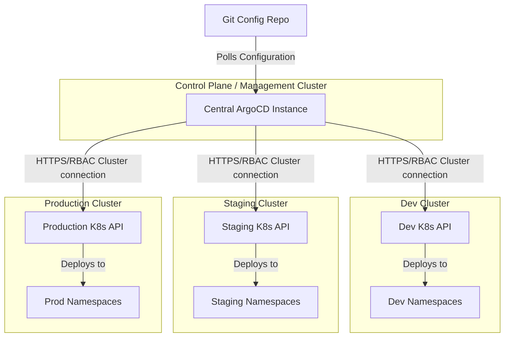

### 11. Blue/Green Deployment Strategy
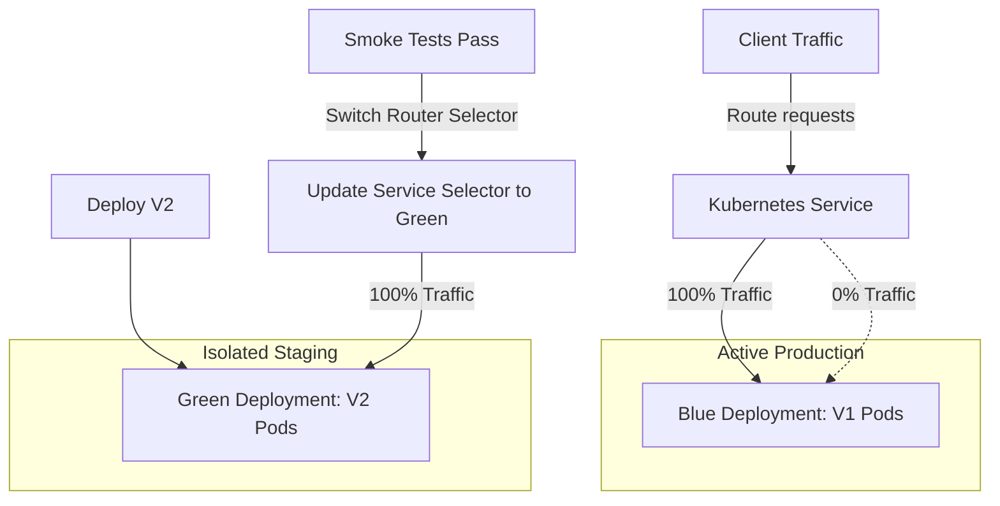

### 12. Canary Deployment Strategy
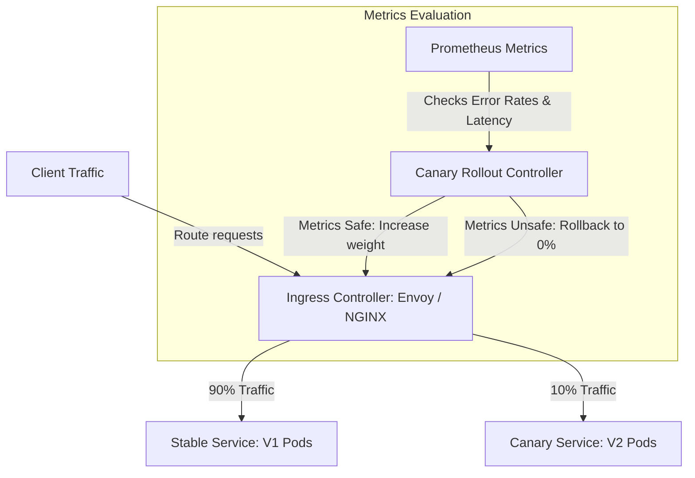

---

## 🛠️ GitOps Tools Deep Dive: ArgoCD vs. Flux

Although both tools implement GitOps, their architecture and operations differ significantly.

| Feature | ArgoCD | Flux v2 |
| :--- | :--- | :--- |
| **Architecture** | Monolithic control plane, API server, Redis cache, Web UI. | Microservices based, GitOps Toolkit, Kubernetes-native controllers. |
| **User Interface** | Outstanding, rich real-time visual web dashboard. | CLI first (GitOps CLI). Third-party UIs (Weave Gitops) exist. |
| **Multi-tenancy** | Managed via AppProjects with built-in RBAC/SSO. | Managed using native Kubernetes namespaces, RBAC, and ServiceAccounts. |
| **Sync Model** | Pushes to targeted clusters from a central instance (Hub-and-Spoke). | Pulled locally inside each cluster (highly decentralized and secure). |
| **Templating** | Helm, Kustomize, Jsonnet, Raw YAML out of the box. | Native Kustomize and Helm controllers. |

---

## 🚀 Deployment Strategies

When deploying updates to your applications, you must choose a deployment strategy to minimize downtime and risk.

### 1. Rolling Update (Default)
Kubernetes spins up new replica pods (V2) while gradually terminating old ones (V1).
* **Pros:** Simple, built-in, no extra resources needed.
* **Cons:** No control over traffic shifting (users hit both versions simultaneously). Hard to roll back instantly if a database migration error occurs.

### 2. Blue/Green
You run two identical environments: Blue (current production) and Green (new release). Once Green passes testing, traffic is cut over.
* **Pros:** Zero downtime. Immediate rollback (just point the router/service back to Blue).
* **Cons:** Double the infrastructure cost during deployment.

### 3. Canary
You route a tiny slice of real traffic (e.g., 5%) to the new release (Canary). You observe telemetry (HTTP 5xx, latency). If healthy, you scale the canary and route more traffic.
* **Pros:** High safety margin. Tests new code with real production traffic.
* **Cons:** Complex configuration. Requires advanced Ingress controllers (Istio, Linkerd, NGINX) and automated metric analysis (e.g., Argo Rollouts, Flux Flagger).

---

## 🧑‍💻 Production Code Snippets

Let's look at how we declaratively configure GitOps resources.

### ArgoCD Application manifest
This resource tells ArgoCD where to look for Kubernetes manifests in Git and where to deploy them.

```yaml
apiVersion: argoproj.io/v1alpha1
kind: Application
metadata:
  name: payment-service-production
  namespace: argocd
spec:
  project: default
  source:
    repoURL: 'https://github.com/userhimanshuverma/30-Days-of-Production-Kubernetes.git'
    targetRevision: main
    path: Day-20/manifests
  destination:
    server: 'https://kubernetes.default.svc'
    namespace: production
  syncPolicy:
    automated:
      prune: true
      selfHeal: true
    syncOptions:
      - CreateNamespace=true
```

### Flux Kustomization manifest
This resource tells Flux's Kustomize controller how to apply manifests downloaded by the source controller.

```yaml
apiVersion: kustomize.toolkit.fluxcd.io/v1
kind: Kustomization
metadata:
  name: payment-service-prod
  namespace: flux-system
spec:
  interval: 10m0s
  path: ./Day-20/manifests
  prune: true
  sourceRef:
    kind: GitRepository
    name: main-config
  targetNamespace: production
```

---

## 🧪 Interactive Learning

We have built an enterprise-grade simulator to help you visualize these concepts live.

### GitOps Control Center Simulation
Open [gitops-control-center.html](file:///d:/30_Days_of_Production_Kubernetes/Day-20/gitops-control-center.html) in your browser. This custom UI lets you:
* Commit code and watch the CI pipeline package and update the manifest repo.
* Observe ArgoCD / Flux pulling the changes and spinning up pods.
* **Simulate Configuration Drift:** Edit the live pods manually (simulating a `kubectl edit`), watch the controller immediately flag it as `OutOfSync`, and execute auto-healing.
* Test Progressive Delivery options (Canary/Blue-Green) and witness how service selectors shift traffic dynamically.

---

## 📂 Day-20 Directory Map

Explore the directories to complete today's curriculum:

* 📔 [notes/](notes/): Deep dives on [CI/CD Fundamentals](notes/ci-cd-fundamentals.md), [ArgoCD Core Architecture](notes/argocd-architecture.md), [Flux GitOps Toolkit](notes/flux-architecture.md), and [Deployment Strategies](notes/deployment-strategies.md).
* ⚙️ [manifests/](manifests/): Production-grade microservice Kubernetes definitions.
* 📦 [argocd/](argocd/): ArgoCD custom applications and project rules.
* 🌿 [flux/](flux/): Flux GitRepository and Kustomization definitions.
* 🔬 [labs/](labs/): 6 step-by-step production labs (from basic installs to multi-env promotion). Read [labs/README.md](labs/README.md) to start.
* 🛑 [troubleshooting/](troubleshooting/): Production Incident Runbook resolving common ArgoCD/Flux sync errors.
* 🧠 [exercises/](exercises/): SRE assignments to configure automated drift recovery.
* 📖 [production-notes/](production-notes/): Senior platform engineer handbook on Secrets management and GitOps scaling.
