# 📊 Day 20 Architectural Diagrams: GitOps & Deployment Pipelines

This directory contains a centralized library of the 12 primary architectural workflows for Day 20, designed to make GitOps and progressive delivery processes visually intuitive.

---

## 🧭 Directory Index

* [1. End-to-End GitOps CI/CD Pipeline](#1-end-to-end-gitops-cicd-pipeline)
* [2. GitOps Reconciliation Loop](#2-gitops-reconciliation-loop)
* [3. ArgoCD Internal Architecture](#3-argocd-internal-architecture)
* [4. Flux v2 Internal Architecture](#4-flux-v2-internal-architecture)
* [5. Desired State Reconciliation Lifecycle](#5-desired-state-reconciliation-lifecycle)
* [6. Deployment Lifecycle](#6-deployment-lifecycle)
* [7. Drift Detection Workflow](#7-drift-detection-workflow)
* [8. Rollback Workflow](#8-rollback-workflow)
* [9. Multi-Environment Promotion Workflow](#9-multi-environment-promotion-workflow)
* [10. Multi-Cluster Production Deployment Architecture](#10-multi-cluster-production-deployment-architecture)
* [11. Blue/Green Deployment Strategy](#11-bluegreen-deployment-strategy)
* [12. Canary Deployment Strategy](#12-canary-deployment-strategy)

---

## 1. End-to-End GitOps CI/CD Pipeline

Describes the separation of code compilation/packaging (CI) and resource reconciliation (CD).

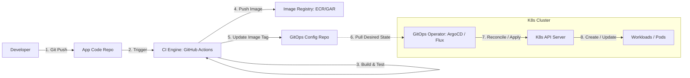

---

## 2. GitOps Reconciliation Loop

Visualizes the continuous check comparing desired configuration with real cluster state.

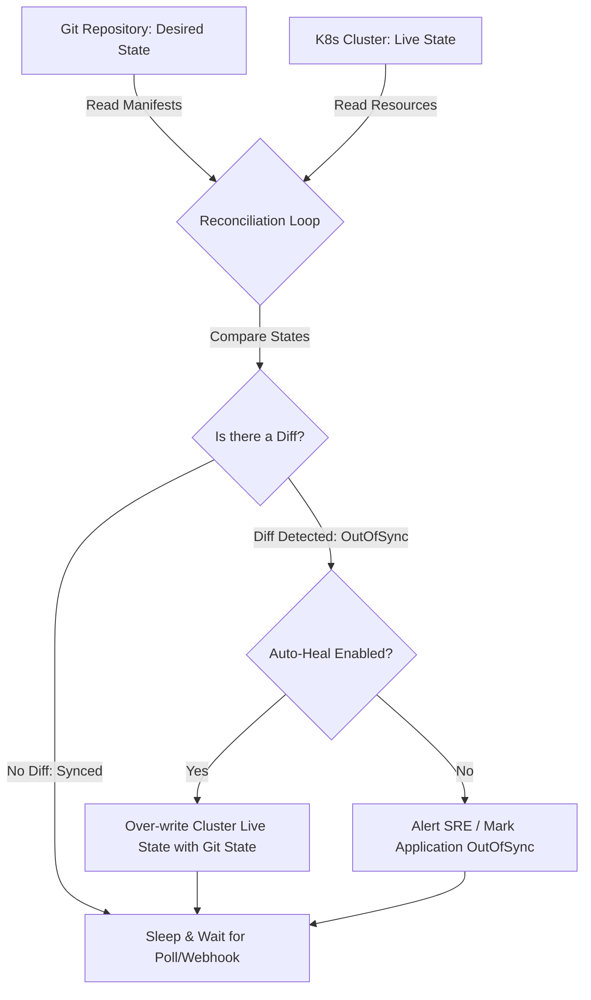

---

## 3. ArgoCD Internal Architecture

Components within an ArgoCD namespace.

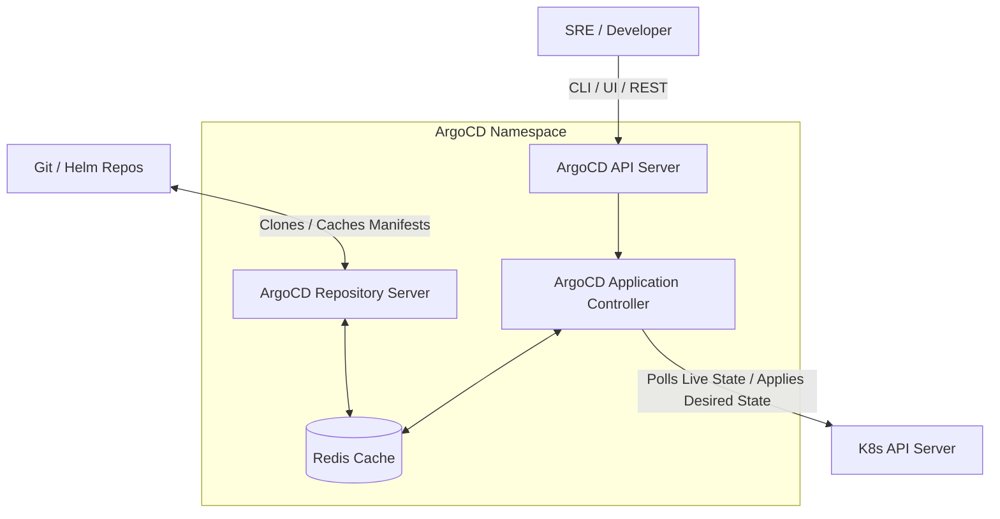

---

## 4. Flux v2 Internal Architecture

The microservices model of Flux's GitOps Toolkit controllers.

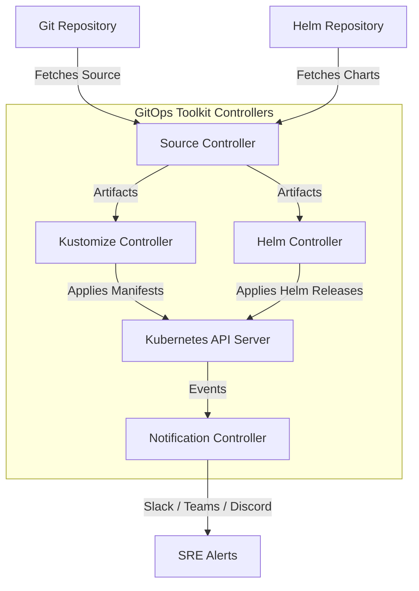

---

## 5. Desired State Reconciliation Lifecycle

A sequence of events demonstrating reconciliation steps.

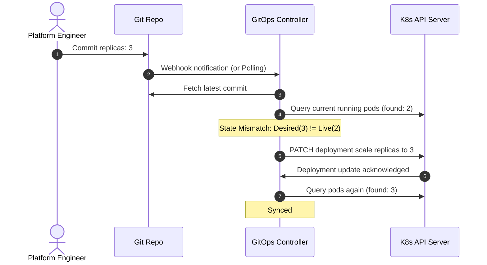

---

## 6. Deployment Lifecycle

The states through which a resource passes during transition.

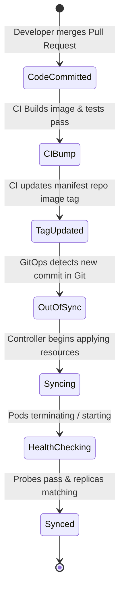

---

## 7. Drift Detection Workflow

How manual kubectl edits are identified and processed.

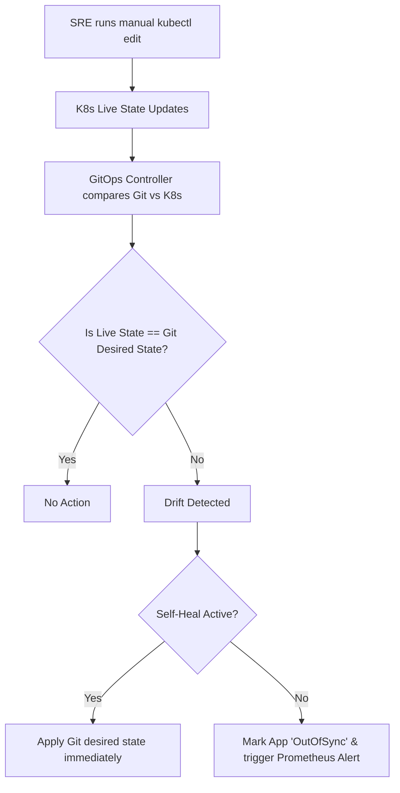

---

## 8. Rollback Workflow

Reverting a failed application update in GitOps.

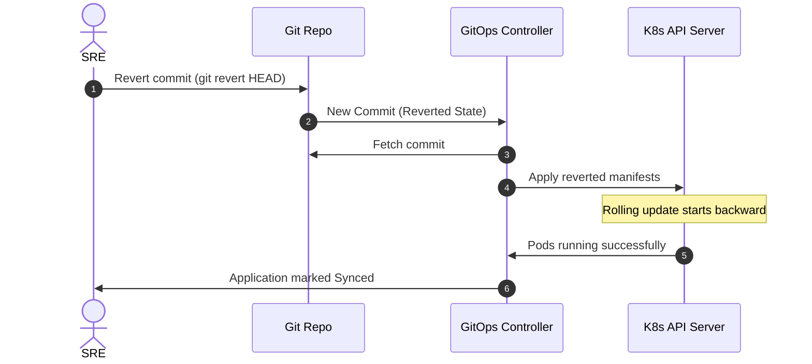

---

## 9. Multi-Environment Promotion Workflow

Steps to promote changes through gated quality environments.

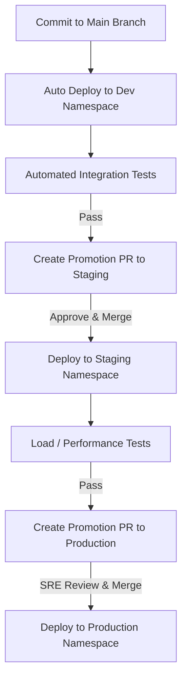

---

## 10. Multi-Cluster Production Deployment Architecture

Connecting multiple physical environments to a single controller.

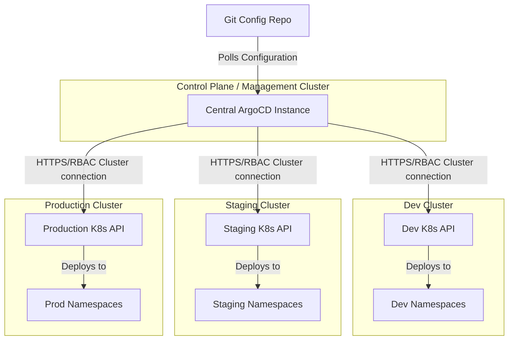

---

## 11. Blue/Green Deployment Strategy

Routing traffic between two physical releases.

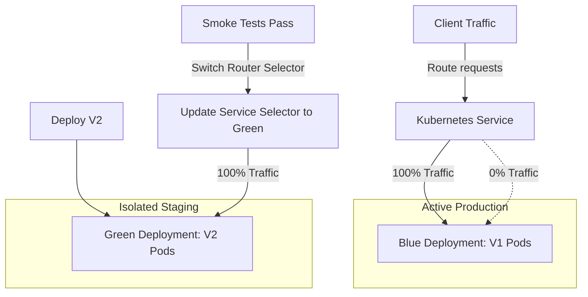

---

## 12. Canary Deployment Strategy

Exposing V2 to a percentage of requests and validating metrics.

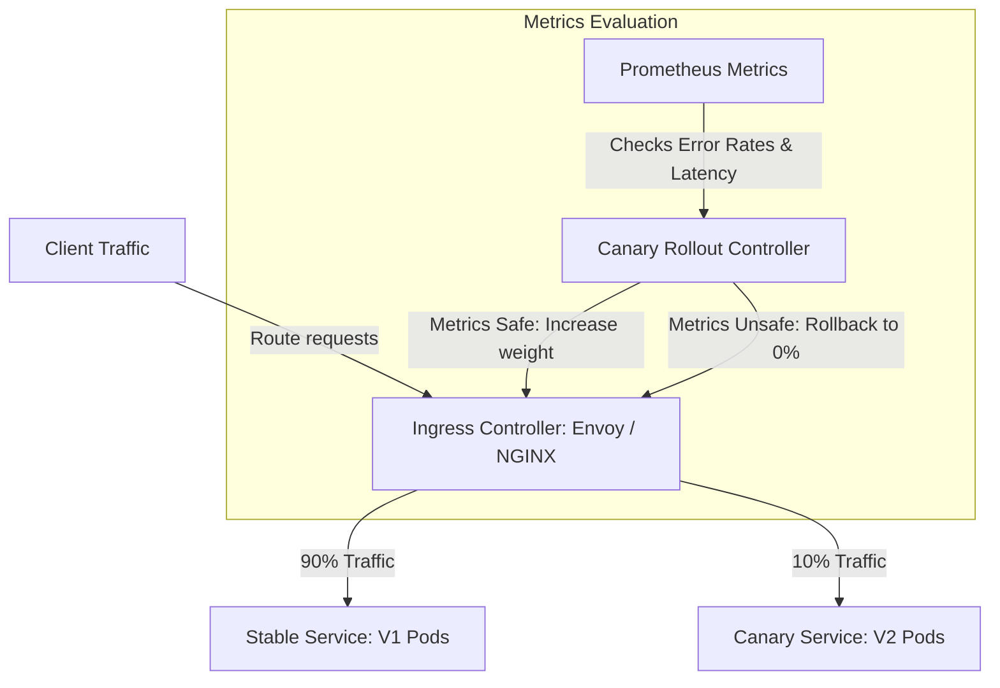
