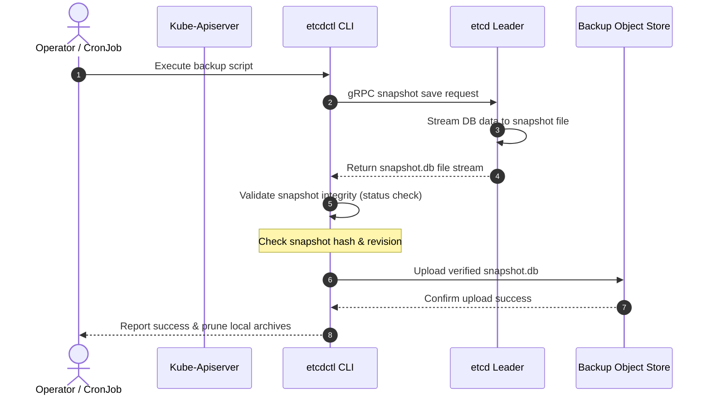
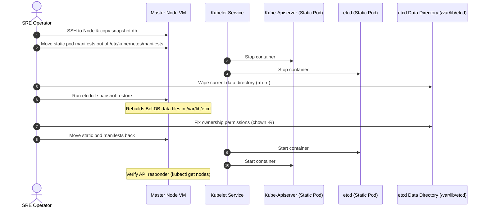
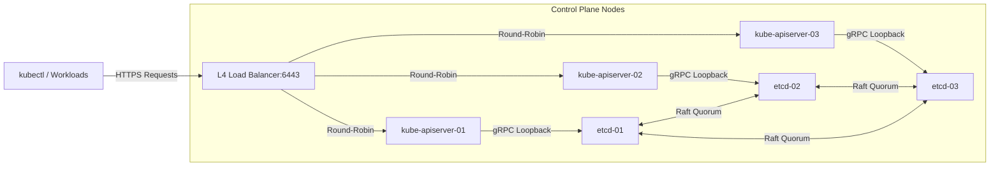
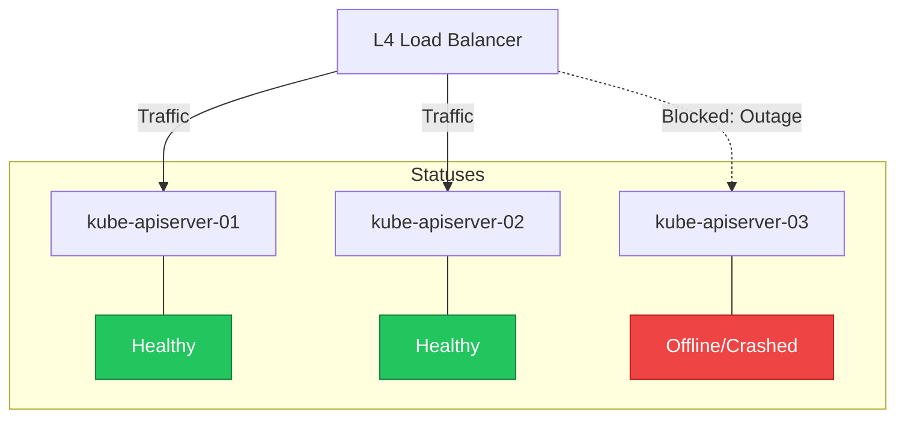
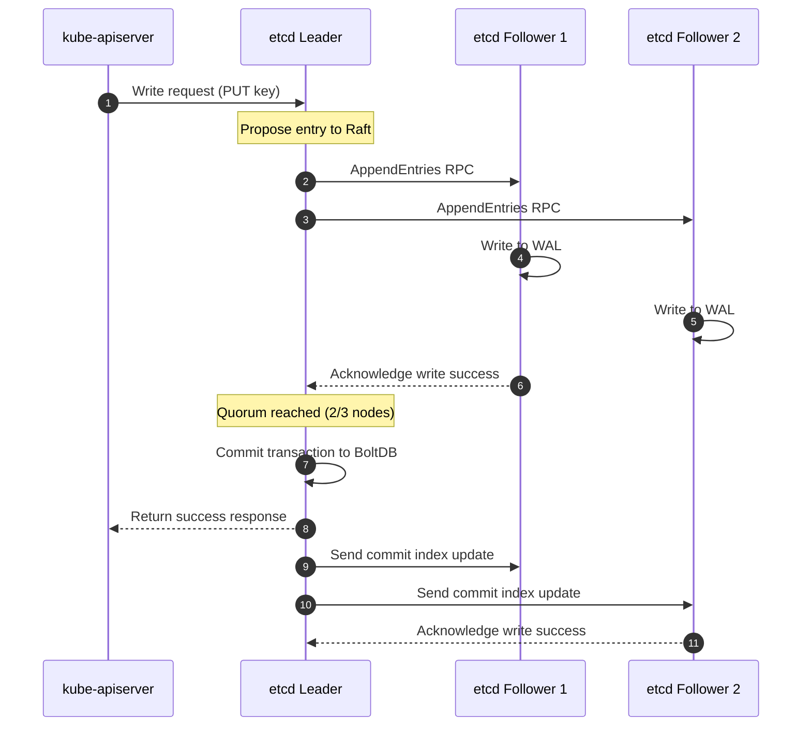
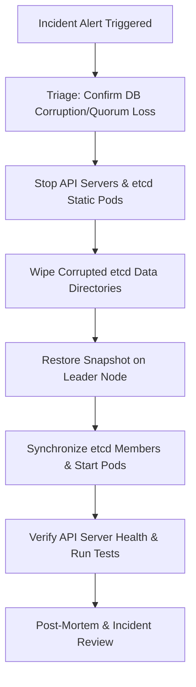
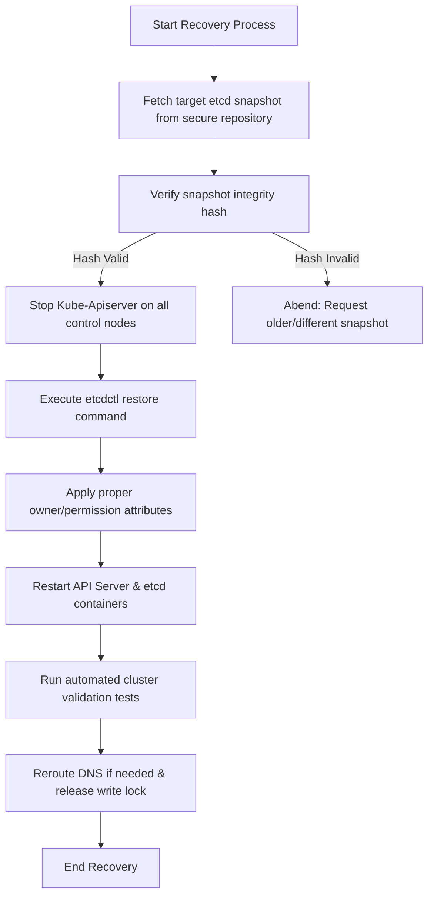
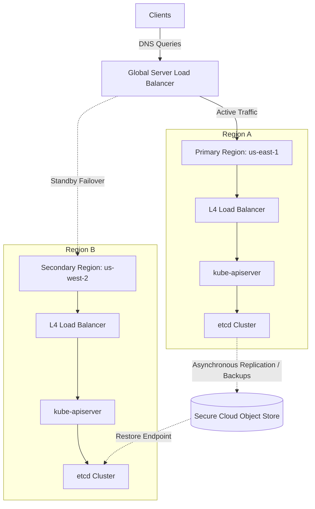

```mermaid
gantt
    title RPO vs RTO Timeline Comparison
    dateFormat  HH:mm
    axisFormat %H:%M
    section Data Timeline
    Successful Backup          :a1, 12:00, 1m
    Unsaved Transactions (Data Loss / RPO) :active, 12:00, 13:00
    Disaster Event             :milestone, 13:00, 0m
    Outage / Downtime (RTO)    :crit, 13:00, 13:45
    Cluster Restored & Online  :milestone, 13:45, 0m
```

# 📖 Day 21 — Backup, Disaster Recovery & High Availability
### 🏷️ PHASE 3 — OBSERVABILITY & PRODUCTION OPERATIONS

> **TL;DR:** Master the architectural and operational skills required to make Kubernetes resilient. Learn etcd backup automation, disaster recovery procedures, multi-zone cluster layout configurations, and failover strategies.

---

## 🎯 Learning Objectives
By the end of this day, you will be able to:
1. Explain **why disaster recovery matters** and write concrete recovery plans.
2. Troubleshoot and restore an **etcd database corruption** or quorum loss event.
3. Configure **High Availability** across control planes, worker nodes, and applications.
4. Implement **Multi-Zone architectures** using Pod Topology Spread Constraints.
5. Apply **Active-Passive and Active-Active failover strategies** to mitigate regional cloud outages.

---

## 🏛️ why Disaster Recovery Matters

Disaster recovery is not merely insurance; it is a critical requirement of modern platform engineering. Kubernetes abstracts away physical infrastructure, but it remains susceptible to hardware degradation, network partitions, software faults, and human errors.

### Real-World Outage Archetypes:
* **The Infrastructure Failure**: A physical data center catches fire, or a lightning strike knocks out power supply to an entire region.
* **The Network Partition**: Inter-datacenter communication lines fail, splitting the cluster and interrupting etcd consensus writes.
* **The Human Mistake**: An operator runs `helm delete` on a production namespace, or accidentally wipes the etcd volume on the master node during a manual configuration upgrade.
* **Software Bugs**: A memory leak in the container runtime causes nodes to go `NotReady` sequentially, triggering a scheduling storm that overloads the API server.

---

## 💾 etcd Deep Dive

**etcd** is the distributed, consistent key-value store that acts as the single source of truth for all Kubernetes resources.

```mermaid
graph TD
  Client[kube-apiserver] -->|gRPC Requests| API[gRPC API / KV Server]
  subgraph etcd Server Internals
    API -->|Consensus Proposals| Raft[Raft Consensus Protocol]
    Raft -->|Write Logs| WAL[Write-Ahead Log (Disk)]
    Raft -->|Commit State| MVCC[MVCC Engine]
    MVCC -->|In-Memory Index| BTree[B-Tree Index]
    MVCC -->|Persistent DB| BoltDB[BoltDB Storage (db file)]
  end
```

### Why etcd is Critical:
* **Stateless API Server**: The `kube-apiserver` stores no data. Every time you query resource states, it reads from etcd. Every time you submit a manifest, it writes to etcd.
* **Consensus-Driven**: etcd uses the **Raft** protocol. It requires a majority (quorum) of nodes to accept writes before confirming them to the client.

### etcd Backup & Restore Workflows:



And when performing a restoration during a disaster:



---

## ⏱️ RPO & RTO

Understanding Recovery Point Objective and Recovery Time Objective helps shape your backup frequency and recovery speed targets.



### Definitions:
* **Recovery Point Objective (RPO)**: The maximum targeted period in which data might be lost due to an incident. If your backup runs every 6 hours, your maximum RPO is 6 hours.
* **Recovery Time Objective (RTO)**: The targeted duration of time and service level within which a business process must be restored after a disaster. If it takes your team 45 minutes to run the restore script and verify the api-server, your RTO is 45 minutes.

---

## ⚡ High Availability (HA)

To achieve high availability, you must remove single points of failure across all layers of the cluster.

### 1. Control Plane HA
* Front the stateless `kube-apiserver` instances with a **Layer 4 Load Balancer** operating on port `6443`.
* Separate the control plane nodes into different availability zones.



### 2. Worker Node HA
* Deploy worker nodes across multiple Availability Zones in auto-scaling groups.
* Set up node self-healing (using cloud providers or node-problem-detector).

### 3. Application HA
* **Pod Anti-Affinity**: Prevent replicas of the same app from scheduling on the same physical host.
* **Pod Disruption Budgets (PDB)**: Enforce the minimum number of pods that must remain online during voluntary disruptions (e.g. node drains).
* **Topology Spread Constraints**: Instruct the scheduler to distribute replicas evenly across availability zones.

---

## 🌍 Multi-Zone Architecture

Distributing your cluster across multiple zones protects your system from physical datacenter power failures.

```mermaid
graph TD
  subgraph Regional VPC (us-east-1)
    subgraph Availability Zone A (us-east-1a)
      Master1[master-01]
      Worker1[worker-01]
    end
    subgraph Availability Zone B (us-east-1b)
      Master2[master-02]
      Worker2[worker-02]
    end
    subgraph Availability Zone C (us-east-1c)
      Master3[master-03]
      Worker3[worker-03]
    end
    
    Master1 <-->|Cross-Zone Raft Link| Master2
    Master2 <-->|Cross-Zone Raft Link| Master3
    Master3 <-->|Cross-Zone Raft Link| Master1
  end
```

### SRE Design Rules:
1. **Raft Quorum Requirements**: Ensure you run an odd number of zones (typically 3) so that etcd can establish a majority leader write path even if one zone goes completely dark.
2. **Topology-Aware Routing**: Maintain service-to-service communication paths locally within the same zone to reduce inter-zone latency and cloud data transfer costs.

---

## 🔄 Failover Strategies

When a component fails, the recovery must happen automatically at the infrastructure and routing layer.

### 1. Control Plane Failover
If `master-03` crashes, the L4 Load Balancer detects the failed `/livez` health check and routes api requests to surviving master nodes.



### 2. Application Failover
If Worker Node A in Zone A fails, the pods running on it transition to `Terminating` or `Unknown` states, and the replication controller reschedules them to healthy nodes in Zone B or Zone C.

```mermaid
graph TD
  subgraph Availability Zone A (Failed)
    NodeA[Worker Node A] -.->|Host Offline| PodA[payment-gateway-pod1]
    style NodeA stroke:#ef4444,stroke-width:2px,stroke-dasharray: 5 5
    style PodA fill:#ef4444,color:#fff
  end
  subgraph Availability Zone B (Healthy)
    NodeB[Worker Node B] --> PodB[payment-gateway-pod2]
    NodeB --> PodNew[payment-gateway-pod1-rescheduled]
    style PodNew fill:#22c55e,color:#fff
  end
  subgraph Availability Zone C (Healthy)
    NodeC[Worker Node C] --> PodC[payment-gateway-pod3]
  end
  
  PodA -.->|Evicted after Pod Eviction Timeout| PodNew
```

### 3. Database Replication Flow
etcd replicates data synchronously using Raft. When a client requests a write, the leader replicates it to all followers and commits once a quorum is established.



---

## 🗺️ Disaster Recovery & End-to-End Restoration Process

During a severe incident (e.g., etcd database corruption), follow this comprehensive restoration pipeline:



Detailed end-to-end restore logic flow showing failure checks:



### Regional Disaster Recovery Resilience
For global systems, run active-active or active-passive setups fronted by a Global Server Load Balancer (GSLB) like Route 53 or Cloudflare.



---

## 📂 Day 21 Directory Structure
Below is an overview of files and resources for this day:

* **[`disaster-recovery-command-center.html`](file:///d:/30_Days_of_Production_Kubernetes/Day-21/disaster-recovery-command-center.html)**: Interactive, single-page browser simulator to visually experience node failures, zone outages, and etcd restorations.
* **[`backup/`](file:///d:/30_Days_of_Production_Kubernetes/Day-21/backup/)**: Includes automated [`etcd-backup.sh`](file:///d:/30_Days_of_Production_Kubernetes/Day-21/backup/etcd-backup.sh) script and step-by-step [`etcd-backup-procedure.md`](file:///d:/30_Days_of_Production_Kubernetes/Day-21/backup/etcd-backup-procedure.md) guide.
* **[`recovery/`](file:///d:/30_Days_of_Production_Kubernetes/Day-21/recovery/)**: Includes [`etcd-restore.sh`](file:///d:/30_Days_of_Production_Kubernetes/Day-21/recovery/etcd-restore.sh) tool and [`disaster-recovery-runbook.md`](file:///d:/30_Days_of_Production_Kubernetes/Day-21/recovery/disaster-recovery-runbook.md) incident guides.
* **[`ha-designs/`](file:///d:/30_Days_of_Production_Kubernetes/Day-21/ha-designs/)**: Deep dives on stacked vs external control plane topology and multi-zone layouts.
* **[`notes/`](file:///d:/30_Days_of_Production_Kubernetes/Day-21/notes/)**: In-depth theoretical resources detailing etcd's Raft database internals.
* **[`production-notes/`](file:///d:/30_Days_of_Production_Kubernetes/Day-21/production-notes/)**: Hard-won SRE lessons, tradeoffs, and disaster recovery game-day practices.
* **[`troubleshooting/`](file:///d:/30_Days_of_Production_Kubernetes/Day-21/troubleshooting/)**: Root-cause diagnostic steps for etcd corruption, split-brain, and stuck PV mounts.
* **[`labs/`](file:///d:/30_Days_of_Production_Kubernetes/Day-21/labs/)**: Practical hands-on assignments:
  1. [Lab 1: etcd Backup & Restore](file:///d:/30_Days_of_Production_Kubernetes/Day-21/labs/lab-1-etcd-backup-restore.md)
  2. [Lab 2: Multi-Zone Topology Spread Constraints & PDBs](file:///d:/30_Days_of_Production_Kubernetes/Day-21/labs/lab-2-multizone-topology-spread.md)
  3. [Lab 3: Simulating Control Plane Failures & Quorum Loss](file:///d:/30_Days_of_Production_Kubernetes/Day-21/labs/lab-3-simulating-control-plane-failures.md)
* **[`manifests/`](file:///d:/30_Days_of_Production_Kubernetes/Day-21/manifests/)**: Production-ready YAML configs including cron backup scheduling, HA apps, and PDB definitions.
* **[`exercises/`](file:///d:/30_Days_of_Production_Kubernetes/Day-21/exercises/)**: Hands-on challenges to test your troubleshooting and HA scheduling capabilities.
* **[`resources/`](file:///d:/30_Days_of_Production_Kubernetes/Day-21/resources/)**: Books, links, and official documentation reference guides.
