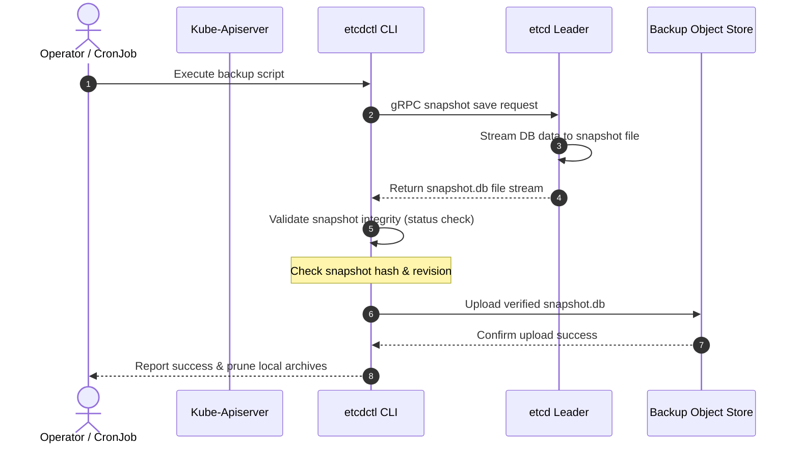
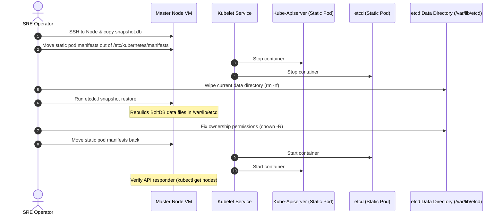
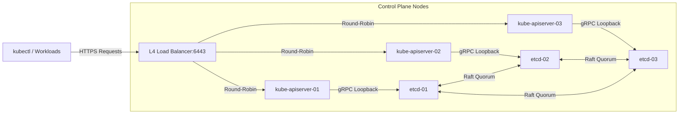
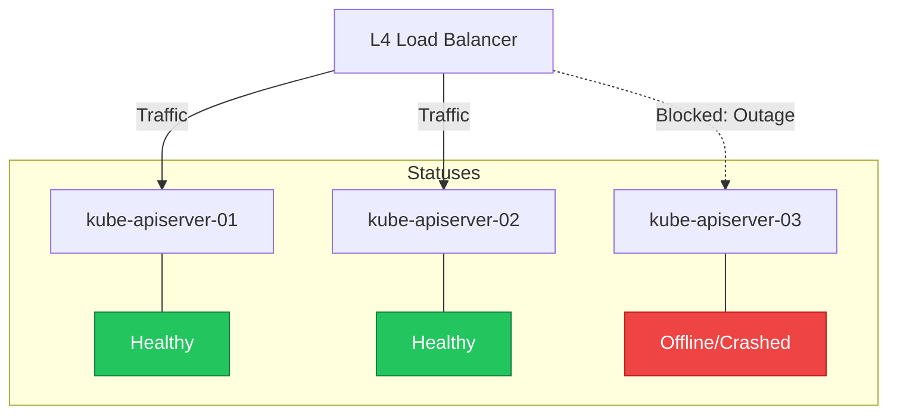
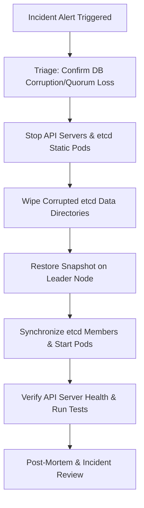
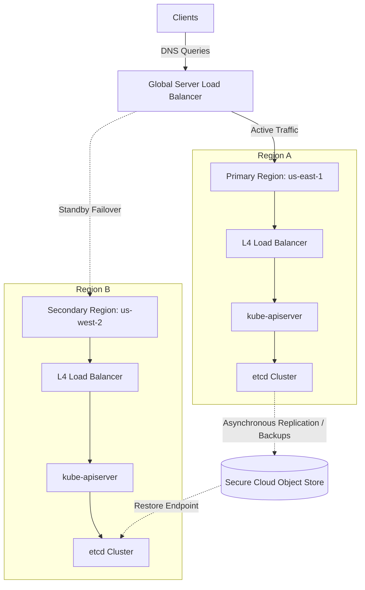
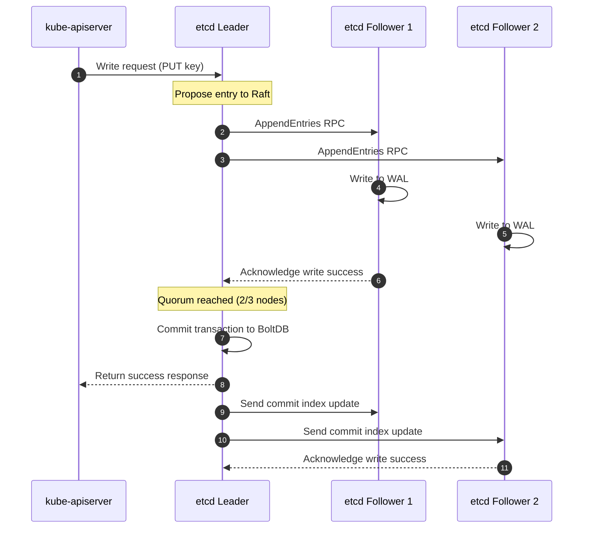
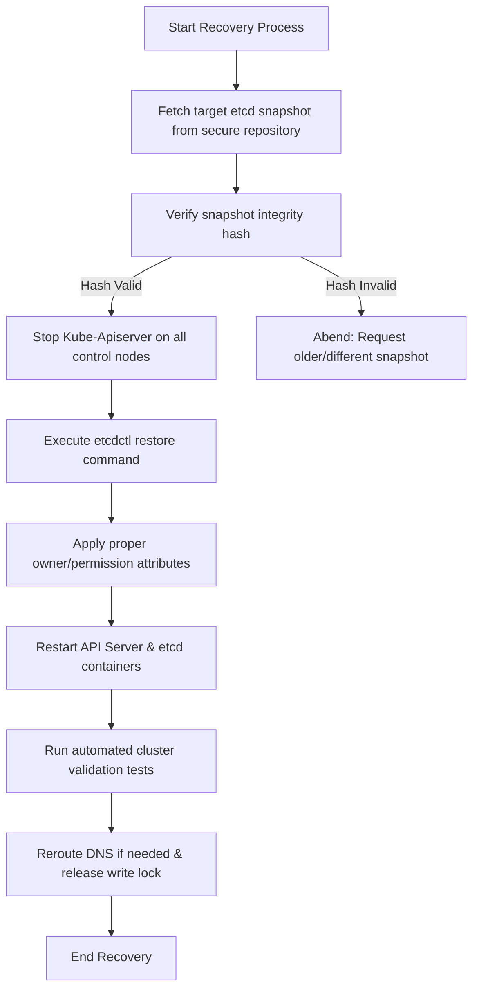

# 📖 Day 21 - Backup, Disaster Recovery and High Availability
### 🏷️ PHASE 3 - OBSERVABILITY & PRODUCTION OPERATIONS

Welcome to Day 21. Today, we focus on the ultimate survival guide for production clusters. In production, the ultimate test of an SRE is not how smoothly the system runs under normal operations, but how quickly and reliably the platform recovers when physical hardware fails, availability zones go dark, or databases get corrupted.

We will dismantle naive cluster architectures and rebuild them with high availability (HA) control planes, multi-zone topology spread rules, and robust etcd backup/restore procedures. By the end of this day, you will never again have to ask: *"What happens if my Kubernetes cluster fails?"*

---

## 🎯 Learning Objectives

By the end of this day, you will deeply understand:
1. Why disaster recovery plans and automated backups are critical to business survival.
2. The internal architecture of **etcd** and how Raft consensus governs state write paths.
3. How to define and calculate **Recovery Point Objective (RPO)** and **Recovery Time Objective (RTO)**.
4. How to design stacked vs. external etcd control plane topologies.
5. The rules for configuring multi-zone cluster workloads using **Topology Spread Constraints** and **Pod Disruption Budgets (PDBs)**.
6. How to execute manual and automated control plane failovers during regional cloud outages.

---

## 🛑 Why Disaster Recovery and HA Matter in Production

Operating a cluster in a single zone without a DR plan is a ticking time bomb. Physical infrastructure is prone to failure, and human error remains the leading cause of major production outages.

### Real-World Outage Incident Archetypes:
* **The OVHcloud Fire (2021)**: A massive fire completely destroyed the SBG2 data center in Strasbourg, France, taking millions of websites offline. Companies that relied on single-region infrastructure lost data permanently. Those with multi-region replication shifted traffic via GSLB within minutes.
* **The AWS S3 us-east-1 Outage (2017)**: An engineer executing a routine billing playbook made a typo in a command, accidentally removing a larger set of servers than intended. This caused a cascading failure across S3 and dependent AWS services worldwide, highlighting how quickly human error can trigger regional failure.
* **The GitLab Database Incident (2017)**: During a replication lag issue, an tired engineer accidentally deleted a 300GB production database directory thinking they were working on a secondary node. The restore failed because the automated backup system hadn't successfully saved data for weeks, reminding us of "Schrödinger's Backup."

---

## 💾 etcd Deep Dive: The Heart of Kubernetes State

Every deployment, pod status, configmap, and namespace in your cluster lives inside **etcd**—a strongly consistent, distributed key-value store written in Go.

* **Single Source of Truth**: The `kube-apiserver` is stateless. If etcd is offline, the API server rejects all commands.
* **Consensus Quorum**: etcd uses the **Raft** protocol to maintain consistency. Writes must be acknowledged by a majority of nodes:
  $$\text{Quorum} = \left\lfloor \frac{N}{2} \right\rfloor + 1$$
* **MVCC Storage**: etcd implements Multi-Version Concurrency Control. Keys are not overwritten in-place; modifications create new revisions. SREs must manage history compaction and defragmentation to prevent the database from exceeding its storage quota limit.

---

## 📊 Visualizing the Architecture (Mermaid Diagrams)

Here are the visual blueprints explaining how HA, backups, and restores operate in production Kubernetes.

### 1. etcd Internal Architecture
```mermaid
graph TD
  Client[kube-apiserver] -->|gRPC Requests| API[gRPC API / KV Server]
  subgraph etcd Server Internals
    API -->|Consensus Proposals| Raft[Raft Consensus Protocol]
    Raft -->|Write Logs| WAL[Write-Ahead Log (Disk)]
    Raft -->|Commit State| MVCC[MVCC Engine]
    MVCC -->|In-Memory Index| BTree[B-Tree Index]
    MVCC -->|Persistent DB| BoltDB[BoltDB Storage (db file)]
  end
```

### 2. etcd Automated Backup Workflow


### 3. etcd Control Plane Restoration Workflow


### 4. High Availability Control Plane Architecture


### 5. Multi-Zone Cluster Topography Design
```mermaid
graph TD
  subgraph Regional VPC (us-east-1)
    subgraph Availability Zone A (us-east-1a)
      Master1[master-01]
      Worker1[worker-01]
    end
    subgraph Availability Zone B (us-east-1b)
      Master2[master-02]
      Worker2[worker-02]
    end
    subgraph Availability Zone C (us-east-1c)
      Master3[master-03]
      Worker3[worker-03]
    end
    
    Master1 <-->|Cross-Zone Raft Link| Master2
    Master2 <-->|Cross-Zone Raft Link| Master3
    Master3 <-->|Cross-Zone Raft Link| Master1
  end
```

### 6. Control Plane Failover Routing


### 7. Multi-Zone Application Eviction & Failover
```mermaid
graph TD
  subgraph Availability Zone A (Failed)
    NodeA[Worker Node A] -.->|Host Offline| PodA[payment-gateway-pod1]
    style NodeA stroke:#ef4444,stroke-width:2px,stroke-dasharray: 5 5
    style PodA fill:#ef4444,color:#fff
  end
  subgraph Availability Zone B (Healthy)
    NodeB[Worker Node B] --> PodB[payment-gateway-pod2]
    NodeB --> PodNew[payment-gateway-pod1-rescheduled]
    style PodNew fill:#22c55e,color:#fff
  end
  subgraph Availability Zone C (Healthy)
    NodeC[Worker Node C] --> PodC[payment-gateway-pod3]
  end
  
  PodA -.->|Evicted after Pod Eviction Timeout| PodNew
```

### 8. Disaster Recovery Incident Triage Workflow


### 9. RPO vs. RTO Timeline Comparison

```mermaid
gantt
    title RPO vs RTO Timeline Comparison
    dateFormat  HH:mm
    axisFormat %H:%M
    section Data Timeline
    Successful Backup          :a1, 12:00, 1m
    Unsaved Transactions (Data Loss / RPO) :active, 12:00, 13:00
    Disaster Event             :milestone, 13:00, 0m
    Outage / Downtime (RTO)    :crit, 13:00, 13:45
    Cluster Restored & Online  :milestone, 13:45, 0m
```


### 10. Multi-Region Active-Passive Production Setup


### 11. etcd Database Sync and Write Path


### 12. End-to-End Control Plane Recovery Logic


---

## ⏱️ RPO & RTO: Engineering for Reliability

Reliability is a trade-off between speed, data integrity, and money. Platform engineers design systems based on two core service level guidelines:

* **Recovery Point Objective (RPO)**: The age of files that must be recovered from backup storage for normal operations to resume. An RPO of 1 hour implies that backups must run at least every hour, tolerating up to 1 hour of transaction loss.
* **Recovery Time Objective (RTO)**: The maximum tolerable duration of downtime before service restoration. An RTO of 30 minutes implies that recovery scripts and DNS routing switches must complete within 30 minutes of failure declaration.

---

## 🏛️ High Availability Topologies: Stacked vs. External etcd

SREs choose between two primary control plane deployment architectures:

| Design Dimension | Stacked etcd Topology | External etcd Topology |
| :--- | :--- | :--- |
| **Co-location** | etcd runs on the same master nodes as api-server. | etcd runs on dedicated, separate instances. |
| **Resource Isolation** | Low. High api-server query loads can starve etcd of CPU/IO. | High. etcd has guaranteed CPU/Memory/IO resource buffers. |
| **Fail Tolerance** | Coupled. Losing a master node removes both an API and DB member. | Decoupled. API master failures do not impact database quorum. |
| **Node Overhead** | Lower. Requires a minimum of 3 nodes for HA. | Higher. Requires a minimum of 6 nodes (3 API + 3 etcd). |
| **Management Complexity** | Low. Handled automatically by standard `kubeadm` boot. | High. Requires separate network rules and cert generation. |

---

## 🌍 Multi-Zone Architecture & Workload Scheduling

Running in multiple zones requires instructing the Kubernetes scheduler to distribute pods evenly.

### Pod Topology Spread Constraints
This constraint guarantees that the difference in pod counts across zones does not exceed a designated skew limit:

```yaml
topologySpreadConstraints:
  - maxSkew: 1
    topologyKey: topology.kubernetes.io/zone
    whenUnsatisfiable: DoNotSchedule
    labelSelector:
      matchLabels:
        app: payment-gateway
```

### Pod Disruption Budgets (PDB)
This resource prevents voluntary disruptions (like automated node upgrades) from evicting too many pods and causing a service outage:

```yaml
apiVersion: policy/v1
kind: PodDisruptionBudget
metadata:
  name: payment-gateway-pdb
spec:
  minAvailable: 2
  selector:
    matchLabels:
      app: payment-gateway
```

---

## 🧑‍💻 Production Code Snippets

Let's look at how SREs take manual snapshots and configure PDBs.

### etcdctl CLI Snapshot Command
Run this command on a control plane node to write a consistent snapshot:
```bash
sudo ETCDCTL_API=3 etcdctl \
  --endpoints=https://127.0.0.1:2379 \
  --cacert=/etc/kubernetes/pki/etcd/ca.crt \
  --cert=/etc/kubernetes/pki/etcd/server.crt \
  --key=/etc/kubernetes/pki/etcd/server.key \
  snapshot save /var/backups/etcd-snapshot.db
```

### etcdctl Verification Status Command
Validate that the snapshot file is valid:
```bash
sudo ETCDCTL_API=3 etcdctl --write-out=table snapshot status /var/backups/etcd-snapshot.db
```

---

## 🧪 Interactive Learning

We have built a single-page interactive simulation to help you visualize control plane failures and database recovery.

### Kubernetes Disaster Recovery Command Center
Open **[disaster-recovery-command-center.html](file:///d:/30_Days_of_Production_Kubernetes/Day-21/disaster-recovery-command-center.html)** in your browser. This custom UI allows you to:
* Trigger individual node failures and observe load balancer traffic redistribution.
* Inject an entire Availability Zone outage, watch pods in that zone transition to `CRASHED` status, and see them reschedule onto surviving zones.
* Corrupt the etcd database, observe the API server throw write alarms, and execute a step-by-step restoration pipeline.
* Adjust backup frequency and automation levels to dynamically calculate RPO/RTO timelines and estimate business downtime costs.

---

## 📂 Day-21 Directory Map

Explore the directories to complete today's curriculum:

* 📔 [notes/](notes/): Deep dives on [etcd Architecture and consensus](notes/etcd-architecture.md).
* 🏛️ [ha-designs/](ha-designs/): In-depth studies of [Multi-Zone HA Topologies](ha-designs/multi-zone-ha-architectures.md).
* 💾 [backup/](backup/): Script files for automated [etcd-backup.sh](backup/etcd-backup.sh) and [etcd-backup-procedure.md](backup/etcd-backup-procedure.md) playbooks.
* 🚑 [recovery/](recovery/): Step-by-step [disaster-recovery-runbook.md](recovery/disaster-recovery-runbook.md) and automated [etcd-restore.sh](recovery/etcd-restore.sh) scripts.
* ⚙️ [manifests/](manifests/): Production-grade manifests for [etcd-backup-cronjob.yaml](manifests/etcd-backup-cronjob.yaml), [ha-app-deployment.yaml](manifests/ha-app-deployment.yaml), [pod-disruption-budget.yaml](manifests/pod-disruption-budget.yaml), and [topology-spread-constraints.yaml](manifests/topology-spread-constraints.yaml).
* 🔬 [labs/](labs/): 3 step-by-step production labs (etcd restoration, topology spread configurations, and control plane crash simulations). Read [labs/README.md](labs/README.md) to start.
* 🧠 [exercises/](exercises/): Hands-on exercises on debugging [restoration permission errors](exercises/exercise-1-etcd-restore-fail.md) and configuring [degraded multi-zone scheduling](exercises/exercise-2-multizone-ha-config.md).
* 📖 [production-notes/](production-notes/): Senior platform engineer handbook on [SRE game-day tests and case studies](production-notes/sre-dr-lessons.md).
* 🛑 [troubleshooting/](troubleshooting/): Production playbook resolving [etcd space alarms and split-brain failures](troubleshooting/troubleshooting-guide.md).
* 📚 [resources/](resources/): Reference guides and reading material on [disaster recovery metrics](resources/references.md).
