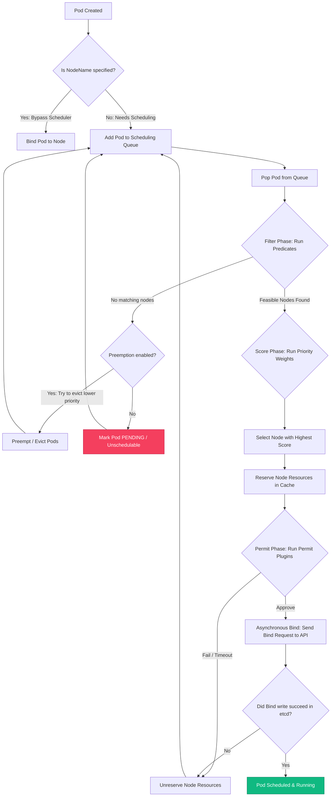
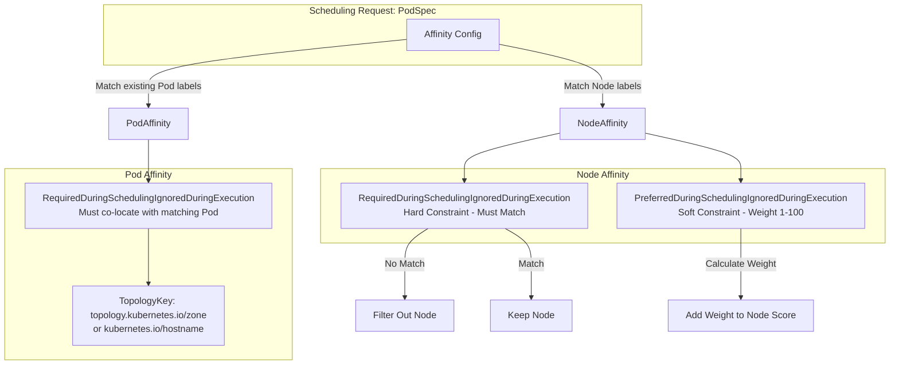
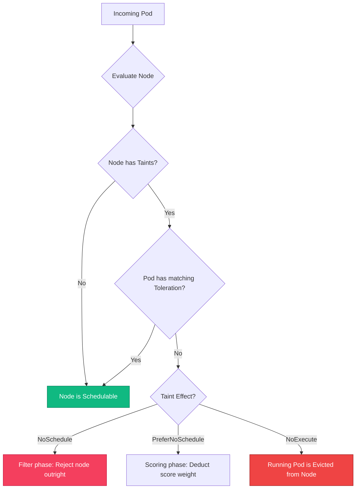

# 📖 Day 22 - Kubernetes Scheduler Internals
### 🏷️ PHASE 4 - ADVANCED CLOUD-NATIVE ENGINEERING

> **TL;DR:** Master the internal mechanics of `kube-scheduler`. Understand the queueing architecture, predicate filtering, priority scoring, node taints, tolerations, pod affinities, and topology spread constraints to design bulletproof node placement strategies at scale.

---

## 🎯 Learning Objectives
By the end of this day, you will be able to:
1. Trace the step-by-step lifecycle of how a Pod is scheduled onto a Node.
2. Explain the difference between Filtering (Predicates) and Scoring (Priorities).
3. Configure advanced Node Affinity, Pod Affinity, and Pod Anti-Affinity patterns.
4. Implement workload isolation using Taints, Tolerations, and Node Affinity.
5. Deploy high-availability workloads across zones using Topology Spread Constraints.
6. Troubleshoot common scheduler failures (e.g. `FailedScheduling`, untolerated taints, resource shortages).

---

## 🧭 Why Scheduling Matters

Workload placement is a core competency of platform engineering. Proper scheduling directly impacts:
* **Resource Utilization**: Proper placement avoids "resource fragmentation" and packs nodes tightly, saving up to 40% in cloud infrastructure costs.
* **Reliability**: Spreading replicas across physical servers and zones ensures your application survives VM or availability zone outages.
* **Specialized Hardware**: Ensures expensive nodes (like GPU nodes or Windows-licensed nodes) are only utilized by workloads that actually require them.

---

## 🏗️ Scheduler Architecture

The `kube-scheduler` is a control loop that watches for newly created Pods with no `spec.nodeName` defined, and selects the best Node for them. 

### 1. End-to-End Decision Process
Here is the sequence of events from Pod creation to running state:

*(View raw diagram source: [12-end-to-end-decision-process.mermaid](file:///d:/30_Days_of_Production_Kubernetes/Day-22/diagrams/12-end-to-end-decision-process.mermaid))*

### 2. The Internal Queue Structure
The scheduler holds pods in three distinct states in memory:
1. **`ActiveQ`**: A heap sorting pods by their `PriorityClass` value.
2. **`UnschedulablePods`**: An unscheduled pod pool holding pods that failed scheduling due to a hard filter failure (e.g. out of memory).
3. **`PodBackoffQ`**: Holds pods that failed due to transient issues, using exponential backoff before retrying.

Detailed architectural analysis can be found in [notes/scheduler-deep-dive.md](file:///d:/30_Days_of_Production_Kubernetes/Day-22/notes/scheduler-deep-dive.md).

---

## 🔌 Filtering vs. Scoring Plugins

The scheduling loop evaluates nodes in two distinct phases:

### Phase 1: Filtering (Predicates)
Evaluates whether a Node *can* host the Pod. If any predicate fails, the node is rejected.
* **`NodeResourcesFit`**: Does the node have enough unreserved CPU and Memory?
* **`NodePorts`**: Is the requested `hostPort` already bound on this node?
* **`NodeAffinity` / `NodeSelector`**: Does the node match the Pod's node selector criteria?
* **`PodTopologySpread`**: Can the node accept the Pod without violating spread limits?

### Phase 2: Scoring (Priorities)
Rates the remaining feasible nodes from 0 to 100 points.
* **`NodeResourcesBalancedAllocation`**: Prefers nodes with balanced CPU and Memory utilization ratios.
* **`ImageLocality`**: Scores nodes higher if they already have the container images cached.
* **`NodeResourcesFit` (LeastAllocated / MostAllocated)**:
  * *Spread Strategy (LeastAllocated)*: Scores nodes higher if they have *low* utilization. (Default).
  * *Bin Packing Strategy (MostAllocated)*: Scores nodes higher if they have *high* utilization, grouping workloads to save costs.

To customize these scoring algorithms, read [scheduler/README.md](file:///d:/30_Days_of_Production_Kubernetes/Day-22/scheduler/README.md) and inspect the enterprise multi-profile [scheduler-config.yaml](file:///d:/30_Days_of_Production_Kubernetes/Day-22/scheduler/scheduler-config.yaml).

---

## 🔗 Affinity & Anti-Affinity

Affinities allow you to define flexible scheduling rules matching node labels or existing pod labels.

*(View raw diagram source: [5-affinity-architecture.mermaid](file:///d:/30_Days_of_Production_Kubernetes/Day-22/diagrams/5-affinity-architecture.mermaid))*

### 1. Node Affinity
Replaces `nodeSelector` by allowing logical operators and soft constraints:
* **Required (Hard)**: `requiredDuringSchedulingIgnoredDuringExecution`
* **Preferred (Soft)**: `preferredDuringSchedulingIgnoredDuringExecution` with a `weight` (1-100) used in the scoring phase.

*Example configuration:* [pod-node-affinity.yaml](file:///d:/30_Days_of_Production_Kubernetes/Day-22/manifests/pod-node-affinity.yaml)

### 2. Pod Affinity & Anti-Affinity
Evaluates labels on *currently running pods* to determine co-location or separation:
* **`topologyKey`**: Defines the physical or network boundary (e.g., `kubernetes.io/hostname` to isolate individual VMs, or `topology.kubernetes.io/zone` to isolate availability zones).
* **Anti-Affinity**: Ensures replicas are spread out for high availability.
* **Affinity**: Groups related workloads (like co-locating a Redis caching pod onto the same VM as a Web API to lower latency).

*Example manifests:* [pod-anti-affinity-ha.yaml](file:///d:/30_Days_of_Production_Kubernetes/Day-22/manifests/pod-anti-affinity-ha.yaml) & [pod-affinity-colocation.yaml](file:///d:/30_Days_of_Production_Kubernetes/Day-22/manifests/pod-affinity-colocation.yaml). Find deep-dive explanations in [affinity/README.md](file:///d:/30_Days_of_Production_Kubernetes/Day-22/affinity/README.md).

---

## 🚫 Taints & Tolerations

Taints allow nodes to repel certain workloads unless the workloads carry a matching toleration.

*(View raw diagram source: [7-taints-tolerations-workflow.mermaid](file:///d:/30_Days_of_Production_Kubernetes/Day-22/diagrams/7-taints-tolerations-workflow.mermaid))*

### Taint Effects:
* **`NoSchedule`**: Pods without tolerations cannot be placed on the node.
* **`PreferNoSchedule`**: Soft avoidance. The scheduler tries to place the pod elsewhere but will use the tainted node as a last resort.
* **`NoExecute`**: Evicts existing running pods from the node if they do not tolerate the taint (used for node failures).

For isolating specialized node pools (like GPU nodes), read [taints/README.md](file:///d:/30_Days_of_Production_Kubernetes/Day-22/taints/README.md) and see the manifest [taint-toleration-gpu.yaml](file:///d:/30_Days_of_Production_Kubernetes/Day-22/manifests/taint-toleration-gpu.yaml).

---

## 🎮 Kubernetes Scheduling Command Center (Simulation)

To visually experience the filtering and scoring mechanics of Kube-Scheduler, open [scheduler-command-center.html](file:///d:/30_Days_of_Production_Kubernetes/Day-22/scheduler-command-center.html) in your browser.

### 🕹️ Interactive Tasks to Try:
1. **Node Outages**: Mark a node offline and observe active pods automatically re-queuing and rescheduling.
2. **Apply Taints**: Add `hardware=gpu:NoSchedule` taint to a node. Submit a standard pod and see the filtering scorecard reject it.
3. **Change Strategies**: Toggle from `Spread` to `Bin Packing` mode and observe how the node resource scores change to pack workloads tightly.

---

## 🛠️ Hands-On Labs

Learn how to configure and debug placement rules step-by-step:

* **[Lab 1: Exploring Scheduler Internals](file:///d:/30_Days_of_Production_Kubernetes/Day-22/labs/lab-1-scheduler-internals.md)**: Query scheduling events, inspect logs, and adjust verbosity.
* **[Lab 2: Implementing Node Affinity](file:///d:/30_Days_of_Production_Kubernetes/Day-22/labs/lab-2-node-affinity.md)**: Enforce security-based zone placement on nodes.
* **[Lab 3: Pod Affinity & Anti-Affinity](file:///d:/30_Days_of_Production_Kubernetes/Day-22/labs/lab-3-pod-affinity-anti-affinity.md)**: Distribute frontends for high-availability and co-locate redis caches.
* **[Lab 4: Workload Isolation via Taints](file:///d:/30_Days_of_Production_Kubernetes/Day-22/labs/lab-4-taints-tolerations.md)**: Set up dedicated GPU node pools.
* **[Lab 5: Multi-Zone Topology Spread Constraints](file:///d:/30_Days_of_Production_Kubernetes/Day-22/labs/lab-5-multi-zone-topology.md)**: Balance pods evenly across availability zones.

---

## 🚨 Troubleshooting & Diagnostics

Common errors and how to resolve them:

| Symptom | Probable Cause | Diagnostic Command & Resolution |
|---|---|---|
| Pod Stuck in `Pending` | Out of CPU/Memory capacity | `kubectl describe pod <pod>`   Check `FailedScheduling` events. Add nodes or adjust CPU requests. |
| `Untolerated Taint` error | Pod running on general worker nodes | Check node taints with `kubectl get nodes -o yaml`   Add matching tolerations to PodSpec. |
| Skew Limit Exceeded | Zone/Node Spread failure | Inspect `topologySpreadConstraints` and node counts per zone. Adjust `whenUnsatisfiable` to `ScheduleAnyway`. |

Find detailed SRE incident playbooks in [troubleshooting/troubleshooting-guide.md](file:///d:/30_Days_of_Production_Kubernetes/Day-22/troubleshooting/troubleshooting-guide.md).

---

## 📚 References and Tooling

* Read the senior-level architectural design notes in [production-notes/production-placement-strategies.md](file:///d:/30_Days_of_Production_Kubernetes/Day-22/production-notes/production-placement-strategies.md) to understand resource fragmentation and scaling deschedulers.
* A curated list of production tools (like Karpenter, Descheduler, etc.) can be found in [resources/additional-resources.md](file:///d:/30_Days_of_Production_Kubernetes/Day-22/resources/additional-resources.md).
