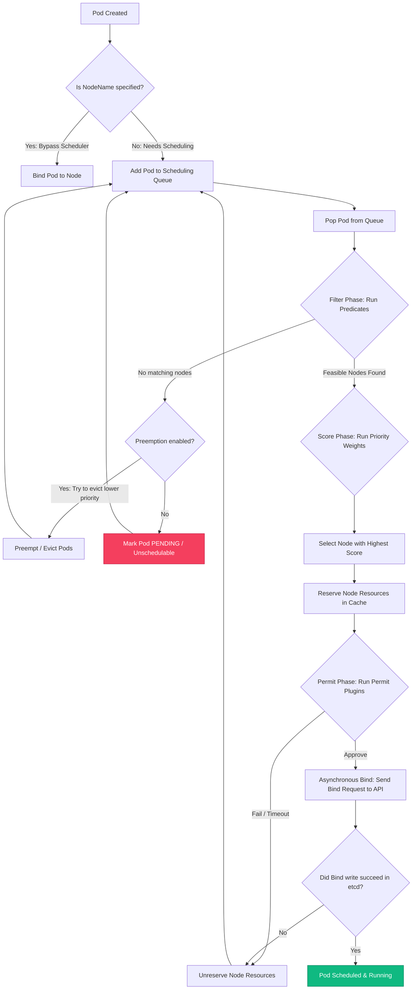

# 📖 Day 22: Kubernetes Scheduler Internals
### 🏷️ PHASE 4 — ADVANCED CLOUD-NATIVE ENGINEERING

Welcome to Day 22 of the **30 Days of Production Kubernetes** course. Today, we step into the shoes of a Principal Platform Engineer and Distributed Systems Architect.

In a large-scale cloud-native environment, managing where your workloads run is critical. Unplanned pod scheduling leads to resource starvation, node hotspots, and high cloud bills. Today, you will master the internal mechanics of `kube-scheduler`, understanding how it evaluates nodes and enforces pod placements so you never again have to ask: *"How did Kubernetes decide to place my Pod on that node?"*

---

## 🗺️ Day 22 Directory Structure

Here is how today's learning resources are organized:
-   [notes/scheduler-deep-dive.md](file:///d:/30_Days_of_Production_Kubernetes/Day-22/notes/scheduler-deep-dive.md) — Advanced reference guide covering internal scheduler cache queues (`ActiveQ`, `BackoffQ`, `Unschedulable`), scheduling cycles, and preemption loops.
-   [diagrams/](file:///d:/30_Days_of_Production_Kubernetes/Day-22/diagrams/) — 12 raw Mermaid diagram text files detailing decision trees, filtering predicates, and scoring priority weight processes.
-   [manifests/](file:///d:/30_Days_of_Production_Kubernetes/Day-22/manifests/) — Production-ready YAML manifests demonstrating different scheduling rules:
    *   [pod-node-affinity.yaml](file:///d:/30_Days_of_Production_Kubernetes/Day-22/manifests/pod-node-affinity.yaml) — Showcases hard and soft node affinity constraints.
    *   [pod-anti-affinity-ha.yaml](file:///d:/30_Days_of_Production_Kubernetes/Day-22/manifests/pod-anti-affinity-ha.yaml) — Enforces multi-host spreading for high-availability.
    *   [pod-affinity-colocation.yaml](file:///d:/30_Days_of_Production_Kubernetes/Day-22/manifests/pod-affinity-colocation.yaml) — Co-locates Redis cache pods next to API frontend workloads.
    *   [taint-toleration-gpu.yaml](file:///d:/30_Days_of_Production_Kubernetes/Day-22/manifests/taint-toleration-gpu.yaml) — Isolates workloads on dedicated GPU node pools.
    *   [topology-spread-constraints.yaml](file:///d:/30_Days_of_Production_Kubernetes/Day-22/manifests/topology-spread-constraints.yaml) — Spreads replicas evenly across availability zones.
-   [scheduler/](file:///d:/30_Days_of_Production_Kubernetes/Day-22/scheduler/) — custom scheduler settings:
    *   [README.md](file:///d:/30_Days_of_Production_Kubernetes/Day-22/scheduler/README.md) — Guide on custom scheduler profiles and extension points.
    *   [scheduler-config.yaml](file:///d:/30_Days_of_Production_Kubernetes/Day-22/scheduler/scheduler-config.yaml) — Enterprise-grade `KubeSchedulerConfiguration` using `NodeResourcesFit` for bin-packing.
-   [affinity/README.md](file:///d:/30_Days_of_Production_Kubernetes/Day-22/affinity/README.md) — Reference guide explaining the differences between selectors, affinities, and the usage of `topologyKey`.
-   [taints/README.md](file:///d:/30_Days_of_Production_Kubernetes/Day-22/taints/README.md) — Comprehensive guide on taints, tolerations, and node eviction delays governed by the `TaintManager`.
-   [labs/](file:///d:/30_Days_of_Production_Kubernetes/Day-22/labs/) — 5 hands-on engineering labs:
    *   [Lab 1: Exploring Scheduler Internals](file:///d:/30_Days_of_Production_Kubernetes/Day-22/labs/lab-1-scheduler-internals.md)
    *   [Lab 2: Implementing Node Affinity](file:///d:/30_Days_of_Production_Kubernetes/Day-22/labs/lab-2-node-affinity.md)
    *   [Lab 3: Pod Affinity & Anti-Affinity](file:///d:/30_Days_of_Production_Kubernetes/Day-22/labs/lab-3-pod-affinity-anti-affinity.md)
    *   [Lab 4: Workload Isolation via Taints](file:///d:/30_Days_of_Production_Kubernetes/Day-22/labs/lab-4-taints-tolerations.md)
    *   [Lab 5: Multi-Zone Topology Spread](file:///d:/30_Days_of_Production_Kubernetes/Day-22/labs/lab-5-multi-zone-topology.md)
-   [production-notes/production-placement-strategies.md](file:///d:/30_Days_of_Production_Kubernetes/Day-22/production-notes/production-placement-strategies.md) — Lessons learned running large clusters, including resource fragmentation, spreading vs. bin packing, and Karpenter node provisioning.
-   [troubleshooting/troubleshooting-guide.md](file:///d:/30_Days_of_Production_Kubernetes/Day-22/troubleshooting/troubleshooting-guide.md) — Step-by-step diagnostic workflows for fixing pending pods, untolerated taints, and scheduling conflicts.
-   [exercises/scheduling-challenges.md](file:///d:/30_Days_of_Production_Kubernetes/Day-22/exercises/scheduling-challenges.md) — Daily coding assignment: configure strict routing rules for sensitive payment workloads.
-   [scheduler-command-center.html](file:///d:/30_Days_of_Production_Kubernetes/Day-22/scheduler-command-center.html) — Futuristic, interactive single-page HTML simulator. Test scheduling scenarios, inspect scoring points, fail nodes, apply taints, and monitor live scheduler logs.

---

## 1. Why Scheduling Matters in Production

How Kubernetes schedules Pods directly impacts:
*   **Resource efficiency (Bin Packing):** Compacting workloads reduces the number of running VM nodes, saving cloud costs.
*   **High Availability (Spreading):** Separating replicas across nodes and availability zones avoids single-points-of-failure.
*   **Workload Isolation:** Isolating sensitive databases, critical system agents, or resource-heavy batch workloads ensures performance stability and compliance.

---

## 2. Scheduler Internals: The Two-Cycle Loop

The scheduler evaluates Pods in a two-cycle execution pipeline:
1.  **Scheduling Cycle (Synchronous):** Executes on a single thread. It pops a Pod from the queue, evaluates filtering predicates, scores feasible nodes, and optimistically reserves resources.
2.  **Binding Cycle (Asynchronous):** Spawns a separate concurrent thread to write the `spec.nodeName` binding back to the API server, freeing the main thread to immediately evaluate the next pod.

*(View raw diagram source: [12-end-to-end-decision-process.mermaid](file:///d:/30_Days_of_Production_Kubernetes/Day-22/diagrams/12-end-to-end-decision-process.mermaid))*

---

## 3. Filtering vs. Scoring: Plugin Extension Points

The scheduler matches workloads using a plugin-based architecture at specific extension points:
*   **Filtering (Predicates):** Strict filters. If a node fails a predicate (like `NodeResourcesFit` or `NodePorts` conflicts), it is immediately disqualified.
*   **Scoring (Priorities):** Soft weights. Discovered nodes are rated 0-100. Plugins (like `ImageLocality` or `NodeResourcesBalancedAllocation`) calculate scores multiplied by weights to select the node with the highest point total.

*For plugin configuration guides, review [scheduler/README.md](file:///d:/30_Days_of_Production_Kubernetes/Day-22/scheduler/README.md).*

---

## 4. Workload Placement via Affinity & Anti-Affinity

Affinities allow matching expressions based on Node and Pod labels:
*   **Node Affinity:** Replaces `nodeSelector` by offering soft preferences (`preferredDuringScheduling...`) and logical operators.
*   **Pod Affinity:** Co-locates related containers (e.g. redis cache next to backend pods) on the same host VM.
*   **Pod Anti-Affinity:** Repels similar workloads. Essential to spread frontend pods across VMs or availability zones using the `topologyKey`.

*Review usage examples in [affinity/README.md](file:///d:/30_Days_of_Production_Kubernetes/Day-22/affinity/README.md).*

---

## 5. Taints & Tolerations: Repelling Workloads

A taint allows a Node to repel workloads:
*   **Taint:** Key/value pairs applied to nodes (e.g. `hardware=gpu:NoSchedule`).
*   **Toleration:** Exception rules declared in PodSpecs allowing pods to ignore specific taints.
*   **TaintManager:** Manages evictions. Nodes marked with `NoExecute` taints automatically evict untolerated pods after a specified `tolerationSeconds` window.

*Read more in [taints/README.md](file:///d:/30_Days_of_Production_Kubernetes/Day-22/taints/README.md).*

---

## 🏁 Summary of Daily Tasks

To complete Day 22:
1.  **Open the Interactive Simulator:** Launch [scheduler-command-center.html](file:///d:/30_Days_of_Production_Kubernetes/Day-22/scheduler-command-center.html) in your browser. Trigger and diagnose scenarios (GPU routing, HA host anti-affinity, bin packing), inspect scoring points, and monitor live scheduler logs.
2.  **Study Deep-Dive Notes:** Review [notes/scheduler-deep-dive.md](file:///d:/30_Days_of_Production_Kubernetes/Day-22/notes/scheduler-deep-dive.md) to master queue types, scheduling phases, and preemption cycles.
3.  **Explore the Reference Guides:** Read [scheduler/README.md](file:///d:/30_Days_of_Production_Kubernetes/Day-22/scheduler/README.md), [affinity/README.md](file:///d:/30_Days_of_Production_Kubernetes/Day-22/affinity/README.md), and [taints/README.md](file:///d:/30_Days_of_Production_Kubernetes/Day-22/taints/README.md).
4.  **Execute the Labs:** Complete [Labs 1 to 5](file:///d:/30_Days_of_Production_Kubernetes/Day-22/labs/) inside your cluster environment using the configs in [manifests/](file:///d:/30_Days_of_Production_Kubernetes/Day-22/manifests/).
5.  **Review Production Operations:** Study [production-notes/production-placement-strategies.md](file:///d:/30_Days_of_Production_Kubernetes/Day-22/production-notes/production-placement-strategies.md) and [troubleshooting/troubleshooting-guide.md](file:///d:/30_Days_of_Production_Kubernetes/Day-22/troubleshooting/troubleshooting-guide.md).
6.  **Complete the Challenge:** Implement all placement rules required in [exercises/scheduling-challenges.md](file:///d:/30_Days_of_Production_Kubernetes/Day-22/exercises/scheduling-challenges.md).
