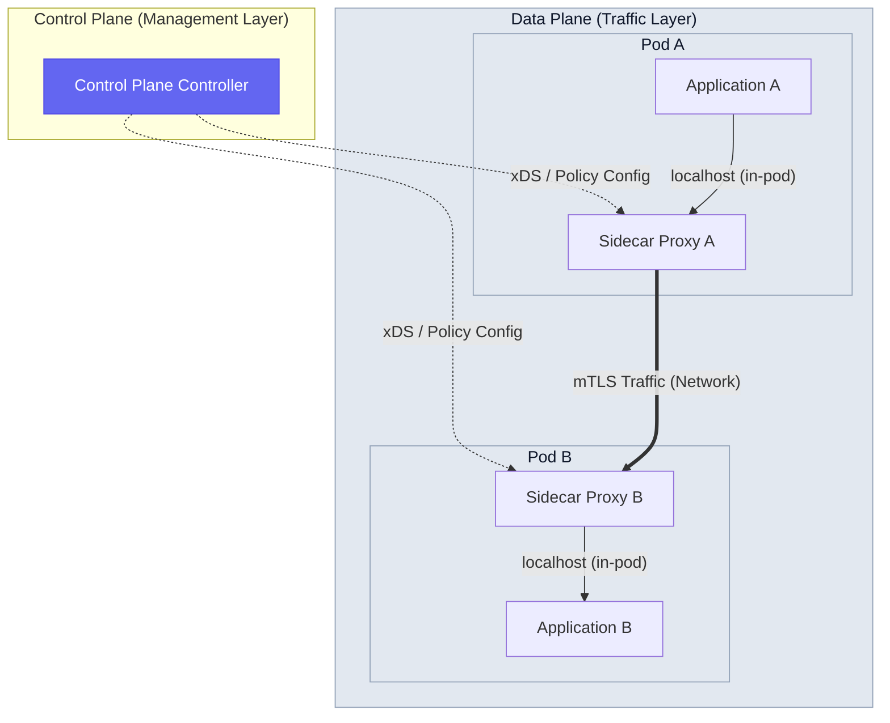
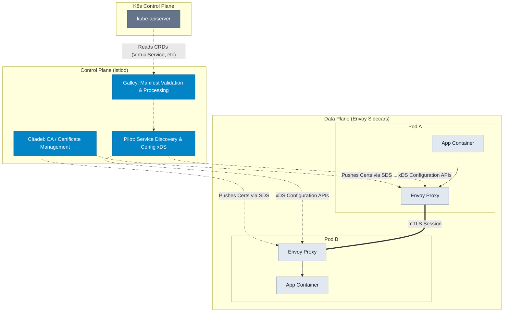
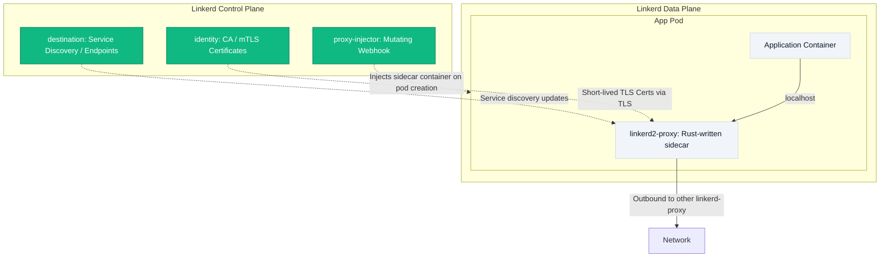
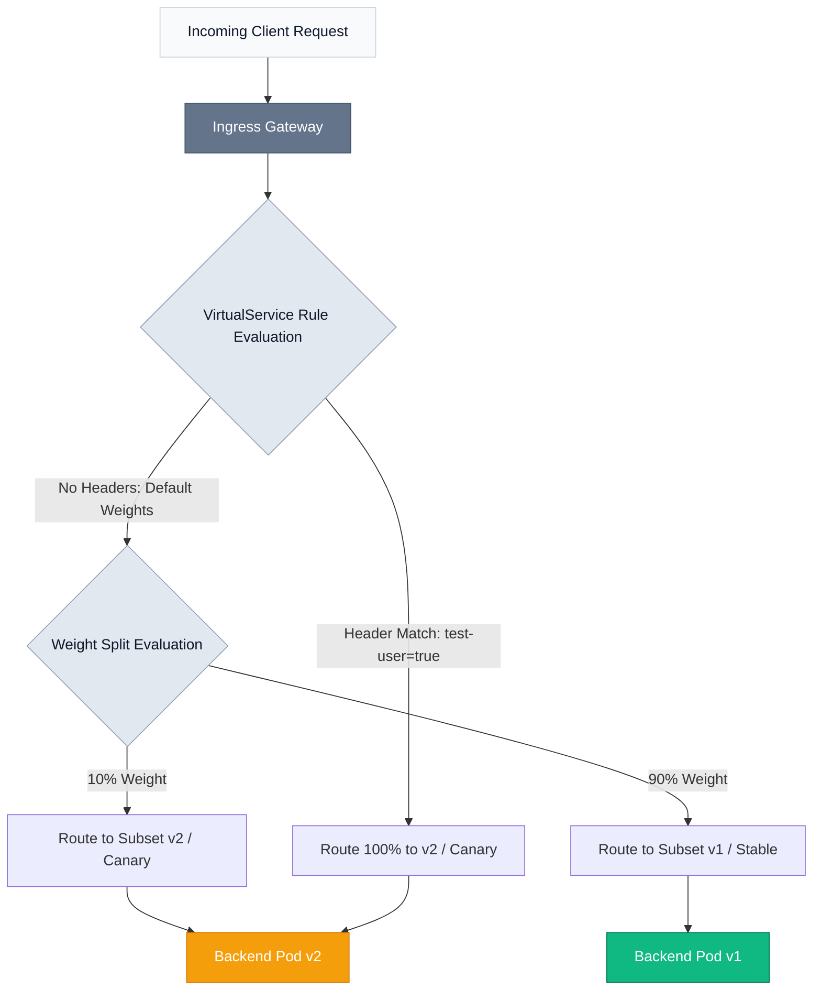
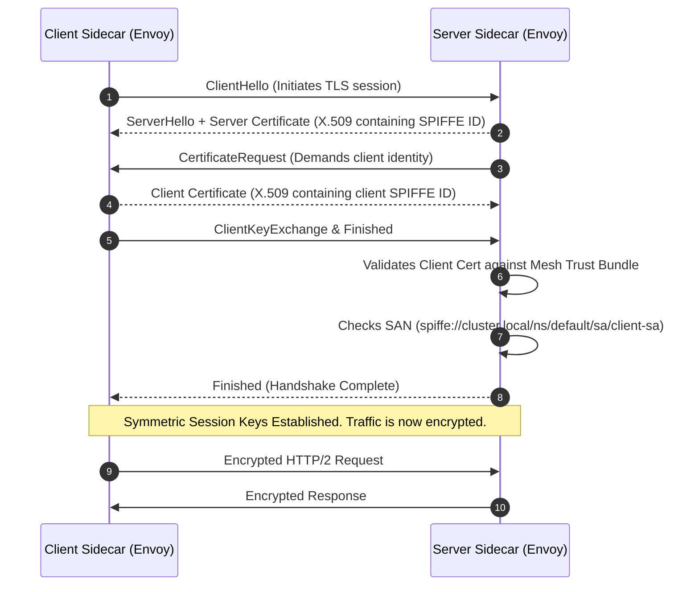

# 🕸️ Day 23: Service Mesh Deep Dive
### 🏷️ PHASE 4 — ADVANCED CLOUD-NATIVE ENGINEERING

Welcome to Day 23 of the **30 Days of Production Kubernetes** course. Today, we step into the shoes of a Cloud-Native Architect and Principal Systems Engineer to explore service mesh internals.

In a distributed container system with hundreds of microservices, managing communication reliability, transport security, and granular observability inside application code becomes impossible. Today, you will master the mechanics of sidecar proxy interception, Envoy configurations, dynamic routing, and zero-trust security policies so you never again have to ask: *"Why do I need Istio if Kubernetes networking already works?"*

---

## 🗺️ Day 23 Directory Structure

Here is how today's learning resources are organized:
-   [notes/service-mesh-deep-dive.md](file:///d:/30_Days_of_Production_Kubernetes/Day-23/notes/service-mesh-deep-dive.md) — Core reference guide covering out-of-process sidecar patterns, iptables vs. eBPF, Envoy xDS APIs (LDS, RDS, CDS, EDS), and Istio vs. Linkerd differences.
-   [diagrams/](file:///d:/30_Days_of_Production_Kubernetes/Day-23/diagrams/) — 12 raw Mermaid text files detailing mesh topologies, mTLS handshakes, proxy interception packet paths, and policy evaluations.
-   [service-mesh-control-center.html](file:///d:/30_Days_of_Production_Kubernetes/Day-23/service-mesh-control-center.html) — Futuristic, interactive single-page HTML simulator. Visualise sidecar injection, mTLS handshakes, adjust weighted canary splits, inject faults (503s), test authorization policies, and monitor real-time Envoy log streams.
-   [manifests/](file:///d:/30_Days_of_Production_Kubernetes/Day-23/manifests/) — Production-ready Kubernetes workloads:
    *   [frontend-deployment.yaml](file:///d:/30_Days_of_Production_Kubernetes/Day-23/manifests/frontend-deployment.yaml) — Client deployment with dedicated ServiceAccount.
    *   [backend-v1-deployment.yaml](file:///d:/30_Days_of_Production_Kubernetes/Day-23/manifests/backend-v1-deployment.yaml) — Backend Stable (v1) running http-echo.
    *   [backend-v2-deployment.yaml](file:///d:/30_Days_of_Production_Kubernetes/Day-23/manifests/backend-v2-deployment.yaml) — Backend Canary (v2) instances.
    *   [services.yaml](file:///d:/30_Days_of_Production_Kubernetes/Day-23/manifests/services.yaml) — Service specs with Istio-compatible port names.
-   [istio/](file:///d:/30_Days_of_Production_Kubernetes/Day-23/istio/) — Istio installation and components:
    *   [istio-operator.yaml](file:///d:/30_Days_of_Production_Kubernetes/Day-23/istio/istio-operator.yaml) — Production deployment profile with custom resource limits and telemetry.
    *   [istio-ingressgateway.yaml](file:///d:/30_Days_of_Production_Kubernetes/Day-23/istio/istio-ingressgateway.yaml) — LoadBalancer Service configuration for public edge traffic.
-   [linkerd/](file:///d:/30_Days_of_Production_Kubernetes/Day-23/linkerd/) — Linkerd specifications:
    *   [linkerd-viz.yaml](file:///d:/30_Days_of_Production_Kubernetes/Day-23/linkerd/linkerd-viz.yaml) — Metrics and visualization extension resources.
-   [traffic-management/](file:///d:/30_Days_of_Production_Kubernetes/Day-23/traffic-management/) — Advanced routing configs:
    *   [gateway.yaml](file:///d:/30_Days_of_Production_Kubernetes/Day-23/traffic-management/gateway.yaml) — Istio edge ingress gateway configuration.
    *   [virtual-service-canary.yaml](file:///d:/30_Days_of_Production_Kubernetes/Day-23/traffic-management/virtual-service-canary.yaml) — Defines 90/10 canary split weights and beta headers overrides.
    *   [destination-rule-canary.yaml](file:///d:/30_Days_of_Production_Kubernetes/Day-23/traffic-management/destination-rule-canary.yaml) — Defines target subsets `v1`/`v2` and load balancing rules.
-   [security/](file:///d:/30_Days_of_Production_Kubernetes/Day-23/security/) — Zero-trust access policies:
    *   [peer-authentication-strict.yaml](file:///d:/30_Days_of_Production_Kubernetes/Day-23/security/peer-authentication-strict.yaml) Enforces strict mutual TLS (mTLS) for workloads.
    *   [authorization-policy.yaml](file:///d:/30_Days_of_Production_Kubernetes/Day-23/security/authorization-policy.yaml) — Permissive path and identity-based access whitelist.
-   [labs/](file:///d:/30_Days_of_Production_Kubernetes/Day-23/labs/) — 8 detailed engineering labs:
    *   [Lab 1: Installing Istio](file:///d:/30_Days_of_Production_Kubernetes/Day-23/labs/lab-1-install-istio.md)
    *   [Lab 2: Installing Linkerd](file:///d:/30_Days_of_Production_Kubernetes/Day-23/labs/lab-2-install-linkerd.md)
    *   [Lab 3: Configure Sidecar Injection](file:///d:/30_Days_of_Production_Kubernetes/Day-23/labs/lab-3-sidecar-injection.md)
    *   [Lab 4: Enforce Mutual TLS (mTLS)](file:///d:/30_Days_of_Production_Kubernetes/Day-23/labs/lab-4-enable-mtls.md)
    *   [Lab 5: L7 Traffic Routing & Canary Releases](file:///d:/30_Days_of_Production_Kubernetes/Day-23/labs/lab-5-traffic-routing-canary.md)
    *   [Lab 6: Configure Authorization Policies](file:///d:/30_Days_of_Production_Kubernetes/Day-23/labs/lab-6-authorization-policies.md)
    *   [Lab 7: Implement Zero-Trust Networking](file:///d:/30_Days_of_Production_Kubernetes/Day-23/labs/lab-7-zero-trust.md)
    *   [Lab 8: Production Operations & Debugging](file:///d:/30_Days_of_Production_Kubernetes/Day-23/labs/lab-8-production-operations.md)
-   [production-notes/service-mesh-at-scale.md](file:///d:/30_Days_of_Production_Kubernetes/Day-23/production-notes/service-mesh-at-scale.md) — Sizing guidelines, configuration scopes via the `Sidecar` resource, multi-cluster architectures, retry storms, and operational trade-offs.
-   [troubleshooting/service-mesh-troubleshooting.md](file:///d:/30_Days_of_Production_Kubernetes/Day-23/troubleshooting/service-mesh-troubleshooting.md) — 10 real-world outage debug scenarios with symptom metrics, root-cause analyses, CLI diagnostic commands, and preventions.
-   [exercises/mesh-challenge.md](file:///d:/30_Days_of_Production_Kubernetes/Day-23/exercises/mesh-challenge.md) — Daily assignment: build a canary rollout with circuit-breaking limits and multi-tenant namespace isolation rules.
-   [resources/references.md](file:///d:/30_Days_of_Production_Kubernetes/Day-23/resources/references.md) — Recommended blogs, standard specifications, and documentation indices.

---

## 1. Why Service Mesh Exists

In a standard Kubernetes cluster, networking operates at **Layer 4 (Transport Layer)**. The API server schedules pods, and kube-proxy configures IPVS or iptables rules to load-balance traffic randomly between matching Pod IPs.

However, modern production applications require **Layer 7 (Application Layer)** capabilities. A service mesh shifts networking concerns out of application code and into the infrastructure layer, resolving five key problems:

```
Application Networking Problems
  ↓
Retries (Handling intermittent network glitches without flooding downstream systems)
  ↓
Timeouts (Stopping slow calls from locking up client thread pools)
  ↓
Observability (Measuring p99 latency, request rates, and HTTP error codes automatically)
  ↓
Security (Encrypting data-in-transit via mutual TLS and validating client identities)
  ↓
Traffic Management (Executing fine-grained canary rollouts, headers-routing, and circuit-breaking)
```

---

## 2. Service Mesh Architecture: Data Plane vs. Control Plane

A service mesh is split into two logical areas:



### The Data Plane
Consists of high-performance sidecar proxies (typically **Envoy**) deployed alongside your application containers inside the same Pod. Because containers in a Pod share the same network namespace, all inbound and outbound traffic is intercepted by `iptables` or `eBPF` and routed through the proxy.

### The Control Plane
Consists of a controller daemon (e.g., `istiod` in Istio) that converts user configuration rules (YAML manifests) into low-level proxy instructions (routes, endpoints, encryption settings) and streams them dynamically to the sidecars using the **xDS APIs**.

---

## 3. Istio Deep Dive

Istio is the most feature-rich service mesh in the cloud-native ecosystem.



-   **`istiod`**: The single control plane process. It compiles endpoints, signs certificates, and processes configurations.
-   **Envoy Sidecar**: Runs in the pod network space. Intercepts traffic on ingress port `15006` and egress port `15001`.
-   **Mutating Webhook Injection**: When a new Pod is scheduled in an enabled namespace, the `sidecar-injector` mutating webhook intercepts the API call and automatically injects the `istio-init` container (to write iptables rules) and the `istio-proxy` container into the Pod template.

---

## 4. Linkerd Deep Dive

Linkerd is designed for operators who prioritize operational simplicity and resource efficiency.



-   **No Envoy**: Linkerd replaces the generic Envoy proxy with a highly specialized, custom-written `linkerd2-proxy` in Rust.
-   **Minimal Footprint**: By omitting heavy configurations and L7 extension engines (such as WebAssembly), Linkerd sidecars consume only 15MB of memory (compared to Envoy's 100MB+ in large clusters).
-   **Out-of-the-box Security**: mTLS is enabled automatically upon installation. It requires no complex custom resource definitions to configure connection encryption.

---

## 5. Traffic Shaping & Canary Routing

In standard Kubernetes, deploying a new version of a pod splits traffic based on pod replicas (e.g., 4 v1 pods and 1 v2 pod gives a rigid 80/20 split).

A service mesh splits traffic at the **L7 routing layer** using two components:
1.  **VirtualService**: Defines the traffic routing matching rules, mapping weights, and gateway links.
2.  **DestinationRule**: Groups pods into named **subsets** based on labels (e.g., matching `version: v1` vs `version: v2`) and configures connection pool policies.



This allows you to deploy 1 pod of V2 alongside 100 pods of V1 and send exactly **1% of traffic** to the new instance without wasting CPU and memory resources.

---

## 6. Mutual TLS (mTLS) & Zero-Trust Security

A service mesh implements a **Zero-Trust Network Architecture**: *Never Trust, Always Verify*.



### SPIFFE Identities
Every workload in the mesh gets a cryptographic identity formatted as a URI SAN:
`spiffe://<trust-domain>/ns/<namespace>/sa/<service-account>`

### Policy Control Layers
1.  **PeerAuthentication**: Controls the transport validation. In `STRICT` mode, the server Envoy sidecar immediately rejects any client connection that attempts to connect over unencrypted plaintext.
2.  **AuthorizationPolicy**: Controls access validation. It parses the client's SPIFFE principal inside the certificate and checks it against permitted HTTP methods, paths, and source IPs before letting the connection reach the container.

---

## 7. Real-World Production Topologies

-   **E-Commerce Platforms**: Use service meshes to isolate frontend web apps from backend database pods. L7 circuit-breaking ensures that if the payment gateway degrades, checkout pods fail fast rather than locking up thread pools.
-   **Payment Systems & Regulated Environments**: Rely on `STRICT` PeerAuthentication policies to satisfy PCI-DSS encryption requirements, preventing internal pods from sending unencrypted plaintext over the cluster network overlay.
-   **Multi-Team Platforms**: Use Istio `Sidecar` config scoping to limit configuration distribution across namespaces, preventing single configuration errors from affecting the entire cluster network.

---

## 🏁 Summary of Daily Tasks

To complete Day 23, proceed with the following steps:
1.  **Open the Interactive Simulator**: Open [service-mesh-control-center.html](file:///d:/30_Days_of_Production_Kubernetes/Day-23/service-mesh-control-center.html) in your browser. Complete the **Guided Learning Stepper** scenarios to visualize sidecar injection, strict mTLS handshakes, 70/30 canary weight splits, auth validation drops (403), and latency injection.
2.  **Study the Deep-Dive Notes**: Read [notes/service-mesh-deep-dive.md](file:///d:/30_Days_of_Production_Kubernetes/Day-23/notes/service-mesh-deep-dive.md) to master xDS dynamics and proxy interception.
3.  **Execute the Step-by-Step Labs**:
    *   [Lab 1: Installing Istio](file:///d:/30_Days_of_Production_Kubernetes/Day-23/labs/lab-1-install-istio.md) — Download binary and apply custom operators.
    *   [Lab 2: Installing Linkerd](file:///d:/30_Days_of_Production_Kubernetes/Day-23/labs/lab-2-install-linkerd.md) — Preflight check execution and viz dashboard dashboard access.
    *   [Lab 3: Configure Sidecar Injection](file:///d:/30_Days_of_Production_Kubernetes/Day-23/labs/lab-3-sidecar-injection.md) — Labeling namespaces and auditing container layout layers.
    *   [Lab 4: Enforce Mutual TLS (mTLS)](file:///d:/30_Days_of_Production_Kubernetes/Day-23/labs/lab-4-enable-mtls.md) — Restricting namespace to STRICT transport credentials.
    *   [Lab 5: L7 Traffic Routing & Canary Releases](file:///d:/30_Days_of_Production_Kubernetes/Day-23/labs/lab-5-traffic-routing-canary.md) — Dynamic weight splits and header matching routing.
    *   [Lab 6: Configure Authorization Policies](file:///d:/30_Days_of_Production_Kubernetes/Day-23/labs/lab-6-authorization-policies.md) — Whitelisting calling service accounts on HTTP pathways.
    *   [Lab 7: Implement Zero-Trust Networking](file:///d:/30_Days_of_Production_Kubernetes/Day-23/labs/lab-7-zero-trust.md) — Staging zero-trust sandbox namespace environments.
    *   [Lab 8: Production Operations & Debugging](file:///d:/30_Days_of_Production_Kubernetes/Day-23/labs/lab-8-production-operations.md) — Proxy configs audits and dynamic endpoints inspections.
4.  **Study Production Best Practices**: Read [production-notes/service-mesh-at-scale.md](file:///d:/30_Days_of_Production_Kubernetes/Day-23/production-notes/service-mesh-at-scale.md) to understand sidecar memory footprint sizing, configuration scopes, multi-cluster east-west networks, and SRE post-mortems.
5.  **Review Troubleshooting Runbooks**: Read [troubleshooting/service-mesh-troubleshooting.md](file:///d:/30_Days_of_Production_Kubernetes/Day-23/troubleshooting/service-mesh-troubleshooting.md) to understand diagnostics commands for routing drift, certificate expiration, and sidecar injection failures.
6.  **Complete the Challenges**: Open [exercises/mesh-challenge.md](file:///d:/30_Days_of_Production_Kubernetes/Day-23/exercises/mesh-challenge.md) and solve the assignments on canary circuit-breaking and tenant namespace isolation rules.
