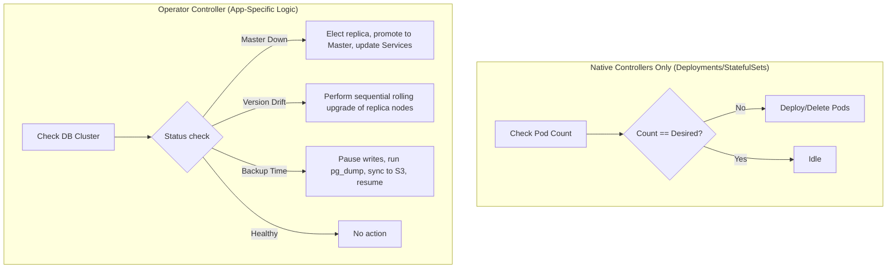
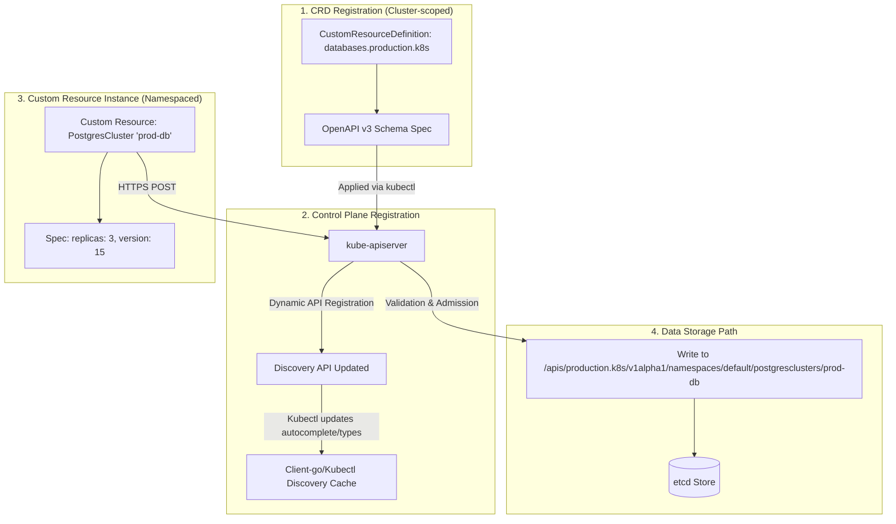
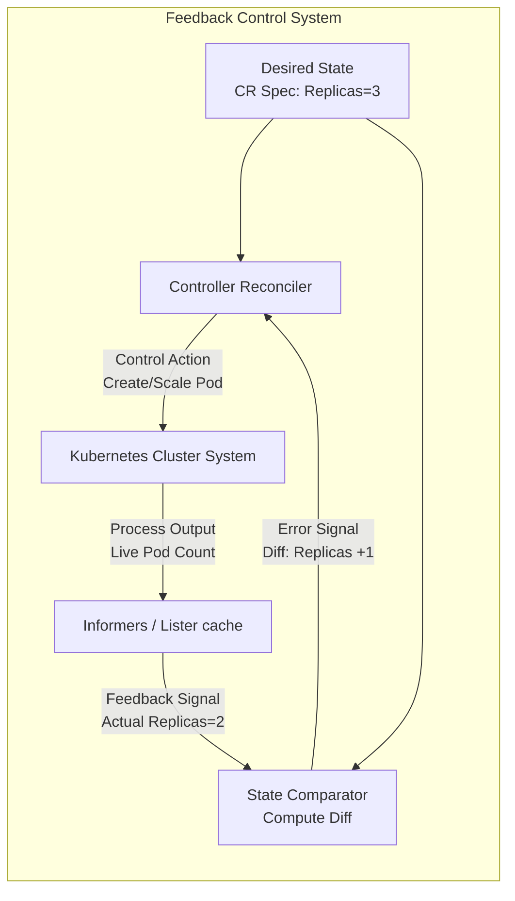
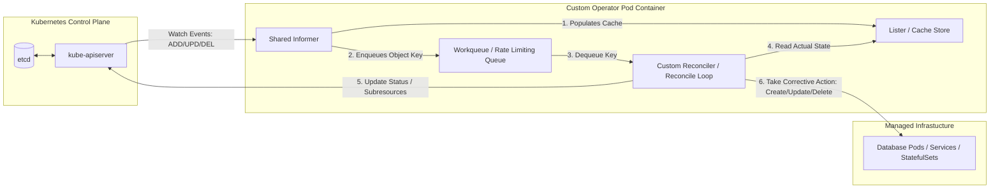
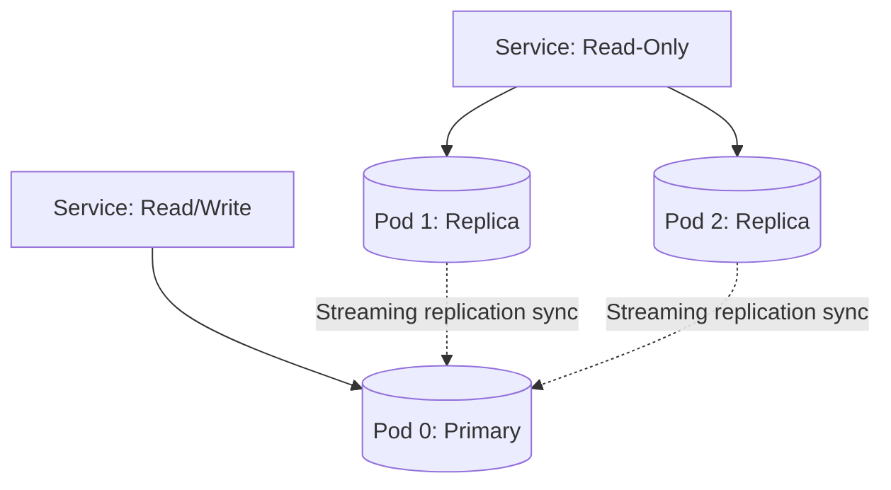
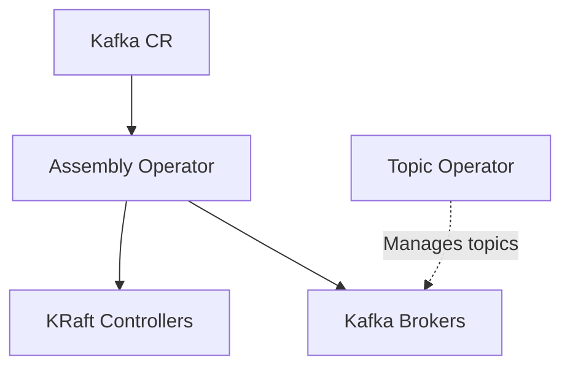

# 📖 Day 24: Operators & Custom Resources

### 🏷️ PHASE 4: ADVANCED CLOUD-NATIVE ENGINEERING

Welcome to **Day 24 of 30 Days of Production Kubernetes**. Today, we shift our focus from utilizing standard Kubernetes APIs to **extending** them. We will dive deep into how Kubernetes transforms from an orchestrator of containers into a universal, declarative control plane that automates operations for databases, messaging queues, and custom cloud infrastructure.

By the end of today's module, you will understand how the **Operator Pattern** solves the challenges of running stateful applications at scale, and you will never again ask: *"How does Kubernetes manage databases and complex stateful systems?"*

---

## 🧭 Course Directory Layout
Ensure you explore the supplementary files generated in the subdirectories:
* [visual Simulator](file:///d:/30_Days_of_Production_Kubernetes/Day-24/operator-control-center.html) — Interactive HTML sandbox demonstrating Operator workflows.
* [diagrams/](file:///d:/30_Days_of_Production_Kubernetes/Day-24/diagrams/) — Fenced Mermaid files mapping the operator lifecycle.
* [notes/](file:///d:/30_Days_of_Production_Kubernetes/Day-24/notes/operators_crd_deep_dive.md) — Technical definitions, OpenAPI v3 schema validation structures, and level-triggered systems.
* [production-notes/](file:///d:/30_Days_of_Production_Kubernetes/Day-24/production-notes/lessons_learned_at_scale.md) — Designing webhooks, leader elections, and memory-saving informer caches.
* [troubleshooting/](file:///d:/30_Days_of_Production_Kubernetes/Day-24/troubleshooting/operator_playbook.md) — Emergency playbooks for stuck finalizers and API validation blocks.
* [manifests/](file:///d:/30_Days_of_Production_Kubernetes/Day-24/manifests/) — Production-ready Postgres CRD and CR samples.
* [labs/](file:///d:/30_Days_of_Production_Kubernetes/Day-24/labs/) — Multi-stage hands-on guides implementing schemas and custom controllers.
* [exercises/](file:///d:/30_Days_of_Production_Kubernetes/Day-24/exercises/operator-healing-challenge.md) — Schema debugging and scale subresource alignment challenge.

---

## 1. Why Kubernetes Needed Operators

In its native state, Kubernetes manages **Stateless Applications** with ease. If a frontend pod crashes, the ReplicaSet controller simply deploys another one. The pods are completely identical and carry no local state.

However, **Stateful Applications** (such as PostgreSQL, MySQL, Apache Kafka, and Elasticsearch) introduce operations that native resources like Deployments cannot automate. A database cluster requires:
* **Topology Awareness:** Replica nodes must join the primary node using specific credentials and wait for sync replication.
* **Rolling Upgrades:** You cannot upgrade all replica databases at once. Replicas must be upgraded one by one, checked for lag, failed over, and then the primary upgraded last.
* **Failover Orchestration:** If the primary database node crashes, the system must choose a replica, promote it to primary, re-route client traffic, and provision a new replica to join the cluster.
* **Backup Management:** Snapshot dumps must be scheduled, compressed, encrypted, and uploaded to physical storage targets like AWS S3 or MinIO without application downtime.



An **Operator** encapsulates the human operational knowledge (e.g., the runbooks of a Database Administrator) into software code that runs indefinitely inside your cluster control plane.

---

## 2. CRDs Deep Dive (Custom Resource Definitions)

A **Custom Resource Definition (CRD)** is a declaration to the Kubernetes API server that registers a new API object type. It is the schema definition, while the **Custom Resource (CR)** is the instance containing actual data.

```text
Built-in Resource (Pod, Service)
   ↓
Custom Resource Definition (Enforces OpenAPI schema, endpoints, e.g., postgres-crd.yaml)
   ↓
Custom Resource (An instance submitted by a developer, e.g., prod-db-cluster)
```



By registering a CRD, we can write configurations that represent complex applications using simple, declarative YAML syntax. For example, our [postgres-cr.yaml](file:///d:/30_Days_of_Production_Kubernetes/Day-24/manifests/postgres-cr.yaml):

```yaml
apiVersion: database.production.k8s/v1alpha1
kind: PostgresCluster
metadata:
  name: prod-db-cluster
spec:
  replicas: 3
  version: "15.2"
  storage:
    size: "50Gi"
    class: "premium-rwo"
```

The Kubernetes API server parses this schema definition, validates it against our OpenAPI limits, and stores it in the key-value store (`etcd`).

---

## 3. Custom Controllers

A **Custom Controller** is a background loop running inside the cluster that watches for events relating to our Custom Resources.

```text
Watch Resources (HTTP Streaming API)
   ↓
Compare Desired State (from spec field)
   ↓
Compare Actual State (running cluster infrastructure)
   ↓
Take Action (Scale, repair, upgrade, create)
```

It implements the classical feedback control loop model:



---

## 4. The Operator Pattern Architecture

The Operator pattern relies on an **Event-Driven Architecture** utilizing **Shared Informers** to watch for CRUD operations and a thread-safe **Lister Cache** to avoid hammering etcd databases with read actions.



### Components of the Operator Pod:
* **Reflector:** Maintains a persistent `Watch` connection stream to the API Server.
* **Informer:** Decodes raw events and updates the internal cache.
* **Indexer/Lister Cache:** A local memory database mirroring etcd, allowing fast read actions.
* **Workqueue:** Holds work items (the namespaces/names of resources) with built-in rate-limiting and back-off delays.
* **Reconciler:** A loop that pulls keys from the workqueue, evaluates state, and runs execution plans.

---

## 5. Real-World Production Examples

### PostgreSQL Operator (CloudNativePG / PGO)
* **What it manages:** Primary-Replica topologies, streaming WAL log backups, and auto-failovers.
* **Visual Topology:**


### Apache Kafka Operator (Strimzi)
* **What it manages:** Distributes Zookeeper/KRaft controllers, broker partitions, Kafka Topic CRs, and Kafka User ACLs.


---

## 6. Interactive Control Center Simulation
Before jumping into the CLI labs, you should open and explore our [Interactive Simulator](file:///d:/30_Days_of_Production_Kubernetes/Day-24/operator-control-center.html) in your browser:


This tool simulates a live operator controller manager running in your browser:
1. **Register CRD:** Observe the discovery API initialization.
2. **Deploy Operator:** Watch the Shared Informer gear spin up.
3. **Submit Custom Resource:** Observe the watch triggers and creation of database workloads.
4. **Trigger Scaling & Upgrades:** Scale the workload up/down or trigger version upgrades.
5. **Inject Failure:** Crash the database primary node, watch the controller promote a replica, and re-provision infrastructure to heal itself.

---

## 🏁 Summary Checklist
- [x] Read [Theory Notes](file:///d:/30_Days_of_Production_Kubernetes/Day-24/notes/operators_crd_deep_dive.md) on Kubernetes API Extensibility.
- [x] Complete [Lab 1](file:///d:/30_Days_of_Production_Kubernetes/Day-24/labs/lab-1-crd-creation-inspection.md): CRD Creation & Inspection.
- [x] Complete [Lab 2](file:///d:/30_Days_of_Production_Kubernetes/Day-24/labs/lab-2-building-simplest-controller.md): Building a custom python controller with Kopf.
- [x] Complete [Lab 3](file:///d:/30_Days_of_Production_Kubernetes/Day-24/labs/lab-3-deploy-operate-postgres-operator.md): Deploying and operating the Postgres Operator.
- [x] Resolve the [Operator Healing Challenge](file:///d:/30_Days_of_Production_Kubernetes/Day-24/exercises/operator-healing-challenge.md).
- [x] Read [Production Hardening Notes](file:///d:/30_Days_of_Production_Kubernetes/Day-24/production-notes/lessons_learned_at_scale.md) and [Troubleshooting Playbook](file:///d:/30_Days_of_Production_Kubernetes/Day-24/troubleshooting/operator_playbook.md).
