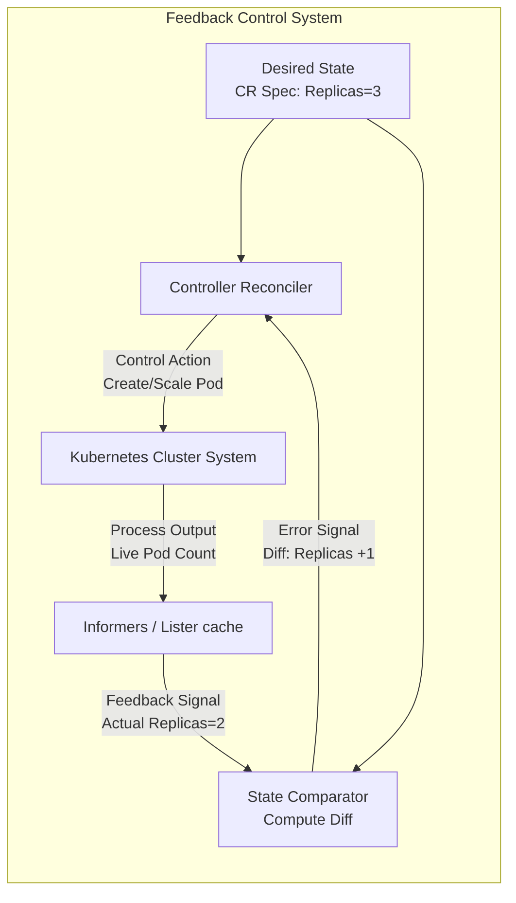
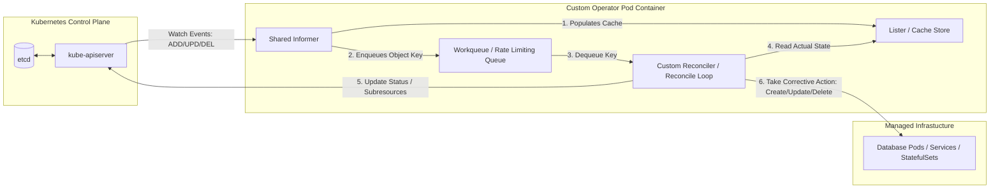

# 📖 Day 24 Theory Notes: Operators, Custom Resources & API Extensibility

## 1. Why Operators Exist

In the early days of Kubernetes, the platform excelled at managing **stateless workloads** (like web APIs, microservices, and static frontends). If a stateless container crashes or needs to scale, the system deletes it or spawns a new one.

However, **stateful applications** (like PostgreSQL, Apache Kafka, Redis, Elasticsearch, and Prometheus) are completely different. They have:
* **Clustering Topology:** Strict ordering of startup (e.g., Zookeeper before Kafka; Primary before Replica).
* **Data Consistency:** Master promotion, database failovers, data replication synchronization.
* **Day-2 Maintenance:** Point-in-time backups, physical storage resizing, rolling schema upgrades, minor/major version upgrades.
* **State Preservation:** You cannot simply terminate a database node and replace it with a blank disk without losing critical records.

A standard `Deployment` or `StatefulSet` does not understand database topology or how to execute a safe PostgreSQL switchover. 

This led Brandon Philips (CoreOS) to introduce the **Operator Pattern** in 2016. An **Operator** is a method of packaging, deploying, and managing a Kubernetes application by combining:
1. **Custom Resource Definitions (CRDs)** to represent desired state.
2. A **Custom Controller** containing the application-specific operational intelligence (representing the human operator).

---

## 2. CRDs Deep Dive (Custom Resource Definitions)

A **Custom Resource Definition (CRD)** is a cluster-level resource that tells the Kubernetes API Server how to validate and store a new, bespoke API type. 

### The Resource Hierarchy
```text
Built-in Resource (e.g., Pod) 
   ↓
Custom Resource Definition (Registers the schema rules, endpoints, and validation rules)
   ↓
Custom Resource (An instance of the schema deployed by the user, e.g., prod-db-cluster)
```

### Key Elements of a Modern CRD
1. **Group and Version:** Defines the API endpoint routing namespace (e.g., `apiVersion: database.production.k8s/v1alpha1`).
2. **Names & Scope:** Set names (singular, plural, shortnames) and scope (`Namespaced` vs `Cluster`).
3. **OpenAPI v3 Schema:** Rigorous structure validation. Enforces data types, string regex formatting, array limits, and default values.
4. **Subresources:**
   - **`/status`:** Decouples the spec (desired state) from the status (actual state updated by the controller). This prevents race conditions and limits authorization access (using RBAC, you can allow a controller to update status but prevent users from doing so).
   - **`/scale`:** Integrates the resource with `kubectl scale` and Horizontal Pod Autoscalers (HPA).
5. **Printer Columns:** Define customized output displays for command-line users.

---

## 3. Custom Controllers & Informers

The core runtime loop of any Kubernetes controller is the **Control Loop**. In control theory, this is a feedback loop that runs indefinitely:



### Under the Hood: Informer Architecture

To avoid hammering the `kube-apiserver` with continuous polling requests, Kubernetes controllers use **Shared Informers**:



### Inside the Informer Workflow:
1. **Reflector:** Connects to the API server via an HTTP chunked transfer connection. It maintains a continuous streaming **Watch** on resources.
2. **Delta FIFO Queue:** Stores state changes (deltas) as events arrive.
3. **Indexer / Cache Store:** The Reflector writes objects into a local thread-safe memory database (the Cache). The reconciler queries this cache instead of calling the API server directly, conserving cluster memory and API capacity.
4. **Workqueue:** When an event is caught (e.g., `prod-db` spec changed), the event handler enqueues the resource's namespace/name key (e.g., `default/prod-db`) into a queue.
5. **Reconciler workers:** Multiple worker threads read keys from the queue, execute the `Reconcile()` function, compute the diff, and execute actions.

### Level-Triggered vs Edge-Triggered
Kubernetes is **level-triggered**, not edge-triggered.
* **Edge-triggered:** The system reacts to the transition of a state (e.g., "A pod just deleted! Create one pod"). If you miss the event message due to network loss, the system remains in a broken state.
* **Level-triggered:** The system reacts to the state itself (e.g., "The desired replica count is 5, but I count 4 pods. Let's create one"). The controller continuously queries the current state of the system, meaning it heals even if it missed intermediate events.

---

## 4. The Operator Pattern & Real-World Implementations

An Operator encapsulates operational processes into software loops. Here are five enterprise-grade Operators used in production:

| Operator | Creator / Maintainer | What it Automates |
|---|---|---|
| **PostgreSQL (CloudNativePG / PGO)** | EnterpriseDB / Crunchy Data | Coordinates master-replica streaming replication, WAL archiving to S3, automated failovers (via Patroni or custom leases), and database configuration tuning. |
| **Kafka (Strimzi)** | Red Hat / CNCF Sandbox | Manages Kafka brokers, ZooKeeper/KRaft consensus nodes, client users, topics (via Topic CRD), security cert generation, and dynamic topic scaling. |
| **Prometheus Operator** | Prometheus Community | Dynamically configures Prometheus server targets via `ServiceMonitor` and `PodMonitor` CRDs. Automates alerting rule updates. |
| **Elasticsearch Operator (ECK)** | Elastic | Coordinates shard rebalancing, cluster rolling upgrades, certificates generation, hot-warm-cold storage node splits, and volume scaling. |
| **Apache Pinot Operator** | Pinot Community / Cloud Providers | Manages distributed real-time analytics clusters. Automates Pinot Controllers, Brokers, Servers, and Minion pods. |

---

## 5. Kubernetes Extensibility (Building a Platform for Platforms)

Kubernetes is not just a container orchestrator; it is an **extensible control plane** (often called a "meta-framework") designed for building platforms.

By leveraging CRDs, Custom Controllers, and Webhooks, organizations build **Internal Developer Platforms (IDPs)**. For example, a developer can run:

```yaml
apiVersion: platform.enterprise.com/v1
kind: DeveloperWorkspace
metadata:
  name: team-alpha-dev
spec:
  language: "golang"
  database: "postgres-ha"
  cicd: "github-actions"
```

An enterprise platform operator watches for this `DeveloperWorkspace` resource and internally provisions:
- GitHub repository
- Namespace with RBAC controls
- Cloud SQL database instances
- Vault credentials
- ArgoCD sync applications

Through custom APIs, Kubernetes acts as the standard API layer that orchestrates the entire cloud architecture.
