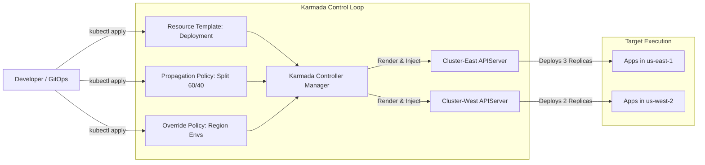
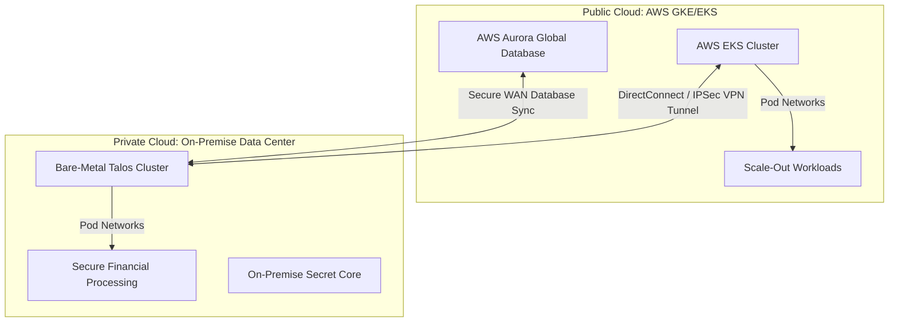
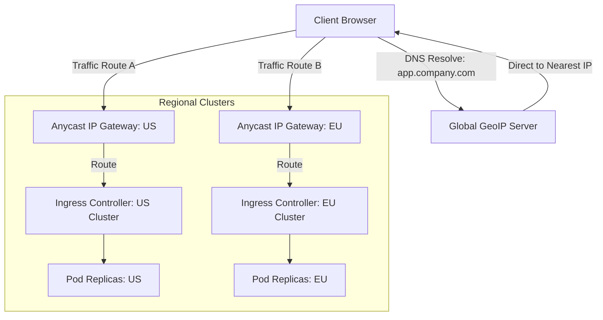
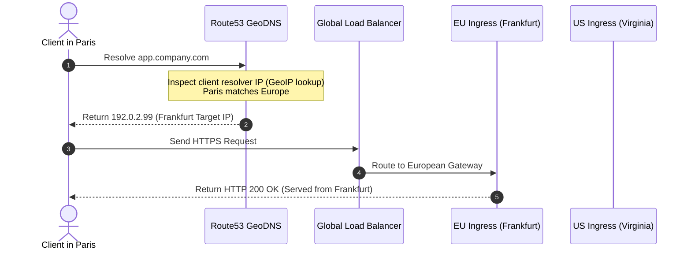
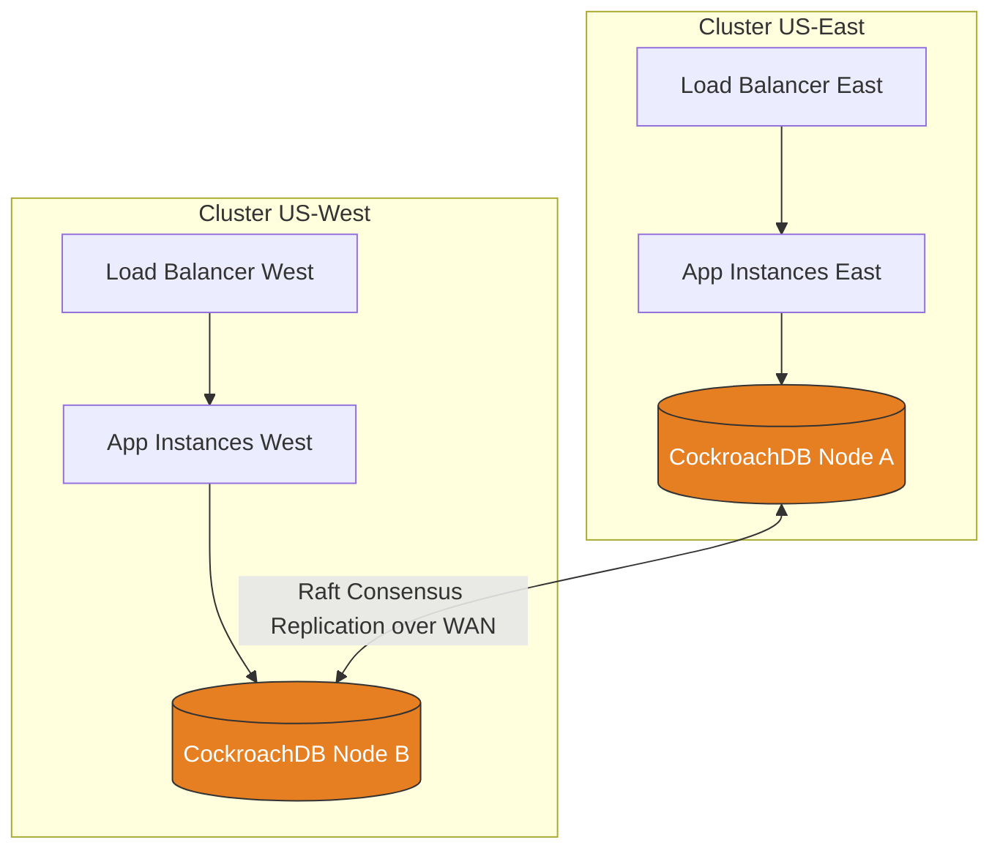
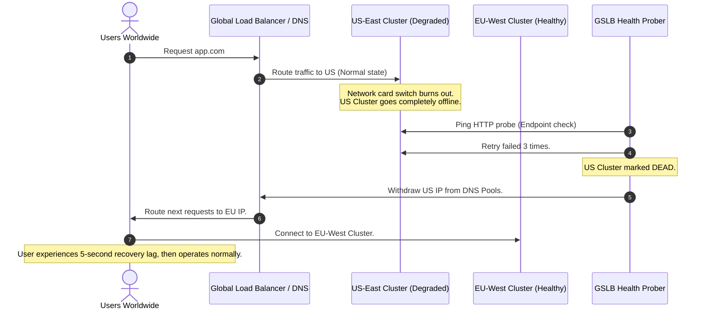
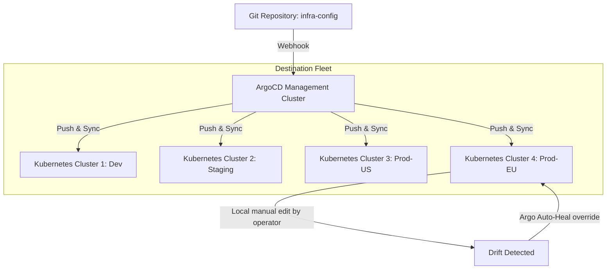

# 📊 Day 25: Multi-Cluster Architectural Diagram Reference

This document catalogs the 12 primary structural models, networking paths, and control systems required to build a global cloud-native platform.

---

## 1. Multi-Cluster Architecture: Hub-and-Spoke vs. Mesh

This diagram contrasts the two main organizational structures for managing multiple clusters.

```mermaid
graph TD
    subgraph Hub and Spoke Model
        HC[Hub Cluster / Mgmt Plane] -->|Control Policies| C1[Spoke Cluster A]
        HC -->|Control Policies| C2[Spoke Cluster B]
        HC -->|Control Policies| C3[Spoke Cluster C]
        style HC fill:#1B4F72,stroke:#333,stroke-width:2px,color:#fff
    end

    subgraph Mesh Model (Decentralized)
        M1[Independent Cluster A] <-->|Peer-to-Peer Mesh Sync| M2[Independent Cluster B]
        M2 <-->|Peer-to-Peer Mesh Sync| M3[Independent Cluster C]
        M3 <-->|Peer-to-Peer Mesh Sync| M1[Independent Cluster A]
        style M1 fill:#145A32,stroke:#333,stroke-width:2px,color:#fff
        style M2 fill:#145A32,stroke:#333,stroke-width:2px,color:#fff
        style M3 fill:#145A32,stroke:#333,stroke-width:2px,color:#fff
    end
```

*   **Hub-and-Spoke**: Ideal for central operations. The hub runs the controllers and distributes configurations; spokes are cattle clusters that only execute workloads.
*   **Mesh Model**: Ideal for independent autonomous divisions. Every cluster is its own master and communicates with peers directly.

---

## 2. Cluster Federation Model (Karmada/OCM Controller)

This diagram shows how Karmada translates a single developer intent into customized, regional deployments.



---

## 3. Hybrid Cloud Topology

Connecting an on-premise private data center running bare-metal Kubernetes with AWS cloud managed EKS.



---

## 4. Global Deployment Architecture

End-to-end request flow from a user accessing a global website to local endpoints in different continents.



---

## 5. Cross-Cluster Networking (Cilium ClusterMesh vs. Submariner)

How CNI overlays allow direct, encrypted pod-to-pod network connectivity across cluster boundaries.

```mermaid
graph TD
    subgraph Cluster A (10.240.0.0/16)
        PodA[Pod A: 10.240.1.15]
    end

    subgraph Cluster B (10.241.0.0/16)
        PodB[Pod B: 10.241.2.34]
    end

    subgraph Cilium ClusterMesh Model
        PodA -->|Direct eBPF Routing| MeshRouter[ClusterMesh Gateway]
        MeshRouter -->|Encapsulated Tunnel VXLAN/Geneve| MeshRouterB[ClusterMesh Gateway B]
        MeshRouterB --> PodB
    end

    subgraph Submariner IPSec Model
        PodA -->|Route via Submariner Gateway| GatewayA[Submariner Gateway Node A]
        GatewayA -->|IPsec Encrypted Tunnel over WAN| GatewayB[Submariner Gateway Node B]
        GatewayB --> PodB
    end
```

---

## 6. Global Traffic Routing (GeoDNS Logic)

A detailed workflow showing how GeoDNS selects endpoints based on geographical distance.



---

## 7. Disaster Recovery Architecture (Active-Passive Sync)

How state and resources are backed up and restored to a cold or warm standby cluster.

```mermaid
graph TD
    subgraph Primary Cluster (Active)
        AppP[Active App Workloads] -->|Write State| DBP[Primary Database]
        GitP[ArgoCD Sync State]
    end

    subgraph Backup Storage
        S3[S3 Encrypted Object Store]
    end

    subgraph Standby Cluster (Passive)
        DBPassive[Standby Database]
        AppStandby[Passive Replicas scaled to 0]
    end

    DBP -->|Continuous Async Replication| DBPassive
    AppP -->|Velero Backup manifests| S3
    S3 -->|Scheduled Restore dry-runs| StandbyCluster[Standby Cluster Admin]
```

---

## 8. Active-Active Cluster Replication

Two clusters running concurrently, managing synchronous database replication to prevent data divergence.



---

## 9. Active-Passive Clusters (DNS Routing Weight)

Traffic distribution weights configured to stand up warm reserves.

```mermaid
graph TD
    User[Web Client] -->|Request app.com| DNS[DNS GSLB]
    DNS -->|Weight: 100%| ClusterA[Cluster US-East1: Active Primary]
    DNS -->|Weight: 0% (Offline)| ClusterB[Cluster US-West2: Passive Warm Standby]

    ClusterA -->|Database Replication stream| ClusterB
    style ClusterA fill:#1E8449,color:#fff
    style ClusterB fill:#95A5A6,color:#fff
```

---

## 10. Multi-Region Failover Sequence

A step-by-step failure resolution flow when a regional data center goes completely dark.



---

## 11. Platform Management Architecture (GitOps Engine)

How platform teams manage and maintain drift correction across a global fleet of 100+ clusters.



---

## 12. End-to-End Global Platform Design

This diagram represents the ultimate synthesis: a global request entry pipeline combining CDN, Global Server Load Balancing, Web Application Firewall, local ingress, cross-cluster service mesh, and globally replicated databases.

```mermaid
graph TD
    Client[Global Users] -->|Query| CDN[Cloudflare CDN & Edge WAF]
    CDN -->|GeoDNS / Anycast Routing| GSLB[Global Traffic Load Balancer]

    subgraph Cluster Region A (US)
        GSLB -->|Route US users| IngressA[Nginx Ingress Controller]
        IngressA --> ServiceA[Order Service: Local]
        ServiceA --> PodsA[Order Pods US]
        PodsA --> Database[(CockroachDB: Master Node A)]
    end

    subgraph Cluster Region B (EU)
        GSLB -->|Route EU users| IngressB[Nginx Ingress Controller]
        IngressB --> ServiceB[Order Service: Local]
        ServiceB --> PodsB[Order Pods EU]
        PodsB --> Database
    end

    subgraph Service Mesh Interconnect
        PodsA <-->|Cilium ClusterMesh encrypted tunnels| PodsB
    end

    style Database fill:#E67E22,stroke:#333,color:#fff
```
