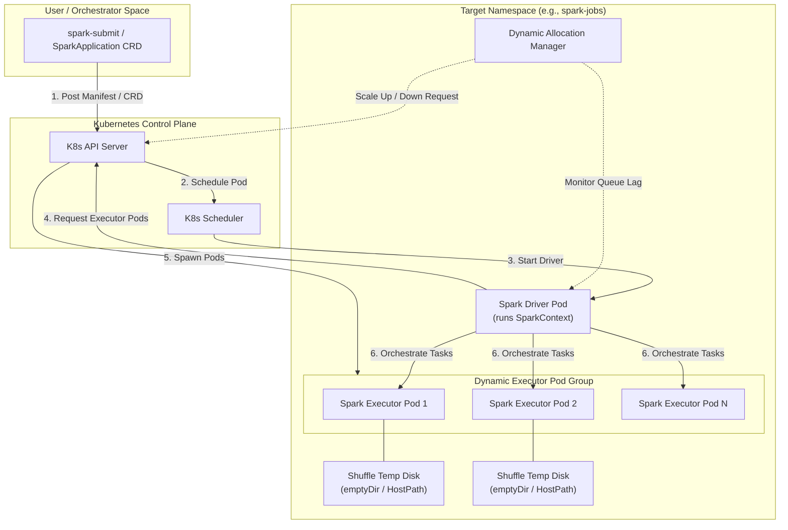
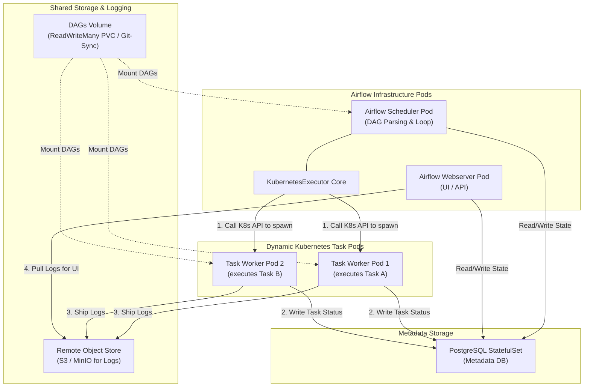
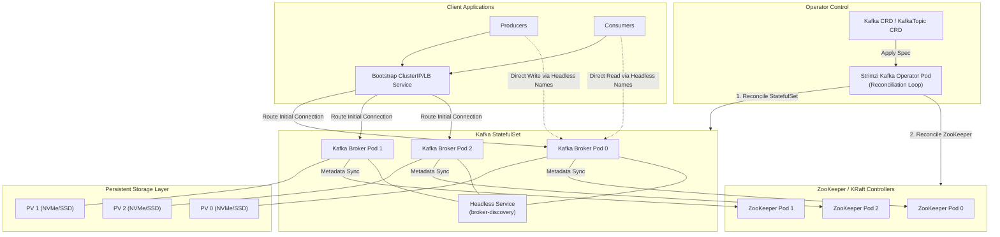
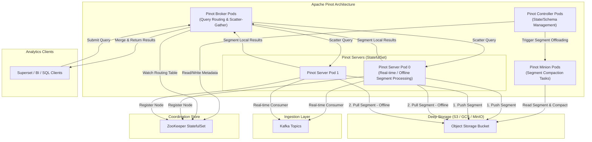

# 📖 Day 27: Running Data Platforms on Kubernetes
### 🏷️ PHASE 4 — ADVANCED CLOUD-NATIVE ENGINEERING

Welcome to Day 27 of the **30 Days of Production Kubernetes** course. Today, we step into the role of a Senior Data Platform Architect and Cloud-Native SRE.

Running stateful data platforms on Kubernetes is one of the final frontiers of modern platform engineering. Historically, organizations partitioned analytics platforms into isolated hardware groups. Today, you will learn how to design, deploy, and secure a complete cloud-native data platform featuring Apache Spark, Apache Airflow, Apache Kafka, and Apache Pinot running side-by-side on a unified Kubernetes compute plane.

---

## 🗺️ Day 27 Directory Structure

Here is how today's learning resources are organized:
-   [notes/data-platforms-on-k8s.md](file:///d:/30_Days_of_Production_Kubernetes/Day-27/notes/data-platforms-on-k8s.md) — Architectural reference guide covering traditional silos vs K8s data infrastructure, Spark dynamic allocation, Airflow executors, Strimzi Kafka brokers, and Pinot components.
-   [diagrams/](file:///d:/30_Days_of_Production_Kubernetes/Day-27/diagrams/) — 12 professional diagrams outlining architecture configurations:
    *   [spark-architecture.mermaid](file:///d:/30_Days_of_Production_Kubernetes/Day-27/diagrams/spark-architecture.mermaid)
    *   [airflow-architecture.mermaid](file:///d:/30_Days_of_Production_Kubernetes/Day-27/diagrams/airflow-architecture.mermaid)
    *   [kafka-architecture.mermaid](file:///d:/30_Days_of_Production_Kubernetes/Day-27/diagrams/kafka-architecture.mermaid)
    *   [pinot-architecture.mermaid](file:///d:/30_Days_of_Production_Kubernetes/Day-27/diagrams/pinot-architecture.mermaid)
    *   [data-platform-ecosystem.mermaid](file:///d:/30_Days_of_Production_Kubernetes/Day-27/diagrams/data-platform-ecosystem.mermaid)
    *   [streaming-analytics-pipeline.mermaid](file:///d:/30_Days_of_Production_Kubernetes/Day-27/diagrams/streaming-analytics-pipeline.mermaid)
    *   [resource-allocation-model.mermaid](file:///d:/30_Days_of_Production_Kubernetes/Day-27/diagrams/resource-allocation-model.mermaid)
    *   [stateful-storage-architecture.mermaid](file:///d:/30_Days_of_Production_Kubernetes/Day-27/diagrams/stateful-storage-architecture.mermaid)
    *   [operator-driven-management.mermaid](file:///d:/30_Days_of_Production_Kubernetes/Day-27/diagrams/operator-driven-management.mermaid)
    *   [production-data-platform-topology.mermaid](file:///d:/30_Days_of_Production_Kubernetes/Day-27/diagrams/production-data-platform-topology.mermaid)
    *   [end-to-end-analytics-pipeline.mermaid](file:///d:/30_Days_of_Production_Kubernetes/Day-27/diagrams/end-to-end-analytics-pipeline.mermaid)
    *   [multi-service-platform-architecture.mermaid](file:///d:/30_Days_of_Production_Kubernetes/Day-27/diagrams/multi-service-platform-architecture.mermaid)
-   [manifests/](file:///d:/30_Days_of_Production_Kubernetes/Day-27/manifests/) — Production-ready deployment configurations:
    *   [storageclass-local-nvme.yaml](file:///d:/30_Days_of_Production_Kubernetes/Day-27/manifests/storageclass-local-nvme.yaml) — Optimized SSD StorageClass configuration with `WaitForFirstConsumer` binding.
    *   [spark-operator-rbac.yaml](file:///d:/30_Days_of_Production_Kubernetes/Day-27/manifests/spark-operator-rbac.yaml) — ServiceAccount, Role, and RoleBinding for Spark pods.
    *   [spark-pi-app.yaml](file:///d:/30_Days_of_Production_Kubernetes/Day-27/manifests/spark-pi-app.yaml) — SparkApplication CRD with dynamic scaling and node tolerances.
    *   [airflow-db-statefulset.yaml](file:///d:/30_Days_of_Production_Kubernetes/Day-27/manifests/airflow-db-statefulset.yaml) — PostgreSQL database StatefulSet for metadata storage.
    *   [airflow-k8s-executor.yaml](file:///d:/30_Days_of_Production_Kubernetes/Day-27/manifests/airflow-k8s-executor.yaml) — ConfigMap, RBAC, Webserver, and Scheduler utilizing `KubernetesExecutor`.
    *   [kafka-strimzi-cluster.yaml](file:///d:/30_Days_of_Production_Kubernetes/Day-27/manifests/kafka-strimzi-cluster.yaml) — Highly available 3-broker Strimzi cluster with volume claims.
    *   [kafka-topic.yaml](file:///d:/30_Days_of_Production_Kubernetes/Day-27/manifests/kafka-topic.yaml) — Durable topic definition for clickstream ingestion.
    *   [pinot-cluster.yaml](file:///d:/30_Days_of_Production_Kubernetes/Day-27/manifests/pinot-cluster.yaml) — Complete real-time OLAP Pinot Controller, Broker, Server, and Minion pods.
-   [labs/](file:///d:/30_Days_of_Production_Kubernetes/Day-27/labs/) — Step-by-step engineering labs:
    *   [Lab 1: Deploy Spark Operator](file:///d:/30_Days_of_Production_Kubernetes/Day-27/labs/lab-1-deploy-spark.md)
    *   [Lab 2: Deploy Airflow & Postgres](file:///d:/30_Days_of_Production_Kubernetes/Day-27/labs/lab-2-deploy-airflow.md)
    *   [Lab 3: Deploy Kafka Strimzi Cluster](file:///d:/30_Days_of_Production_Kubernetes/Day-27/labs/lab-3-deploy-kafka.md)
    *   [Lab 4: Deploy Apache Pinot OLAP](file:///d:/30_Days_of_Production_Kubernetes/Day-27/labs/lab-4-deploy-pinot.md)
    *   [Lab 5: Stateful Platform Scaling & Resilience](file:///d:/30_Days_of_Production_Kubernetes/Day-27/labs/lab-5-platform-scaling-resilience.md)
-   [spark/](file:///d:/30_Days_of_Production_Kubernetes/Day-27/spark/) — Optimized scripts:
    *   [spark-pi.py](file:///d:/30_Days_of_Production_Kubernetes/Day-27/spark/spark-pi.py) — Monte Carlo Pi Spark script.
    *   [spark-defaults.conf](file:///d:/30_Days_of_Production_Kubernetes/Day-27/spark/spark-defaults.conf) — SRE-tuned configurations.
-   [airflow/k8s_executor_dag.py](file:///d:/30_Days_of_Production_Kubernetes/Day-27/airflow/k8s_executor_dag.py) — Airflow DAG orchestrating isolated `KubernetesPodOperator` pods.
-   [kafka/](file:///d:/30_Days_of_Production_Kubernetes/Day-27/kafka/) — Streaming client scripts:
    *   [producer.py](file:///d:/30_Days_of_Production_Kubernetes/Day-27/kafka/producer.py) & [consumer.py](file:///d:/30_Days_of_Production_Kubernetes/Day-27/kafka/consumer.py) — Durable streaming scripts with manual commit and retry flags.
-   [pinot/](file:///d:/30_Days_of_Production_Kubernetes/Day-27/pinot/) — Ingestion schema and table metadata mapping:
    *   [user-clicks-schema.json](file:///d:/30_Days_of_Production_Kubernetes/Day-27/pinot/user-clicks-schema.json) & [user-clicks-table-config.json](file:///d:/30_Days_of_Production_Kubernetes/Day-27/pinot/user-clicks-table-config.json)
-   [production-notes/senior-architect-ops.md](file:///d:/30_Days_of_Production_Kubernetes/Day-27/production-notes/senior-architect-ops.md) — Operational guidelines for G1GC tuning, local NVMe mounts, KEDA auto-scalers, and Spot cost optimization.
-   [troubleshooting/troubleshooting-runbook.md](file:///d:/30_Days_of_Production_Kubernetes/Day-27/troubleshooting/troubleshooting-runbook.md) — Runbooks for executor OOMs, scheduler connection locks, Kafka index corruptions, and CoreDNS storms.
-   [exercises/](file:///d:/30_Days_of_Production_Kubernetes/Day-27/exercises/) — Daily assignments:
    *   [daily-challenge.md](file:///d:/30_Days_of_Production_Kubernetes/Day-27/exercises/daily-challenge.md) — Main unified real-time pipeline challenge.
    *   [challenge-manifests.yaml](file:///d:/30_Days_of_Production_Kubernetes/Day-27/exercises/challenge-manifests.yaml) — Broken manifest containing 3 deliberate bugs.
-   [resources/recommended-reading.md](file:///d:/30_Days_of_Production_Kubernetes/Day-27/resources/recommended-reading.md) — Core reading links, operators, and best practice engineering blogs.
-   [cloud-native-data-platform-command-center.html](file:///d:/30_Days_of_Production_Kubernetes/Day-27/cloud-native-data-platform-command-center.html) — Futuristic, interactive single-page HTML simulator. Trigger outages (Broker disks full, OOMs, lag, DNS, crashes), check logs and events, apply hotfixes, and submit RCAs.

---

## 1. Why Data Platforms Need Kubernetes

Traditional data workloads run on statically provisioned VM groups (Hadoop, standalone VM pools) are highly inefficient:
*   **Low utilization**: Sized for peak loads, static data clusters sit idle 70% of the time, resulting in significant overhead.
*   **Drift and isolation friction**: Different teams require different versions of Java, Scala, or Python, creating environment conflicts on shared virtual machines.
*   **Slow resizing loops**: Adding physical nodes to handle backlogs takes minutes, stalling workflows.

On Kubernetes, data platforms leverage **elastic pod scheduling**, dynamically scaling stateless batch shufflers (Spark) down to zero when idle, assigning stateful nodes (Kafka/Pinot) to localized AZ NVMe pools, and sharing compute across all workloads.

---

## 2. Apache Spark on Kubernetes Architecture

*   **Driver Pod**: Launches the `SparkContext`, requests executor pods from the K8s API server, schedules execution phases, and aggregates outcomes.
*   **Executor Pods**: Spawned dynamically by the API. They process partition tasks and mount `emptyDir` or local HostPaths for quick shuffle space.
*   **Dynamic Allocation**: Spark monitors pending task queues, scaling executors up under load and tearing them down when idle.

---

## 3. Apache Airflow on Kubernetes: Kubernetes Executor

The **Kubernetes Executor** eliminates static worker pools by calling the Kubernetes API to launch a dedicated container pod for every single task in a DAG.

*   **Worker Lifecycle**: Worker pods spin up, pull configuration parameters, execute the target operator (e.g. `KubernetesPodOperator`), report success/failure status back to the metadata database, and terminate.
*   **Resource Isolation**: Tasks can run customized images, environment configurations, and compute requests without conflicting with other DAGs in the scheduler queue.

---

## 4. Apache Kafka on Kubernetes: Strimzi Operators

Kafka requires stable persistent identities and fast network I/O, which is managed on Kubernetes using **StatefulSets** and **Operators**.

*   **Stable Network Identifiers**: A headless service maps unique domain records directly to individual brokers (e.g. `kafka-0`), enabling client applications to write directly to partition leaders.
*   **Operator Reconciliation Loop**: Strimzi automates certificate provisioning, node updates, topic creations (`KafkaTopic`), and sequential broker restarts.

---

## 5. Apache Pinot on Kubernetes: Real-Time Analytics

Pinot uses a scattered architecture that is well-suited for Kubernetes namespace structures.

*   **Controller**: Oversees table creation and schema definitions, coordinating with ZooKeeper.
*   **Broker**: Translates BI client SQL queries, scatters requests to matching servers, gathers sub-results, and merges them.
*   **Server**: Ingests directly from Kafka partition segments and maps data to local NVMe SSDs.
*   **Minion**: Recompacts segments and offloads older datasets to cloud object storage.

---

## 6. Production Challenges: Stateful Workloads

Deploying stateful systems on Kubernetes presents challenges:
1.  **Volume Availability Zone (AZ) Pinning**: If PVCs use `Immediate` binding, volumes can bind to a different AZ than the node scheduled for the pod. **Fix**: Use `volumeBindingMode: WaitForFirstConsumer` on all data StorageClasses.
2.  **East-West Network Saturation**: Replication traffic across AZs increases cloud costs. **Fix**: Implement node topology spread constraints and topology-aware routing.
3.  **JVM Garbage Collection (GC) pauses**: GC halts can exceed ZooKeeper session timeouts, causing cluster evictions. **Fix**: Configure G1GC parameters with explicit maximum pauses.

---

## 🏁 Summary of Daily Tasks

To complete Day 27:
1.  **Open the Interactive Simulator**: Launch [cloud-native-data-platform-command-center.html](file:///d:/30_Days_of_Production_Kubernetes/Day-27/cloud-native-data-platform-command-center.html) in your browser. Trigger and diagnose each of the four incidents (Broker disks full, OOMs, lag, DNS lookups), run kubectl queries, apply remediations, and submit your SRE RCA reports.
2.  **Study Deep-Dive Notes**: Review [notes/data-platforms-on-k8s.md](file:///d:/30_Days_of_Production_Kubernetes/Day-27/notes/data-platforms-on-k8s.md) to understand storage configurations, scheduling parameters, and namespace isolations.
3.  **Review the Diagrams**: Examine [diagrams/](file:///d:/30_Days_of_Production_Kubernetes/Day-27/diagrams/) to visualize how shuffles, consensus lookups, and secure network policies flow.
4.  **Execute the Labs**: Complete [Labs 1 to 5](file:///d:/30_Days_of_Production_Kubernetes/Day-27/labs/) inside your cluster environment using the configurations in [manifests/](file:///d:/30_Days_of_Production_Kubernetes/Day-27/manifests/).
5.  **Review Production Operations**: Study [production-notes/senior-architect-ops.md](file:///d:/30_Days_of_Production_Kubernetes/Day-27/production-notes/senior-architect-ops.md) and [troubleshooting/troubleshooting-runbook.md](file:///d:/30_Days_of_Production_Kubernetes/Day-27/troubleshooting/troubleshooting-runbook.md).
6.  **Complete the Challenge**: Resolve the scheduling, RBAC, and connection bugs inside [exercises/challenge-manifests.yaml](file:///d:/30_Days_of_Production_Kubernetes/Day-27/exercises/challenge-manifests.yaml) and complete the daily assignment in [exercises/daily-challenge.md](file:///d:/30_Days_of_Production_Kubernetes/Day-27/exercises/daily-challenge.md).
