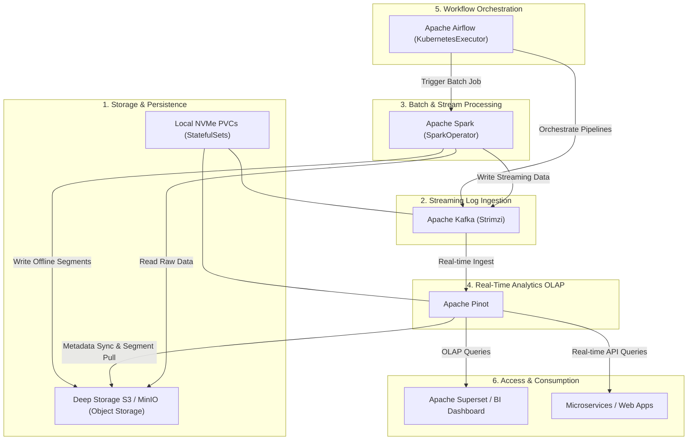
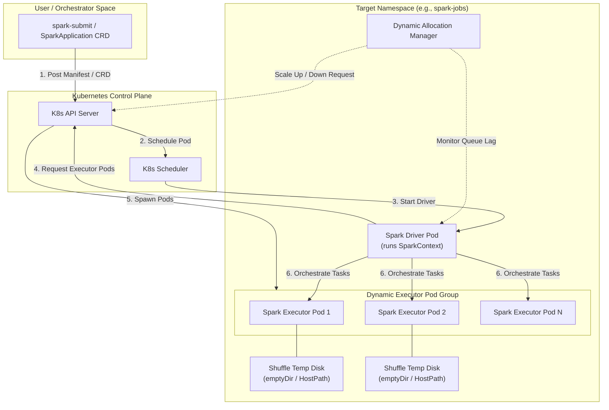
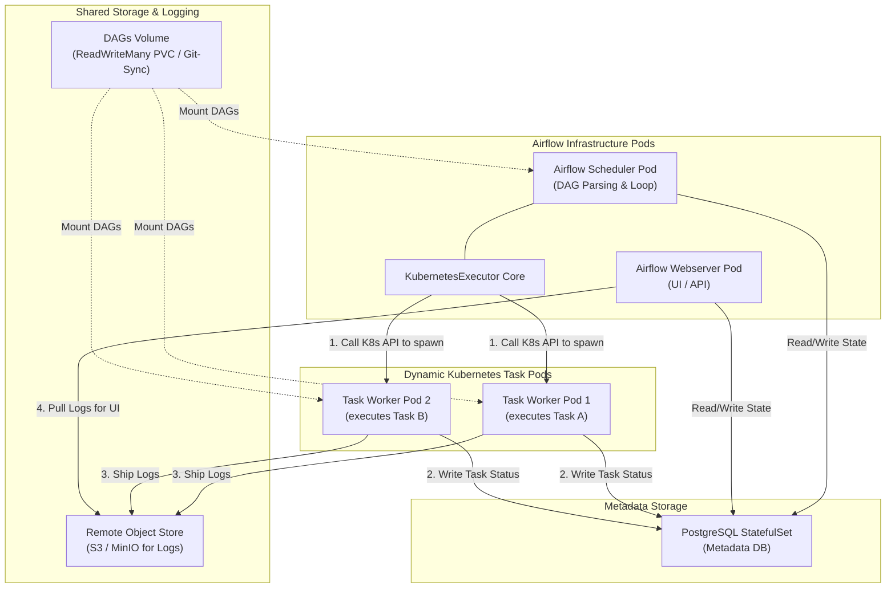
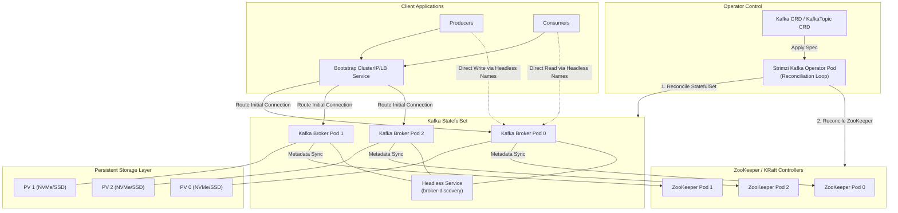

# 📖 Day 27: Running Data Platforms on Kubernetes

### 🏷️ PHASE 4 — ADVANCED CLOUD-NATIVE ENGINEERING

Modern enterprises process petabytes of data daily. Traditional data platform infrastructures, built on static VM allocations and hardware silos, suffer from massive resource waste, scaling friction, and high operational complexity.

Today, elite engineering organizations like Netflix, Uber, LinkedIn, Airbnb, and Databricks run their entire data ecosystems on Kubernetes. This module covers the core architectures, deployment patterns, and operational playbooks required to reliably execute **Stateful Data Platforms on Kubernetes at scale**.

---

## 🎯 Learning Objectives
By the end of this day, you will:
1. **Understand stateful data platforms** on Kubernetes, including storage classes, volume binding modes, and taints/tolerations.
2. **Deploy Apache Spark** with dynamic executor scaling and customized JVM overhead parameters.
3. **Configure Apache Airflow** using the `KubernetesExecutor` to coordinate isolated, on-demand task worker pods.
4. **Run a production-grade Apache Kafka** cluster using the Strimzi Operator with strict replica pod anti-affinity.
5. **Set up Apache Pinot** for real-time OLAP querying with sub-second latency directly from Kafka streams.
6. **Diagnose and mitigate SRE incidents** including volume limits, GC latency loops, memory exhaustion, and DNS query storms.

---

## 🏗️ Visualizing the Complete Data Platform Ecosystem

Below is the multi-service architectural topology. It shows how scheduling, streaming logs, processing, indexing, and orchestration coordinate within a secure cluster boundaries:



---

## 1. Why Data Platforms Moved to Kubernetes

Historically, deploying data pipelines on bare-metal Hadoop or static Virtual Machines resulted in substantial operational drawbacks:

```
Traditional Infrastructure (VM Silos)
┌──────────────────┐  ┌──────────────────┐  ┌──────────────────┐
│  Spark Cluster   │  │  Kafka Cluster   │  │  Airflow Cluster │
│ (Peak Provision) │  │ (Peak Provision) │  │  (Static Pool)   │
├──────────────────┤  ├──────────────────┤  ├──────────────────┤
│    VM / OS       │  │    VM / OS       │  │    VM / OS       │
└──────────────────┘  └──────────────────┘  └──────────────────┘
   Problems: Configuration Drift, Low Hardware Utilization (20-30%)
   
                                   ↓
                                   
Cloud-Native Kubernetes Data Infrastructure
┌──────────────────────────────────────────────────────────────┐
│                      K8s Scheduler API                       │
│  ┌──────────────────┐ ┌──────────────────┐ ┌──────────────┐  │
│  │   Spark Pods     │ │    Kafka Pods    │ │ Airflow Pods │  │
│  │  (Scale to 0)    │ │   (StatefulSet)  │ │ (On-demand)  │  │
│  └──────────────────┘ └──────────────────┘ └──────────────┘  │
├──────────────────────────────────────────────────────────────┤
│               Shared Enterprise Node Pools                   │
└──────────────────────────────────────────────────────────────┘
   Benefits: Declarative API, Shared Resource Pools, Fast Scaling
```

* **Resource Silos**: Because batch processing spikes occur sporadically, sizing VM groups for peak utilization left clusters sitting idle >70% of the time, resulting in high overhead.
* **Operational Drift**: Configuration changes manually applied to VMs inevitably diverged, causing subtle bugs in production jobs.
* **Slow Provisioning**: Spawning new VMs to handle queue backups took minutes, whereas Kubernetes schedules containers in seconds.

By adopting Kubernetes, data infrastructure teams treat compute as a **fluid, shared pool**. Stateless pipelines scale down to zero when idle, stateful brokers run side-by-side with isolated namespace policies, and standard deployments eliminate environment discrepancies.

---

## 2. Apache Spark on Kubernetes

Apache Spark has a native scheduling backend for Kubernetes. Instead of using standalone cluster managers like YARN or Mesos, Spark applications talk directly to the Kubernetes API server.



* **Driver Pod**: Represents the control coordinator. It connects to the API Server, dynamically requests executor pods, registers their IP addresses, schedules tasks, and collects telemetry.
* **Executor Pods**: Created dynamically by the control plane. They load dataset splits, process tasks, and write shuffle data to temporary mounts.
* **Dynamic Resource Allocation**: The Driver monitors the execution queue. If tasks are bottlenecked, it scales up executor count (up to a defined ceiling). If executors remain idle, they are terminated to free up node compute.

---

## 3. Apache Airflow on Kubernetes

Traditional Airflow clusters run continuous daemon workers via Celery or Dask. The **Kubernetes Executor** parses DAG tasks and schedules them as standalone Kubernetes pods.



* **Worker Lifecycle**: Unlike standard static nodes, worker pods spin up when the task is queued, run a single command (e.g., `airflow tasks run`), write the exit status to the Postgres database, and terminate.
* **Environment Customization**: Using the `KubernetesPodOperator`, distinct tasks can use completely different container images, environment variables, storage mounts, and resource quotas, facilitating complex dependencies without dependency conflict.

---

## 4. Apache Kafka on Kubernetes

Deploying distributed, partition-replicated commit logs like Apache Kafka requires maintaining stable network identities and resilient volume storage.



* **StatefulSets**: Replaces standard Deployments. It guarantees that pod hostnames (`kafka-0`, `kafka-1`, `kafka-2`) are persistent across rescheduling and attach to the exact same PersistentVolumes.
* **Headless Service**: Disables cluster-IP load balancing. This gives every broker pod a unique internal DNS record (e.g. `kafka-0.kafka-headless.default.svc.cluster.local`) so that client applications can connect directly to partition leaders.
* **Operators (e.g. Strimzi)**: Automates broker configuration updates, TLS certificate rotation, rolling partition restarts, and replication verification.

---

## 5. Apache Pinot on Kubernetes

Apache Pinot is a distributed real-time OLAP datastore designed for low-latency analytical queries on streaming datasets.

```mermaid
graph TB
    subgraph PinotCluster ["Apache Pinot Architecture"]
        controller["Pinot Controller Pods<br>(State/Schema Management)"]
        broker["Pinot Broker Pods<br>(Query Routing & Scatter-Gather)"]
        
        subgraph ServerGroup ["Pinot Servers (StatefulSet)"]
            server0["Pinot Server Pod 0<br>(Real-time / Offline Segment Processing)"]
            server1["Pinot Server Pod 1"]
        end

        minion["Pinot Minion Pods<br>(Segment Compaction Tasks)"]
    end

    subgraph Coordination ["Coordination Store"]
        zk["ZooKeeper StatefulSet"]
    end

    subgraph DeepStorage ["Deep Storage (S3 / GCS / MinIO)"]
        s3["Object Storage Bucket"]
    end

    subgraph IngestionSource ["Ingestion Layer"]
        kafka["Kafka Topics"]
    end

    subgraph QueryClients ["Analytics Clients"]
        bi["Superset / BI / SQL Clients"]
    end

    %% Coordination lines
    controller -->|Read/Write Metadata| zk
    broker -->|Watch Routing Table| zk
    server0 -->|Register Node| zk
    server1 -->|Register Node| zk
    
    %% Ingest lines
    server0 -->|Real-time Consumer| kafka
    server1 -->|Real-time Consumer| kafka

    %% Ingestion backup / Offloading
    controller -->|Trigger Segment Offloading| minion
    minion -->|Read Segment & Compact| s3
    server0 -->|1. Push Segment| s3
    server1 -->|1. Push Segment| s3
    server0 -->|2. Pull Segment (Offline)| s3
    server1 -->|2. Pull Segment (Offline)| s3

    %% Query execution
    bi -->|Submit Query| broker
    broker -->|Scatter Query| server0
    broker -->|Scatter Query| server1
    server0 -->|Segment Local Results| broker
    server1 -->|Segment Local Results| broker
    broker -->|Merge & Return Results| bi
```

* **Controller**: The brain. Manages table metadata, schemas, and coordinate server partition assignments.
* **Broker**: The router. Accepts queries from client dashboards, checks ZooKeeper to identify which Servers host the required segments, scatters the query, gathers results, and merges them.
* **Server**: The worker. Consumes records from Kafka, processes query executions locally against memory-mapped segments, and mounts persistent NVMe storage for fast scans.
* **Minion**: The cleaner. Re-compacts old segments and offloads cold partitions to deep object storage (S3/GCS).

---

## 6. Real-World Production Challenges

Deploying these systems exposes SRE teams to physical hardware and networking limits:

### Stateful Storage & AZ Binding
A common trap is creating volumes before the pod is scheduled. Using the default `volumeBindingMode: Immediate` binds a PVC to a random Availability Zone (e.g., `us-east-1b`). If the scheduler subsequently schedules the pod in `us-east-1a` due to CPU availability, the pod will remain permanently stuck in `ContainerCreating` with a volume node affinity conflict.
> **Fix**: Set `volumeBindingMode: WaitForFirstConsumer` on all production storage classes.

### Network Throughput & Topology
Stateful replication (Kafka replica syncing) and batch shufflers (Spark partitions) move gigabytes of data. If replicas reside in different Availability Zones, cloud providers levy heavy cross-AZ network transfer fees.
> **Fix**: Write anti-affinity rules to distribute primary brokers across nodes, but configure consumer client connections to leverage topology-aware routing.

### Resource Contention & Evictions
Running resource-heavy Spark batch jobs alongside latency-sensitive Pinot OLAP brokers can lead to CPU starvation, causing query latencies to spike.
> **Fix**: Establish namespace limits, configure node selector taints to isolate workloads, and utilize `PriorityClasses` to allow the scheduler to evict batch executors during cluster resource exhaustion.

---

## 7. Interactive Learning Simulator
To help you visualize these complex orchestration patterns, we have created the **Cloud-Native Data Platform Command Center**.

[](file:///d:/30_Days_of_Production_Kubernetes/Day-27/cloud-native-data-platform-command-center.html)

Open the [cloud-native-data-platform-command-center.html](file:///d:/30_Days_of_Production_Kubernetes/Day-27/cloud-native-data-platform-command-center.html) file in your browser to interact with:
* Live Spark Executor pod creation and shutdown.
* Airflow dynamic worker pod generation.
* Interactive `kubectl` console simulator.
* Active failure injection (Disk exhaustion, GC loops, OOM errors, DNS bottlenecks) and matching SRE remediation controls.

---

## 📂 Day 27 Workspace Structure

* [manifests/](file:///d:/30_Days_of_Production_Kubernetes/Day-27/manifests/) - Production-ready YAML configs (Strimzi, SparkOperator, Airflow, Pinot).
* [labs/](file:///d:/30_Days_of_Production_Kubernetes/Day-27/labs/) - Step-by-step deploy and operation guides.
* [spark/](file:///d:/30_Days_of_Production_Kubernetes/Day-27/spark/) - Optimized configurations and Monte Carlo Pi scripts.
* [airflow/](file:///d:/30_Days_of_Production_Kubernetes/Day-27/airflow/) - Tasks DAGs utilizing Kubernetes Executor.
* [kafka/](file:///d:/30_Days_of_Production_Kubernetes/Day-27/kafka/) - Streaming python clients.
* [pinot/](file:///d:/30_Days_of_Production_Kubernetes/Day-27/pinot/) - Live ingestion schemas and tables metadata.
* [notes/](file:///d:/30_Days_of_Production_Kubernetes/Day-27/notes/data-platforms-on-k8s.md) - Deep architectural references.
* [production-notes/](file:///d:/30_Days_of_Production_Kubernetes/Day-27/production-notes/senior-architect-ops.md) - Hardening guidelines and post-mortems.
* [troubleshooting/](file:///d:/30_Days_of_Production_Kubernetes/Day-27/troubleshooting/troubleshooting-runbook.md) - Real SRE debugging scripts.
* [exercises/](file:///d:/30_Days_of_Production_Kubernetes/Day-27/exercises/daily-challenge.md) - Broken manifests challenge.
