# 📖 Day 28: Designing Production-Grade Kubernetes Architecture

### 🏷️ PHASE 5 — REAL PRODUCTION SYSTEMS

Welcome to Day 28. Today we are designing production-grade Kubernetes platforms. We will cover multi-tier layouts, high availability patterns, VPC network separation, observability stacks, zero-trust security profiles, and enterprise platform blueprints.

---

## 🎯 Learning Objectives
By the end of this day, you will be able to:
1. Design complete, highly available, multi-tier enterprise platforms on Kubernetes.
2. Formulate failure domain architectures to isolate zones, control plane nodes, and storage volumes.
3. Configure robust NetworkPolicies, RBAC boundaries, and KMS envelope encryption.
4. Implement long-term multi-cluster observability using Thanos, Grafana Loki, OpenTelemetry, and Tempo.
5. Apply architectural solutions to debug real-world production outages and bottlenecks.

---

## 🛠️ Interactive Simulator
Before diving into the documentation, run our interactive simulator to visually design and inject failures into a production cluster:
👉 **[Production Kubernetes Architecture Designer](file:///d:/30_Days_of_Production_Kubernetes/Day-28/exercises/architecture_designer.html)**

---

## 🏆 End-to-End Production Platform Blueprint

The following diagram illustrates the complete, integrated architecture of an enterprise Kubernetes platform, showing how users, load balancers, control planes, security configurations, telemetry engines, and data stores interact in a production-grade system.

```mermaid
graph TB
    %% Users & Traffic Entry
    User([Internet Client]) -->|HTTPS| GLB[Global Load Balancer & WAF]
    GLB -->|Layer 4 TCP Routing| NLB[VPC Network Load Balancer]
    
    %% Ingress & Routing Layer
    subgraph Ingress & Mesh Security
        NLB -->|Port 80/443| IngressController[Nginx Ingress Controller]
        IngressController -->|HTTP Routing & TLS Termination| MeshGateway[Istio Ingress Gateway]
        MeshGateway -->|Strict mTLS Tunnel| PodSidecarA[Envoy Proxy Sidecar]
    end
    
    %% Control Plane Boundary
    subgraph Control Plane Nodes
        API[kube-apiserver] <--> etcd[(etcd Raft Consensus Cluster)]
        Scheduler[kube-scheduler] --> API
        Controller[kube-controller-manager] --> API
    end
    
    %% Worker Node Pools
    subgraph Worker Nodes - Multi-Zone Pool
        subgraph Availability Zone A
            PodSidecarA <--> AppA[Stateless App Pod - AZ-A]
            AppA --> LocalDNSA[NodeLocal DNSCache]
        end
        subgraph Availability Zone B
            AppB[Stateless App Pod - AZ-B] --> LocalDNSB[NodeLocal DNSCache]
        end
        subgraph Availability Zone C
            AppC[Stateless App Pod - AZ-C] --> LocalDNSC[NodeLocal DNSCache]
        end
    end
    
    %% Data & Cache Layer
    subgraph Data & Storage Pool
        AppA -->|Read/Write Split| DBLeader[PostgreSQL Leader - AZ-A]
        AppB -->|Replicate| DBReplicaB[PostgreSQL Replica - AZ-B]
        AppC -->|Replicate| DBReplicaC[PostgreSQL Replica - AZ-C]
        AppA -->|Session Cache| RedisCluster[Redis Cluster]
    end
    
    %% Observability Control Plane
    subgraph Telemetry Stack
        Otel[OpenTelemetry Collector] --> Tempo[Grafana Tempo]
        FluentBit[FluentBit DaemonSet] --> Loki[Grafana Loki]
        Prometheus[Prometheus Server] --> Thanos[Thanos Sidecar]
        Thanos --> S3[(S3 Object Storage)]
    end
    
    %% Connect components
    AppA --> Otel
    AppA --> FluentBit
    AppA --> Prometheus
    
    classDef control fill:#1b263b,stroke:#00d2ff,stroke-width:2px;
    classDef secure fill:#1c3d27,stroke:#00ffaa,stroke-width:2px;
    classDef data fill:#3d1c26,stroke:#ff3c6e,stroke-width:2px;
    class API,etcd,Scheduler,Controller control;
    class MeshGateway,PodSidecarA,IngressController secure;
    class DBLeader,DBReplicaB,DBReplicaC,RedisCluster data;
```

---

## 1. What Makes a System Production Grade?

A production-grade Kubernetes architecture is more than just running containers; it must survive scale, growth, hardware degradation, security threats, and configuration mistakes.

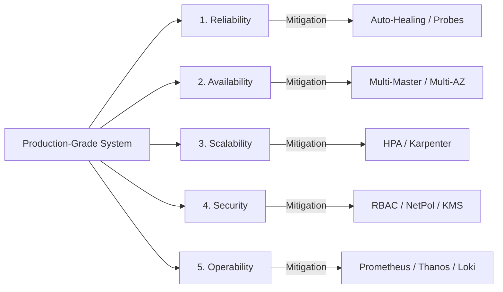

### Core Architecture Pillars:
* **Reliability:** The system behaves correctly and performs the expected functions under stress and load spikes. It relies on pod auto-healing (probes) and replication boundaries.
* **Availability:** The system remains accessible despite node crashes or data center losses. It guarantees a minimum uptime SLA through multi-zone topologies and redundant control plane masters.
* **Scalability:** The ability to scale compute, storage, and API processing horizontally as traffic increases, using autoscalers (HPA, VPA, Karpenter) without manual operations.
* **Security:** Enforcing a multi-layered defence system (Zero Trust) spanning network policies, API role-based limits (RBAC), and Key Management Service (KMS) envelope encryption.
* **Operability:** Giving operations teams complete visibility into cluster health using structured metrics, centralized logs, and distributed traces to resolve outages before users notice.

---

## 2. Multi-Tier Architecture

In production, microservices are separated into distinct layers or "tiers" with strict access limits to minimize risk.

```mermaid
graph TD
    Users([Users & Clients]) -->|HTTPS| GLB[1. Load Balancer Layer]
    GLB -->|Ingress Route| Ingress[2. Ingress & API Gateway Layer]
    Ingress -->|mTLS Service Mesh| AppTier[3. Application Tier - API Server]
    AppTier -->|Secure TCP| DataTier[4. Data & Caching Tier]
    DataTier -->|Persistent Volume Claims| StorageTier[5. Physical Storage Class Layer]
    
    classDef user fill:#1a1c23,stroke:#8a99ad,stroke-width:2px;
    classDef ingress fill:#0c2340,stroke:#00d2ff,stroke-width:2px;
    classDef app fill:#103422,stroke:#00ffaa,stroke-width:2px;
    classDef data fill:#3a0f18,stroke:#ff3c6e,stroke-width:2px;
    
    class Users user;
    class GLB,Ingress ingress;
    class AppTier app;
    class DataTier,StorageTier data;
```

* **Load Balancer (Layer 4):** Acts as the entrypoint for client traffic. It handles SSL handshakes, mitigates DDoS attacks, and routes raw TCP packets to the ingress controller.
* **Ingress / Gateway (Layer 7):** Inspects incoming HTTP headers, routes requests to the correct services based on host rules, applies API rate limits, and terminates TLS.
* **Application Layer (Stateless):** Contains microservices running as Deployments. Workloads are distributed across multiple nodes using anti-affinity scheduling rules and auto-scale dynamically via HPAs.
* **Data Layer (Stateful):** Databases and caches (Postgres, Redis) running as StatefulSets. Each pod maintains a unique network identity and is mapped to dedicated persistent volumes.
* **Storage Layer:** The physical cloud block devices (EBS, Persistent Disk) provisioned dynamically via StorageClasses.

---

## 3. High Availability Design

High availability guarantees that the failure of a single node, rack, control plane master, or availability zone will not take down cluster operations.

### Control Plane Redundancy
A high-availability control plane runs three master nodes. Only one `kube-scheduler` and `kube-controller-manager` is active at a time (decided by leader election leases), while all `kube-apiserver` pods actively handle client requests concurrently.

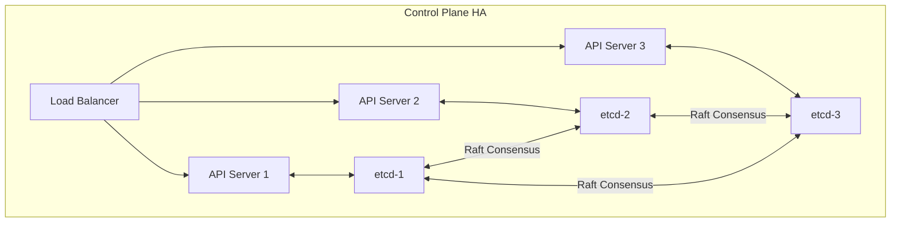

### Multi-Zone Worker Node Pools
Worker nodes are distributed across three distinct availability zones. Pod topology spread constraints enforce that replica counts across zones remain balanced.

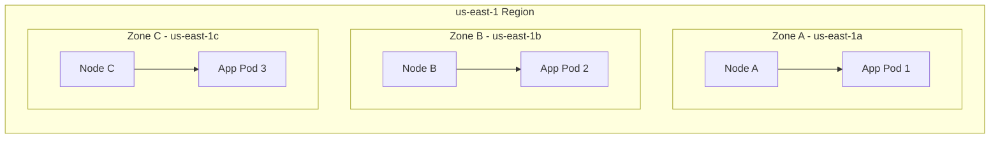

---

## 4. Production Networking

Kubernetes networking enables container communication inside the cluster, while separating namespaces using firewall rules and gateways.

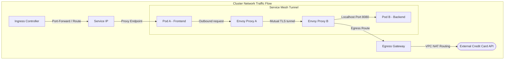

### Networking Best Practices:
* **NodeLocal DNSCache:** Runs a local caching DNS agent on every node as a DaemonSet. This handles dns lookup traffic locally, preventing packet drops and timeouts at the main CoreDNS service.
* **Overlay vs. Native VPC Routing:** Overlay routing (like Flannel or Calico VxLAN) encapsulates packets, decoupling pod IPs from VPC subnets. Native routing (AWS-VPC-CNI) assigns real VPC IPs to pods, reducing latency but risking IP exhaustion.
* **Egress Gateways:** Routes all outbound traffic from pods to third-party endpoints through a secure proxy gateway. This allows SREs to apply domain-level filters (FQDN) to prevent data exfiltration.

---

## 5. Security Architecture

Zero Trust security assumes the host network is compromised, requiring authorization checks at every level.

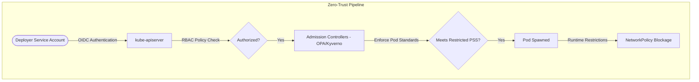

### Security Layers:
* **Role-Based Access Control (RBAC):** Grants permissions based on roles. Access is restricted to specific namespaces and operations. Admin roles and wildcard credentials (`*`) are disallowed.
* **Secret Encryption (KMS):** Ephemeral Data Encryption Keys (DEKs) are generated locally, wrapped by a Cloud Key Management Service (KMS) master key, and used to encrypt secret payloads before they are written to etcd.
* **Network Policies:** Pod firewalls configured to deny all traffic by default. Services must explicitly authorize inbound and outbound communication paths.
* **Pod Security Standards (PSS):** Pod configs enforce `Restricted` security contexts, requiring containers to run as non-root, drop Linux capabilities, and use read-only root filesystems.

---

## 6. Observability Architecture

Observability provides visibility into system states by correlating metrics, logs, and distributed traces.

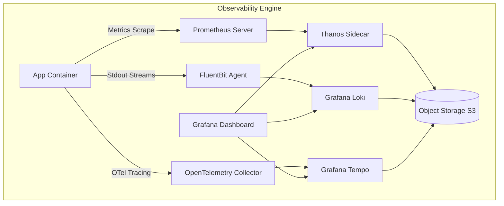

* **Metrics (Prometheus & Thanos):** Prometheus collects and indexes metrics locally. The Thanos Sidecar uploads these metrics blocks to S3 object storage every two hours, enabling long-term metrics storage and global querying across multiple clusters.
* **Logs (Fluentbit & Grafana Loki):** FluentBit agents run on each node to tail container stdout files and stream them to Loki. Loki indexes only the metadata labels (like `pod`, `namespace`), lowering storage costs compared to full-text search databases (like Elasticsearch).
* **Traces (OpenTelemetry & Tempo):** OpenTelemetry collectors process application trace spans and forward them to Grafana Tempo for deep trace lifecycle visualization.

---

## 7. CI/CD GitOps Integration

GitOps enforces that the git repository is the single source of truth for the cluster's state. A reconciler (like ArgoCD or Flux) runs inside the cluster to sync configurations.

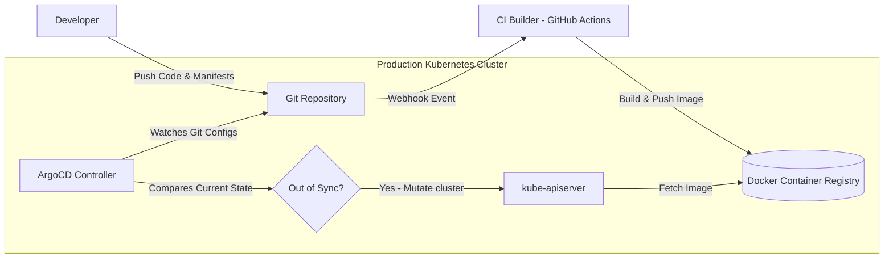

---

## 8. Failure Domain Isolation & Blast Radius

We control failures by defining isolation boundaries, preventing issues from spreading to other workloads.

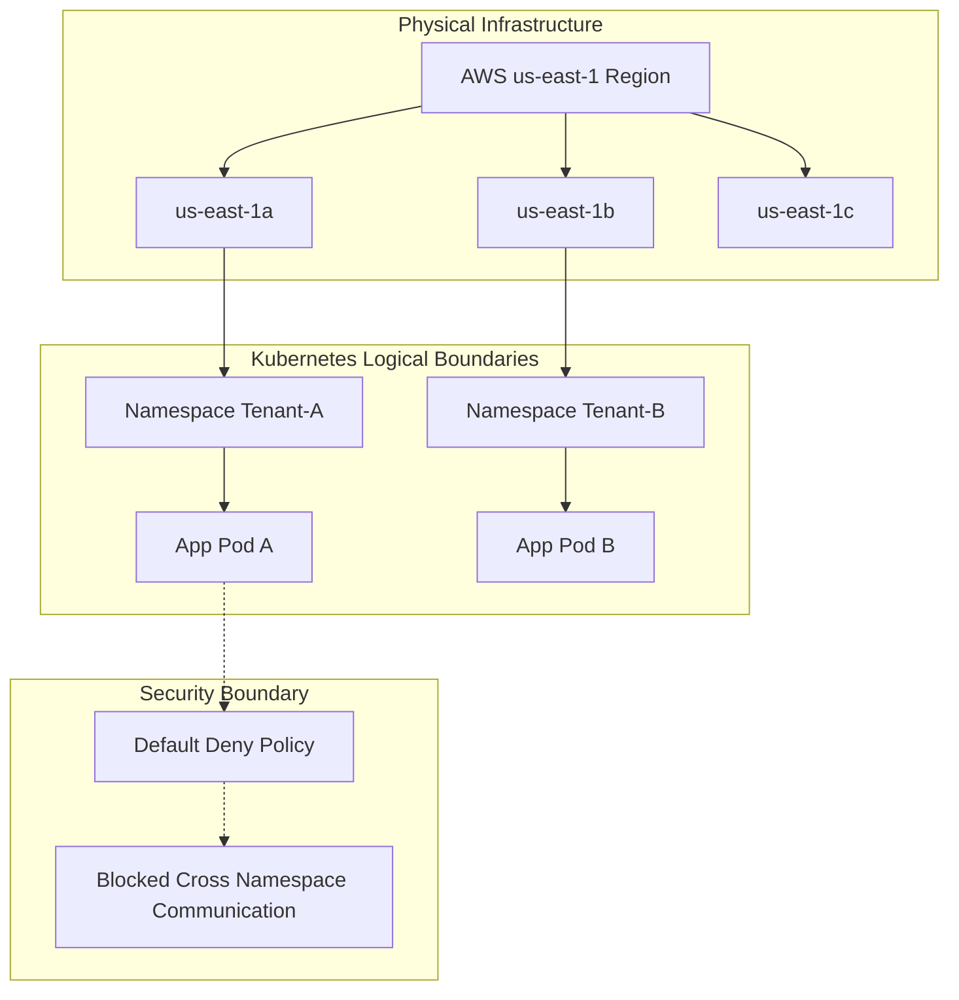

---

## 9. Disaster Recovery & Replication Topology

For business continuity, data is replicated across multiple regions. If the primary region fails, DNS routing switches user traffic to the backup region.

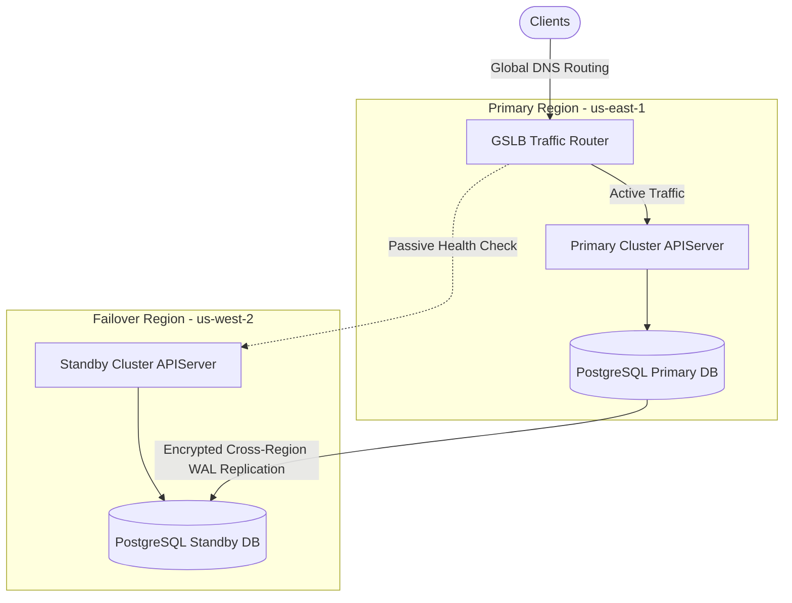

---

## 10. Real Enterprise Patterns

Real-world platforms are optimized for their specific workload profiles. Below are four common enterprise design patterns.

### Pattern A: Enterprise SaaS Platform
* **Design Goal:** Scale to support thousands of business tenants securely while optimizing compute costs.
* **Solution:** Namespace-level separation, dedicated node groups for premium tier customers using taints and tolerations, and Kubecost namespaces labeling to track costs per tenant.

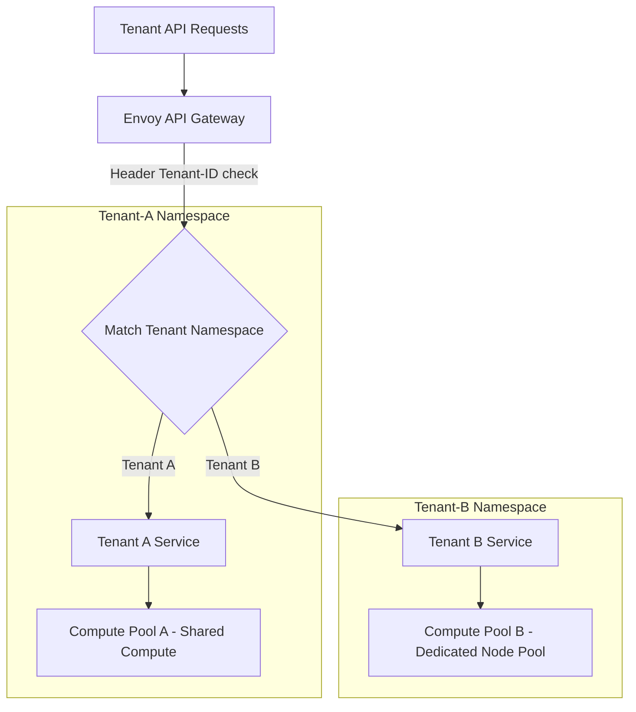

---

### Pattern B: Stateful Data Platform
* **Design Goal:** Enforce high I/O operations and database failover reliability.
* **Solution:** High-performance StorageClasses using nvme SSD drives, StatefulSets with `volumeBindingMode: WaitForFirstConsumer` to respect node zone constraints, and automated database replication controllers (operators).

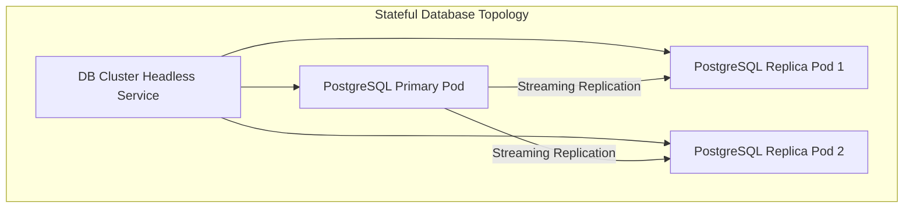

---

### Pattern C: AI/ML GPU Platform
* **Design Goal:** Coordinate batch training jobs and scale high-performance computing (HPC) nodes.
* **Solution:** Volcano batch scheduler for gang scheduling (ensuring all worker pods of a training job spawn together to avoid deadlocks), Karpenter node pools for just-in-time GPU VM creation, and NVIDIA device plugins.

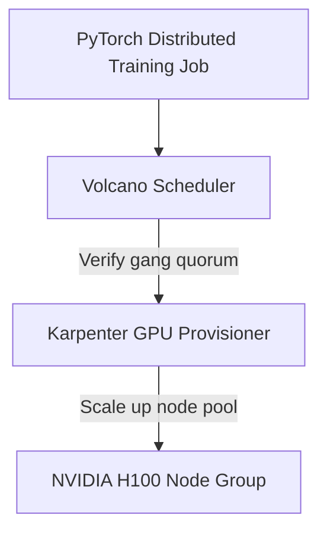

---

### Pattern D: E-commerce Platform
* **Design Goal:** Handle traffic spikes (flash sales) while maintaining low latency.
* **Solution:** Ingress-level cookie sticky sessions, Redis in-memory session caching, KEDA (Event-driven scaling) to pre-scale workloads based on cron rules before sale events start, and circuit breakers to isolate payment API failures.

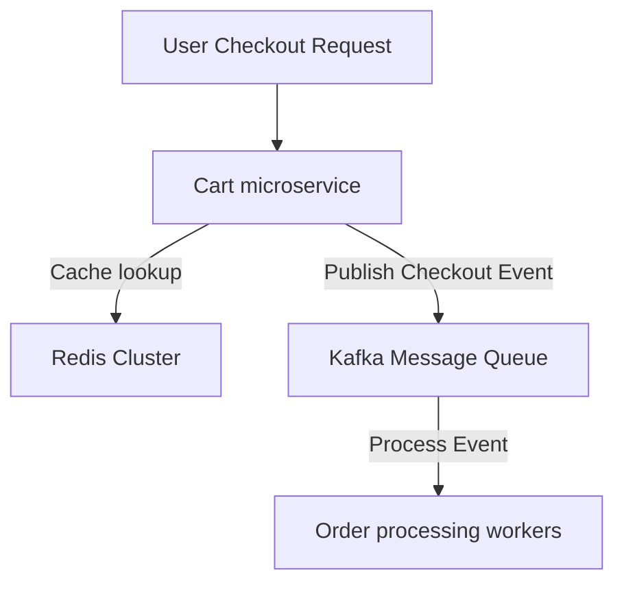

---

## 🛠️ Hands-On Lab Walkthrough
*Step-by-step guides can be found in the [labs/](labs/) directory.*

1. **[Labs 1 to 5 Manual](file:///d:/30_Days_of_Production_Kubernetes/Day-28/labs/lab-1-to-5-platform-design.md)**
   * Deploy 3-tier configurations.
   * Verify control plane active lease holds.
   * Confirm pod zone spread placements.
   * Set up control plane alerts.
   * Secure namespace bounds using default-deny NetworkPolicies.
2. **[Labs 6 to 10 Manual](file:///d:/30_Days_of_Production_Kubernetes/Day-28/labs/lab-6-to-10-resilience-testing.md)**
   * Simulate AZ power loss.
   * Evict zone workloads and monitor scheduling.
   * Inject high request loads via ApacheBench to verify HPA scaleups.
   * Perform an architecture scorecard audit.
   * Run Production Readiness Review (PRR) diagnostics.

---

## ⚡ Production Considerations and Hardening
*Deep operational notes are located in the [production-notes/](production-notes/) directory.*

* **[Lessons Learned designing large-scale clusters](file:///d:/30_Days_of_Production_Kubernetes/Day-28/production-notes/architecture-tradeoffs-incidents.md)**
  * Analysis of Managed vs. Self-managed control planes.
  * Cluster limit guidelines (Kubelet PLEG, namespaces, IP constraints).
  * Root Cause Postmortems: etcd write-latency and CoreDNS UDP timeouts.

---

## 🚨 Troubleshooting Playbook
*Comprehensive troubleshooting runbooks can be found in the [troubleshooting/](troubleshooting/) directory.*

* **[Outage Playbook](file:///d:/30_Days_of_Production_Kubernetes/Day-28/troubleshooting/outage-playbook.md)**
  * Playbook containing symptoms, diagnostics commands, and resolutions for 10 common architecture-level failures (such as API server saturation, etcd quota limit hits, and IP address exhaustion).

---

## 🏆 Daily Assignment and Challenge
1. Open the [Architecture Designer Simulator](file:///d:/30_Days_of_Production_Kubernetes/Day-28/exercises/architecture_designer.html).
2. Configure a fully redundant, production-ready cluster:
   * Add Global Load Balancer, Ingress Controller, Service Mesh, Network Policies, Web Application, PostgreSQL Database, and Redis Cache.
   * Enable Multi-Zone Spreading, Control Plane HA, and Pod Disruption Budgets.
   * Set traffic load to "High" or "Extreme Flash Sale".
   * Inject a random "Failure Domain Outage" and click "Resolve Failures" to test recovery speed.
3. Review your cluster's final Reliability, Scalability, and Security scores to verify that your layout meets enterprise production standards.
