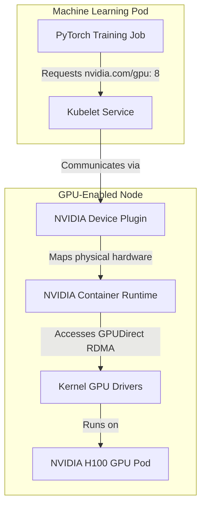

# 🤖 Enterprise AI/ML Platform & GPU Orchestration Architecture

This architecture guide describes how to build, scale, and schedule resource-intensive AI/ML workloads on production Kubernetes clusters using GPU acceleration, custom scheduling, and distributed model processing.

---

## 1. High-Performance GPU Architecture

To leverage hardware accelerators (NVIDIA A100/H100), Kubernetes nodes must run specialized OS drivers and device plugins.



### Essential Hardware Drivers & Toolkits:
* **NVIDIA Container Toolkit:** Modifies the runtime interface (containerd) so containers can access hardware GPUs.
* **NVIDIA Device Plugin:** Advertises GPU capacity (e.g., `nvidia.com/gpu`) to the Kubernetes scheduler.
* **MIG (Multi-Instance GPU):** Splits physical GPUs (e.g., A100) into smaller virtual GPU instances for resource-efficient inference tasks.

---

## 2. Advanced Scheduling: Volcano and Kueue

Default Kubernetes scheduling is designed for long-running HTTP APIs, not batch ML jobs. ML platforms require advanced queueing and gang scheduling.

### Volcano Batch Scheduler
Volcano provides:
* **Gang Scheduling:** Ensures all Pods of a distributed training task (e.g., 1 Parameter Server, 8 Workers) are scheduled simultaneously, or none are. This prevents deadlocks where resources are held by a partial job waiting for the remainder to spawn.
* **Queueing & Priority:** Manages execution priority dynamically across multi-tenant ML workspaces.
* **Min-Resources Reservation:** Reserves cluster compute so large training cycles aren't blocked by minor inference requests.

### Kueue Job Queueing
Kueue manages multi-tenant job queues and quota limits. It hooks into standard Cluster API resources and schedules batch workloads based on budget availability.

---

## 3. Scaling AI Workloads: Karpenter & GPU Node Pools

AI/ML workloads require quick scaling of expensive GPU nodes. Karpenter is preferred over standard Cluster Autoscaler due to its high speed and "just-in-time" node sizing.

### Karpenter NodePool Manifest for GPU Instances:
```yaml
apiVersion: karpenter.sh/v1beta1
kind: NodePool
metadata:
  name: gpu-nodepool
spec:
  template:
    spec:
      requirements:
      - key: "karpenter.k8s.aws/instance-family"
        operator: In
        values: ["p4d.24xlarge", "g5.12xlarge"]
      - key: "karpenter.k8s.aws/instance-gpu-count"
        operator: In
        values: ["4", "8"]
      - key: "kubernetes.io/arch"
        operator: In
        values: ["amd64"]
      - key: "karpenter.sh/capacity-type"
        operator: In
        values: ["on-demand"]
      taints:
      - key: nvidia.com/gpu
        value: "true"
        effect: NoSchedule
      nodeClassRef:
        name: default-aws-nodeclass
  limits:
    cpu: 1000
    memory: 4000Gi
    nvidia.com/gpu: 64
  disruption:
    consolidationPolicy: WhenEmpty
    decayAfter: 7d
```

---

## 4. Serving Infrastructure: KServe and Triton

For low-latency AI model inference, the platform runs KServe (leveraging Knative Serving):
* **Scale-to-Zero:** Shuts down inference pods when requests are zero to optimize cloud spend.
* **Triton Model Server:** Standardizes CPU/GPU loading of models (TensorFlow, PyTorch, ONNX) for optimized batch processing.
* **Shared Storage Access:** Inference engines mount trained weights dynamically from S3/MinIO volumes using low-latency ReadWriteMany (RWX) storage systems (e.g., JuiceFS).
